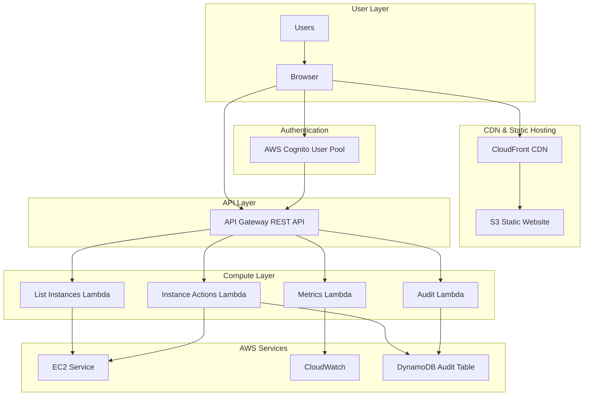
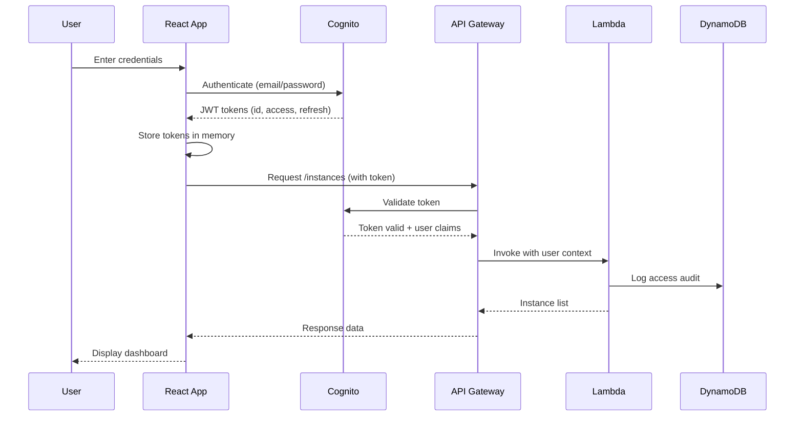
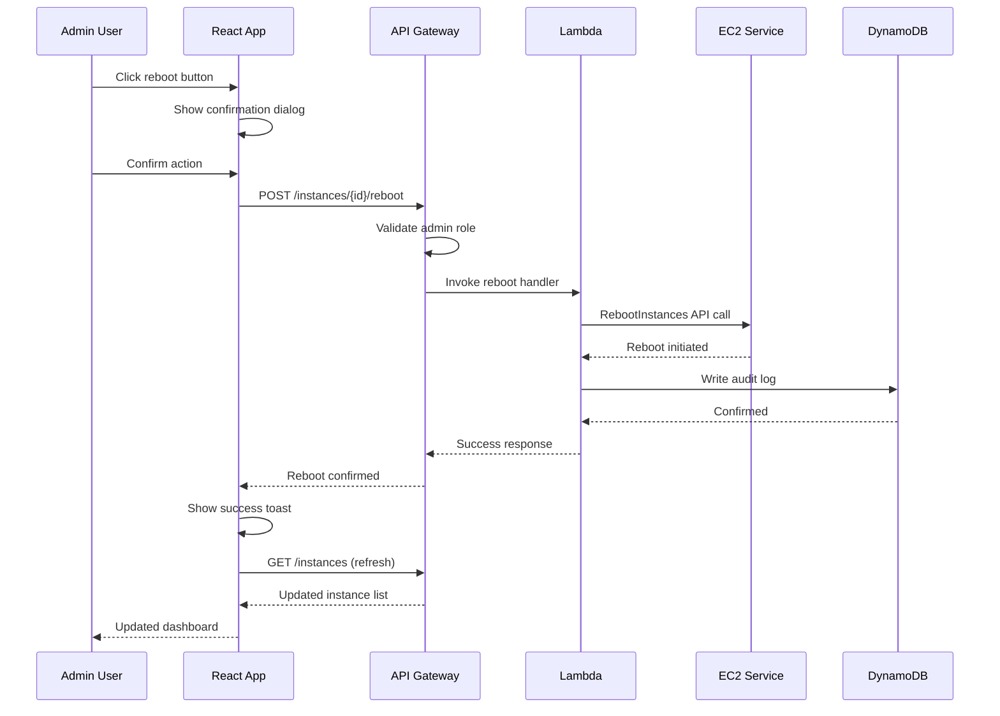
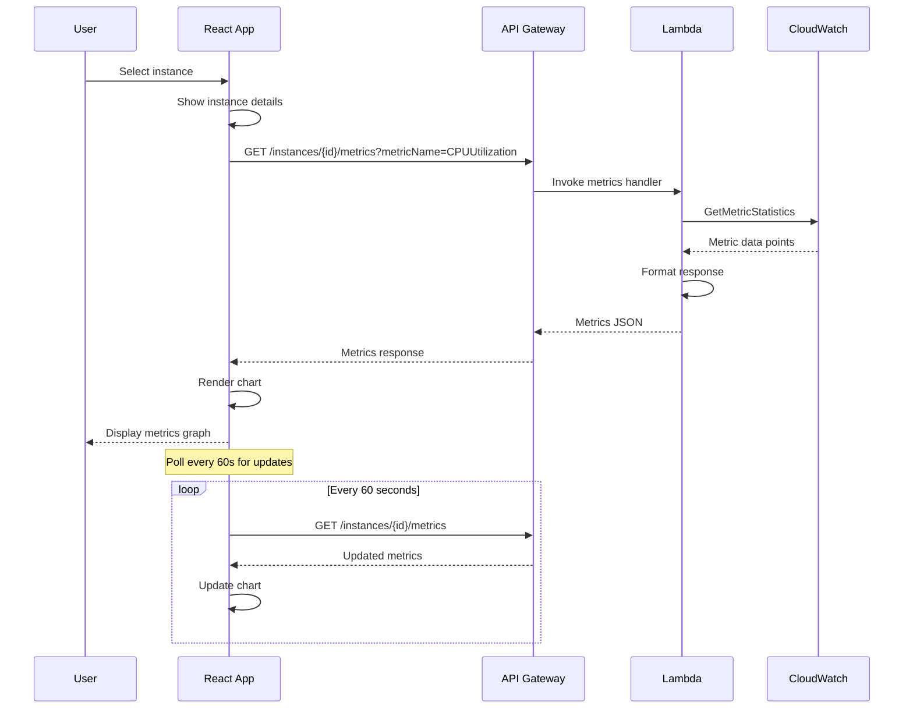
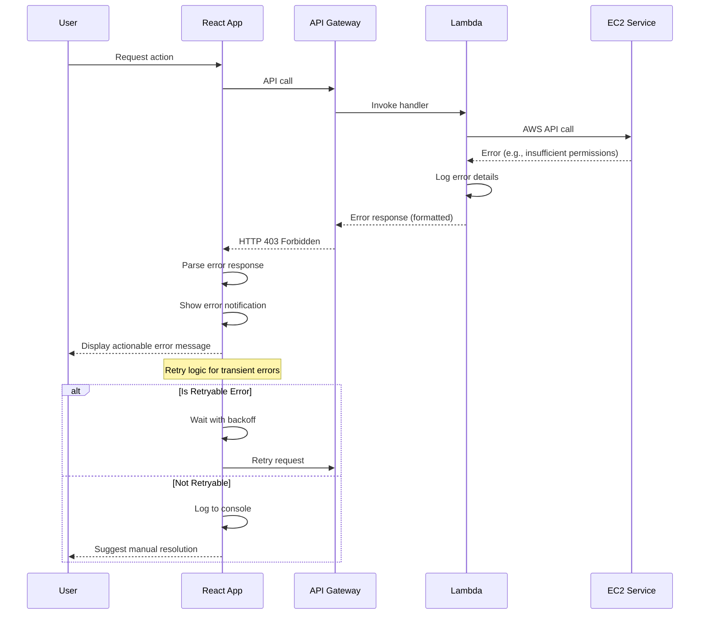
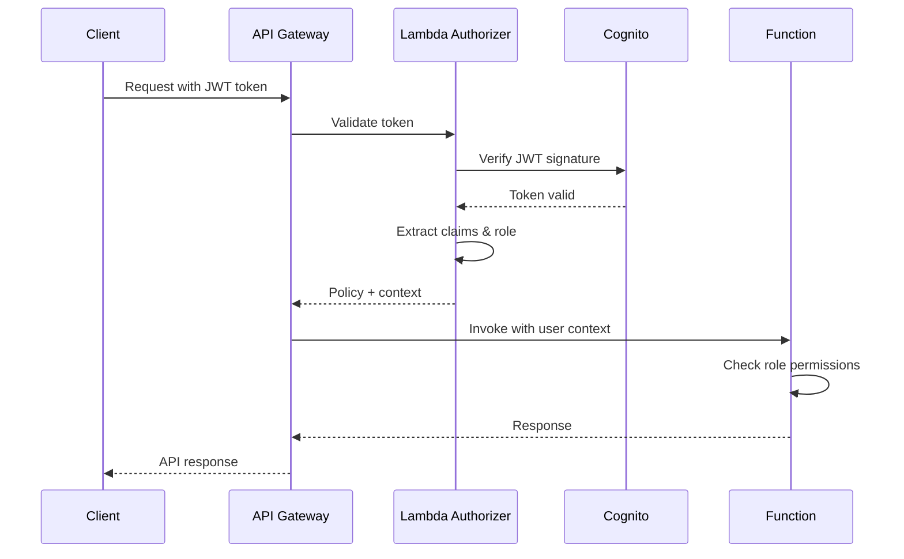
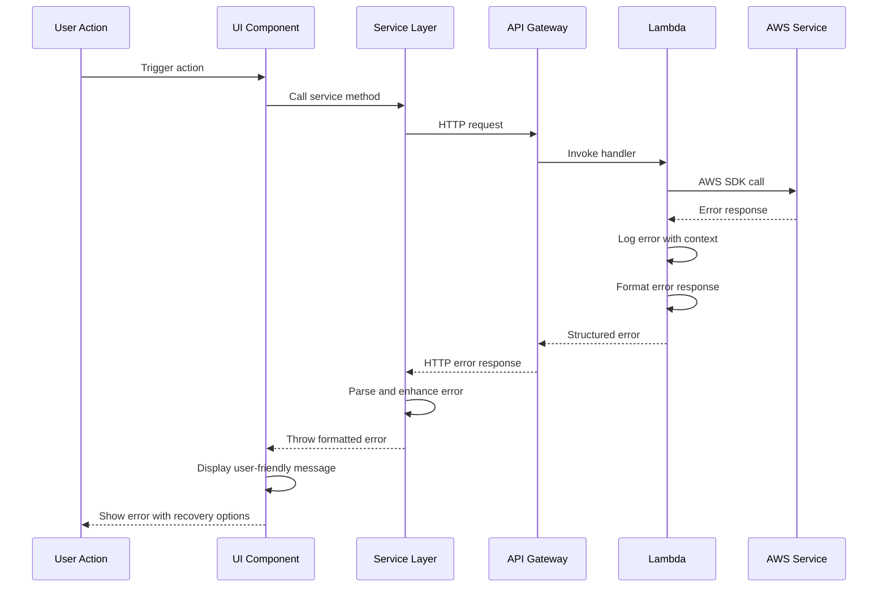

# AWS EC2 Instance Management Platform Fullstack Architecture Document

## Introduction

This document outlines the complete fullstack architecture for AWS EC2 Instance Management Platform, including backend systems, frontend implementation, and their integration. It serves as the single source of truth for AI-driven development, ensuring consistency across the entire technology stack.

This unified approach combines what would traditionally be separate backend and frontend architecture documents, streamlining the development process for modern fullstack applications where these concerns are increasingly intertwined.

### Starter Template or Existing Project

N/A - Greenfield project

### Change Log

| Date       | Version | Description                             | Author              |
| ---------- | ------- | --------------------------------------- | ------------------- |
| 2025-01-13 | 1.0     | Initial fullstack architecture document | Winston (Architect) |

## High Level Architecture

### Technical Summary

The AWS EC2 Instance Management Platform employs a serverless, event-driven architecture using AWS managed services for the backend and a React-based single-page application for the frontend. The system leverages AWS Cognito for authentication, API Gateway with Lambda functions for business logic, and direct AWS SDK integration for EC2 operations. Frontend deployment utilizes S3 static hosting with CloudFront CDN for global distribution and optimal performance. The architecture prioritizes operational simplicity through serverless patterns while maintaining enterprise-grade security and scalability. This design achieves the PRD goals of 50% operational overhead reduction by eliminating server management and providing auto-scaling capabilities out of the box.

### Platform and Infrastructure Choice

**Platform:** AWS (Single Cloud Provider)
**Key Services:** Lambda, API Gateway, Cognito, S3, CloudFront, CloudWatch, DynamoDB, IAM
**Deployment Host and Regions:** us-east-1 (primary), with CloudFront global edge locations

### Repository Structure

**Structure:** Monorepo
**Monorepo Tool:** npm workspaces (built-in Node.js feature)
**Package Organization:** Separate packages for web (frontend), api (backend), shared (common types/utils), and infrastructure (CDK)

### High Level Architecture Diagram



### Architectural Patterns

- **Serverless Architecture:** Lambda functions for all compute needs - _Rationale:_ Eliminates server management overhead and provides automatic scaling
- **Static Site Generation:** React SPA hosted on S3/CloudFront - _Rationale:_ Maximum performance with global CDN distribution and no server requirements
- **API Gateway Pattern:** Single entry point for all backend APIs - _Rationale:_ Centralized authentication, rate limiting, and monitoring
- **Repository Pattern:** Abstract AWS SDK calls behind service interfaces - _Rationale:_ Enables unit testing and potential multi-cloud migration
- **Component-Based UI:** Reusable React components with TypeScript - _Rationale:_ Maintainability and type safety across the frontend codebase
- **Token-Based Authentication:** JWT tokens via Cognito - _Rationale:_ Stateless authentication that scales horizontally
- **Event-Driven Audit Logging:** Async DynamoDB writes for audit trails - _Rationale:_ Non-blocking audit logs that don't impact API performance

## Tech Stack

### Technology Stack Table

| Category             | Technology                   | Version     | Purpose                               | Rationale                                                        |
| -------------------- | ---------------------------- | ----------- | ------------------------------------- | ---------------------------------------------------------------- |
| Frontend Language    | TypeScript                   | 5.3+        | Type-safe frontend development        | Type safety reduces runtime errors and improves IDE support      |
| Frontend Framework   | React                        | 18.2+       | UI component framework                | Industry standard with vast ecosystem and AWS Amplify support    |
| UI Component Library | Material-UI (MUI)            | 5.15+       | Pre-built React components            | Provides professional UI components aligned with Material Design |
| State Management     | Context API + useReducer     | Built-in    | Application state management          | Sufficient for app complexity without Redux overhead             |
| Backend Language     | TypeScript                   | 5.3+        | Type-safe backend development         | Consistency with frontend and strong typing                      |
| Backend Framework    | AWS Lambda + Node.js         | 20.x        | Serverless compute runtime            | Native AWS integration with minimal cold start times             |
| API Style            | REST                         | N/A         | API architecture pattern              | Simple, well-understood pattern suitable for CRUD operations     |
| Database             | DynamoDB                     | N/A         | NoSQL database for audit logs         | Serverless, auto-scaling, perfect for append-only audit data     |
| Cache                | CloudFront                   | N/A         | CDN and API caching                   | Built-in with AWS, reduces latency globally                      |
| File Storage         | S3                           | N/A         | Static asset and website hosting      | Industry standard for static site hosting                        |
| Authentication       | AWS Cognito                  | N/A         | User authentication and authorization | Managed service with built-in security features                  |
| Frontend Testing     | Jest + React Testing Library | 29.x / 14.x | Unit and integration testing          | Standard React testing stack                                     |
| Backend Testing      | Jest                         | 29.x        | Lambda function testing               | Consistent with frontend tooling                                 |
| E2E Testing          | Playwright                   | 1.40+       | End-to-end browser testing            | Modern, fast, reliable cross-browser testing                     |
| Build Tool           | Vite                         | 5.0+        | Frontend build and dev server         | Fast builds with hot module replacement                          |
| Bundler              | Vite (Rollup)                | 5.0+        | JavaScript bundling                   | Integrated with Vite, optimized production builds                |
| IaC Tool             | AWS CDK                      | 2.100+      | Infrastructure as Code                | Type-safe infrastructure with TypeScript                         |
| CI/CD                | GitHub Actions               | N/A         | Continuous Integration/Deployment     | Free for public repos, good AWS integration                      |
| Monitoring           | CloudWatch                   | N/A         | Logs, metrics, and dashboards         | Native AWS service with Lambda integration                       |
| Logging              | CloudWatch Logs              | N/A         | Centralized logging                   | Automatic Lambda log aggregation                                 |
| CSS Framework        | Emotion (via MUI)            | 11.x        | CSS-in-JS styling                     | Integrated with Material-UI, dynamic styling                     |

## Data Models

### User

**Purpose:** Represents authenticated users in the system with their roles and preferences

**Key Attributes:**

- userId: string - Cognito user ID (UUID)
- email: string - User's email address (unique)
- role: 'admin' | 'readonly' - User's permission level
- firstName: string - User's first name
- lastName: string - User's last name
- lastLogin: ISO8601 timestamp - Last successful login time
- createdAt: ISO8601 timestamp - Account creation time

#### TypeScript Interface

```typescript
interface User {
  userId: string;
  email: string;
  role: 'admin' | 'readonly';
  firstName: string;
  lastName: string;
  lastLogin?: string;
  createdAt: string;
}
```

#### Relationships

- One-to-many with AuditLog entries

### EC2Instance

**Purpose:** Represents EC2 instance data retrieved from AWS with enriched metadata

**Key Attributes:**

- instanceId: string - AWS EC2 instance ID
- instanceType: string - EC2 instance type (e.g., t2.micro)
- state: InstanceState - Current instance state
- publicIp: string | null - Public IP address if assigned
- privateIp: string - Private IP address
- launchTime: ISO8601 timestamp - Instance launch time
- availabilityZone: string - AWS availability zone
- tags: Record<string, string> - Instance tags

#### TypeScript Interface

```typescript
type InstanceState =
  | 'pending'
  | 'running'
  | 'stopping'
  | 'stopped'
  | 'shutting-down'
  | 'terminated';

interface EC2Instance {
  instanceId: string;
  instanceType: string;
  state: InstanceState;
  publicIp: string | null;
  privateIp: string;
  launchTime: string;
  availabilityZone: string;
  tags: Record<string, string>;
  monitoring?: {
    state: 'enabled' | 'disabled';
  };
}
```

#### Relationships

- Referenced in AuditLog entries for instance actions

### AuditLog

**Purpose:** Immutable audit trail of all administrative actions performed in the system

**Key Attributes:**

- auditId: string - Unique audit entry ID (UUID)
- userId: string - ID of user who performed action
- userEmail: string - Email of user (denormalized for quick access)
- action: AuditAction - Type of action performed
- resourceType: string - Type of resource affected
- resourceId: string - ID of affected resource
- timestamp: ISO8601 timestamp - When action occurred
- details: object - Additional action-specific data
- ipAddress: string - Client IP address

#### TypeScript Interface

```typescript
type AuditAction = 'LOGIN' | 'LOGOUT' | 'REBOOT_INSTANCE' | 'VIEW_INSTANCE' | 'ACCESS_DENIED';

interface AuditLog {
  auditId: string;
  userId: string;
  userEmail: string;
  action: AuditAction;
  resourceType: 'EC2_INSTANCE' | 'USER' | 'SYSTEM';
  resourceId: string;
  timestamp: string;
  details?: Record<string, any>;
  ipAddress: string;
}
```

#### Relationships

- Many-to-one with User
- References EC2Instance for instance-related actions

### CloudWatchMetrics

**Purpose:** Container for CloudWatch metrics data for EC2 instances

**Key Attributes:**

- instanceId: string - EC2 instance ID
- metricName: string - CloudWatch metric name
- dataPoints: MetricDataPoint[] - Time series data
- unit: string - Metric unit (Percent, Bytes, etc.)
- period: number - Data point interval in seconds

#### TypeScript Interface

```typescript
interface MetricDataPoint {
  timestamp: string;
  value: number;
  unit: string;
}

interface CloudWatchMetrics {
  instanceId: string;
  metricName: string;
  dataPoints: MetricDataPoint[];
  unit: string;
  period: number;
  stat: 'Average' | 'Sum' | 'Maximum' | 'Minimum';
}
```

#### Relationships

- Many-to-one with EC2Instance

## API Specification

### REST API Specification

```yaml
openapi: 3.0.0
info:
  title: EC2 Instance Management API
  version: 1.0.0
  description: REST API for managing EC2 instances with role-based access control
servers:
  - url: https://api.ec2-manager.example.com/v1
    description: Production API Gateway endpoint
components:
  securitySchemes:
    CognitoAuth:
      type: apiKey
      in: header
      name: Authorization
      description: Cognito JWT token
  schemas:
    EC2Instance:
      type: object
      properties:
        instanceId:
          type: string
        instanceType:
          type: string
        state:
          type: string
          enum: [pending, running, stopping, stopped, shutting-down, terminated]
        publicIp:
          type: string
          nullable: true
        privateIp:
          type: string
        launchTime:
          type: string
          format: date-time
        availabilityZone:
          type: string
        tags:
          type: object
          additionalProperties:
            type: string
    Error:
      type: object
      properties:
        error:
          type: object
          properties:
            code:
              type: string
            message:
              type: string
            requestId:
              type: string
paths:
  /instances:
    get:
      summary: List all EC2 instances
      security:
        - CognitoAuth: []
      parameters:
        - name: state
          in: query
          schema:
            type: string
          description: Filter by instance state
        - name: tag
          in: query
          schema:
            type: string
          description: Filter by tag (format: key=value)
      responses:
        '200':
          description: List of EC2 instances
          content:
            application/json:
              schema:
                type: object
                properties:
                  instances:
                    type: array
                    items:
                      $ref: '#/components/schemas/EC2Instance'
        '401':
          description: Unauthorized
        '403':
          description: Forbidden
  /instances/{instanceId}:
    get:
      summary: Get instance details
      security:
        - CognitoAuth: []
      parameters:
        - name: instanceId
          in: path
          required: true
          schema:
            type: string
      responses:
        '200':
          description: Instance details
          content:
            application/json:
              schema:
                $ref: '#/components/schemas/EC2Instance'
        '404':
          description: Instance not found
  /instances/{instanceId}/reboot:
    post:
      summary: Reboot an instance (admin only)
      security:
        - CognitoAuth: []
      parameters:
        - name: instanceId
          in: path
          required: true
          schema:
            type: string
      responses:
        '200':
          description: Reboot initiated
          content:
            application/json:
              schema:
                type: object
                properties:
                  message:
                    type: string
                  instanceId:
                    type: string
        '403':
          description: Forbidden - admin role required
        '404':
          description: Instance not found
  /instances/{instanceId}/metrics:
    get:
      summary: Get CloudWatch metrics for instance
      security:
        - CognitoAuth: []
      parameters:
        - name: instanceId
          in: path
          required: true
          schema:
            type: string
        - name: metricName
          in: query
          required: true
          schema:
            type: string
            enum: [CPUUtilization, NetworkIn, NetworkOut, DiskReadBytes, DiskWriteBytes]
        - name: period
          in: query
          schema:
            type: integer
            default: 300
        - name: startTime
          in: query
          schema:
            type: string
            format: date-time
        - name: endTime
          in: query
          schema:
            type: string
            format: date-time
      responses:
        '200':
          description: Metrics data
          content:
            application/json:
              schema:
                type: object
                properties:
                  metrics:
                    type: array
                    items:
                      type: object
                      properties:
                        timestamp:
                          type: string
                        value:
                          type: number
                        unit:
                          type: string
  /audit-logs:
    get:
      summary: Get audit logs (admin only)
      security:
        - CognitoAuth: []
      parameters:
        - name: limit
          in: query
          schema:
            type: integer
            default: 50
        - name: startDate
          in: query
          schema:
            type: string
            format: date-time
        - name: userId
          in: query
          schema:
            type: string
      responses:
        '200':
          description: Audit log entries
          content:
            application/json:
              schema:
                type: object
                properties:
                  logs:
                    type: array
                    items:
                      type: object
        '403':
          description: Forbidden - admin role required
```

## Components

### Frontend Application

**Responsibility:** React SPA providing user interface for EC2 instance management with real-time updates and responsive design

**Key Interfaces:**

- HTTP REST API calls to API Gateway endpoints
- WebSocket connection for real-time instance state updates (future enhancement)
- Cognito SDK integration for authentication flows

**Dependencies:** API Gateway REST API, AWS Cognito, CloudFront CDN

**Technology Stack:** React 18.2+, TypeScript 5.3+, Material-UI 5.15+, Vite 5.0+

### API Gateway

**Responsibility:** Single entry point for all API requests with request validation, rate limiting, and Cognito authorization

**Key Interfaces:**

- REST endpoints for instance operations
- JWT token validation via Cognito authorizer
- Request/response transformation and validation

**Dependencies:** AWS Cognito (authorization), Lambda Functions (backend logic)

**Technology Stack:** AWS API Gateway REST API, Cognito Authorizer, Request Validators

### Lambda Functions

**Responsibility:** Serverless compute layer executing business logic for instance management, metrics retrieval, and audit logging

**Key Interfaces:**

- Event handlers for API Gateway requests
- AWS SDK calls to EC2, CloudWatch, and DynamoDB
- Structured JSON responses with error handling

**Dependencies:** EC2 API, CloudWatch API, DynamoDB, IAM roles

**Technology Stack:** Node.js 20.x runtime, TypeScript, AWS SDK v3

### Authentication Service (Cognito)

**Responsibility:** User authentication, authorization, and session management with role-based access control

**Key Interfaces:**

- User pool for authentication
- JWT token generation and validation
- Password policies and MFA support (future)

**Dependencies:** None (managed service)

**Technology Stack:** AWS Cognito User Pool with email-based authentication

### Audit Service (DynamoDB)

**Responsibility:** Immutable audit trail storage for all administrative actions with high-performance queries

**Key Interfaces:**

- Put operations for new audit entries
- Query operations by userId, timestamp, or action
- GSI for efficient filtering

**Dependencies:** Lambda Functions (writers)

**Technology Stack:** DynamoDB with on-demand capacity, single table design

### Static Hosting (S3 + CloudFront)

**Responsibility:** Global distribution of frontend assets with caching, compression, and HTTPS termination

**Key Interfaces:**

- S3 bucket for static file storage
- CloudFront distribution with custom domain
- Cache invalidation API for deployments

**Dependencies:** S3 bucket (origin)

**Technology Stack:** S3 static website hosting, CloudFront CDN with OAI

### Monitoring Service (CloudWatch)

**Responsibility:** Centralized logging, metrics collection, and operational dashboards for system observability

**Key Interfaces:**

- Log streams from Lambda functions
- Custom metrics API
- Dashboard API for visualization
- Alarms for operational thresholds

**Dependencies:** All Lambda functions, API Gateway

**Technology Stack:** CloudWatch Logs, Metrics, Dashboards, and Alarms

## Core Workflows

### User Authentication Flow



### Instance Reboot Flow (Admin)



### Real-time Metrics Retrieval



### Error Handling Flow



## Database Schema

### DynamoDB Audit Table

```javascript
// Table: ec2-audit-logs
{
  TableName: 'ec2-audit-logs',
  KeySchema: [
    { AttributeName: 'userId', KeyType: 'HASH' },     // Partition key
    { AttributeName: 'timestamp', KeyType: 'RANGE' }  // Sort key
  ],
  AttributeDefinitions: [
    { AttributeName: 'userId', AttributeType: 'S' },
    { AttributeName: 'timestamp', AttributeType: 'S' },
    { AttributeName: 'action', AttributeType: 'S' },
    { AttributeName: 'resourceId', AttributeType: 'S' }
  ],
  GlobalSecondaryIndexes: [
    {
      IndexName: 'ActionIndex',
      Keys: [
        { AttributeName: 'action', KeyType: 'HASH' },
        { AttributeName: 'timestamp', KeyType: 'RANGE' }
      ],
      Projection: { ProjectionType: 'ALL' }
    },
    {
      IndexName: 'ResourceIndex',
      Keys: [
        { AttributeName: 'resourceId', KeyType: 'HASH' },
        { AttributeName: 'timestamp', KeyType: 'RANGE' }
      ],
      Projection: { ProjectionType: 'ALL' }
    }
  ],
  BillingMode: 'PAY_PER_REQUEST',  // On-demand pricing
  StreamSpecification: {
    StreamEnabled: true,
    StreamViewType: 'NEW_AND_OLD_IMAGES'
  },
  Tags: [
    { Key: 'Environment', Value: 'Production' },
    { Key: 'Application', Value: 'EC2-Manager' }
  ]
}

// Example Item Structure
{
  "userId": "cognito-user-uuid",
  "timestamp": "2025-01-13T10:30:00.000Z",
  "action": "REBOOT_INSTANCE",
  "resourceType": "EC2_INSTANCE",
  "resourceId": "i-1234567890abcdef0",
  "userEmail": "admin@example.com",
  "details": {
    "instanceType": "t2.micro",
    "previousState": "running",
    "region": "us-east-1",
    "reason": "Scheduled maintenance"
  },
  "ipAddress": "203.0.113.1",
  "userAgent": "Mozilla/5.0...",
  "ttl": 2678400  // 31 days retention (optional)
}
```

### Cognito User Attributes Schema

```javascript
// User Pool Attributes
{
  StandardAttributes: {
    email: { required: true, mutable: false },
    email_verified: { required: true },
    given_name: { required: true, mutable: true },
    family_name: { required: true, mutable: true }
  },
  CustomAttributes: {
    'custom:role': {
      type: 'String',
      mutable: false,
      required: true,
      constraints: {
        enum: ['admin', 'readonly']
      }
    },
    'custom:department': {
      type: 'String',
      mutable: true,
      required: false
    }
  },
  PasswordPolicy: {
    minimumLength: 12,
    requireUppercase: true,
    requireLowercase: true,
    requireNumbers: true,
    requireSymbols: true,
    temporaryPasswordValidityDays: 7
  },
  MfaConfiguration: 'OPTIONAL',  // For future enhancement
  AccountRecoverySetting: {
    recoveryMechanisms: [
      { priority: 1, name: 'verified_email' }
    ]
  }
}
```

## Frontend Architecture

### Component Architecture

#### Component Organization

```text
src/components/
├── common/
│   ├── Layout/
│   │   ├── Layout.tsx
│   │   ├── Header.tsx
│   │   ├── Sidebar.tsx
│   │   └── Footer.tsx
│   ├── Feedback/
│   │   ├── Alert.tsx
│   │   ├── Snackbar.tsx
│   │   └── LoadingSpinner.tsx
│   └── DataDisplay/
│       ├── DataTable.tsx
│       ├── Card.tsx
│       └── EmptyState.tsx
├── auth/
│   ├── LoginForm.tsx
│   ├── ProtectedRoute.tsx
│   ├── ForgotPassword.tsx
│   └── SessionTimeout.tsx
├── instances/
│   ├── InstanceList/
│   │   ├── InstanceList.tsx
│   │   ├── InstanceFilters.tsx
│   │   └── InstanceListItem.tsx
│   ├── InstanceDetail/
│   │   ├── InstanceDetail.tsx
│   │   ├── InstanceMetrics.tsx
│   │   └── InstanceActions.tsx
│   └── shared/
│       ├── InstanceStatusBadge.tsx
│       └── InstanceTypeIcon.tsx
└── audit/
    ├── AuditLogTable.tsx
    ├── AuditLogFilters.tsx
    └── AuditLogEntry.tsx
```

#### Component Template

```typescript
// Example: InstanceListItem.tsx
import React, { memo } from 'react';
import {
  Card,
  CardContent,
  Typography,
  Chip,
  IconButton,
  Box
} from '@mui/material';
import { RestartAlt, Info } from '@mui/icons-material';
import { EC2Instance } from '@/types';
import { useAuth } from '@/hooks/useAuth';
import { InstanceStatusBadge } from '../shared/InstanceStatusBadge';

interface InstanceListItemProps {
  instance: EC2Instance;
  onReboot: (instanceId: string) => void;
  onViewDetails: (instanceId: string) => void;
}

export const InstanceListItem = memo<InstanceListItemProps>(({
  instance,
  onReboot,
  onViewDetails
}) => {
  const { user } = useAuth();
  const isAdmin = user?.role === 'admin';

  return (
    <Card sx={{ mb: 2 }}>
      <CardContent>
        <Box display="flex" justifyContent="space-between" alignItems="center">
          <Box>
            <Typography variant="h6">
              {instance.tags?.Name || instance.instanceId}
            </Typography>
            <Typography color="textSecondary" variant="body2">
              {instance.instanceType} • {instance.availabilityZone}
            </Typography>
            <Box mt={1}>
              <InstanceStatusBadge state={instance.state} />
            </Box>
          </Box>
          <Box>
            <IconButton onClick={() => onViewDetails(instance.instanceId)}>
              <Info />
            </IconButton>
            {isAdmin && instance.state === 'running' && (
              <IconButton
                onClick={() => onReboot(instance.instanceId)}
                color="warning"
              >
                <RestartAlt />
              </IconButton>
            )}
          </Box>
        </Box>
      </CardContent>
    </Card>
  );
});

InstanceListItem.displayName = 'InstanceListItem';
```

### State Management Architecture

#### State Structure

```typescript
// src/store/types.ts
export interface AppState {
  auth: AuthState;
  instances: InstancesState;
  ui: UIState;
}

export interface AuthState {
  user: User | null;
  isAuthenticated: boolean;
  isLoading: boolean;
  error: string | null;
}

export interface InstancesState {
  items: EC2Instance[];
  selectedInstance: EC2Instance | null;
  filters: InstanceFilters;
  isLoading: boolean;
  error: string | null;
  lastFetch: string | null;
}

export interface UIState {
  theme: 'light' | 'dark';
  notifications: Notification[];
  sidebarOpen: boolean;
}

// src/store/AuthContext.tsx
import React, { createContext, useReducer, useCallback } from 'react';
import { authReducer, initialAuthState } from './authReducer';
import { authService } from '@/services/auth';

export const AuthContext = createContext<{
  state: AuthState;
  login: (email: string, password: string) => Promise<void>;
  logout: () => void;
  refreshToken: () => Promise<void>;
}>({
  state: initialAuthState,
  login: async () => {},
  logout: () => {},
  refreshToken: async () => {}
});

export const AuthProvider: React.FC<{ children: React.ReactNode }> = ({ children }) => {
  const [state, dispatch] = useReducer(authReducer, initialAuthState);

  const login = useCallback(async (email: string, password: string) => {
    dispatch({ type: 'LOGIN_START' });
    try {
      const response = await authService.login(email, password);
      dispatch({ type: 'LOGIN_SUCCESS', payload: response });
    } catch (error) {
      dispatch({ type: 'LOGIN_FAILURE', payload: error.message });
    }
  }, []);

  // ... other methods

  return (
    <AuthContext.Provider value={{ state, login, logout, refreshToken }}>
      {children}
    </AuthContext.Provider>
  );
};
```

#### State Management Patterns

- Use Context API for global auth state
- Use local component state for UI-only state
- Implement optimistic updates for better UX
- Cache API responses with timestamps
- Use useReducer for complex state logic
- Implement state persistence for user preferences

### Routing Architecture

#### Route Organization

```text
/                           # Redirects to /dashboard or /login
/login                      # Public: Login page
/forgot-password           # Public: Password reset
/dashboard                 # Protected: Main dashboard with instance list
/instances/:id             # Protected: Instance detail view
/instances/:id/metrics     # Protected: Instance metrics view
/audit                     # Protected: Audit logs (admin only)
/profile                   # Protected: User profile/settings
/404                       # Public: Not found page
```

#### Protected Route Pattern

```typescript
// src/components/auth/ProtectedRoute.tsx
import React from 'react';
import { Navigate, useLocation } from 'react-router-dom';
import { useAuth } from '@/hooks/useAuth';
import { LoadingSpinner } from '@/components/common';

interface ProtectedRouteProps {
  children: React.ReactNode;
  requiredRole?: 'admin' | 'readonly';
}

export const ProtectedRoute: React.FC<ProtectedRouteProps> = ({
  children,
  requiredRole
}) => {
  const { user, isLoading, isAuthenticated } = useAuth();
  const location = useLocation();

  if (isLoading) {
    return <LoadingSpinner fullScreen />;
  }

  if (!isAuthenticated) {
    return <Navigate to="/login" state={{ from: location }} replace />;
  }

  if (requiredRole && user?.role !== requiredRole && user?.role !== 'admin') {
    return <Navigate to="/403" replace />;
  }

  return <>{children}</>;
};

// Usage in App.tsx
<Routes>
  <Route path="/login" element={<LoginPage />} />
  <Route path="/dashboard" element={
    <ProtectedRoute>
      <DashboardPage />
    </ProtectedRoute>
  } />
  <Route path="/audit" element={
    <ProtectedRoute requiredRole="admin">
      <AuditLogPage />
    </ProtectedRoute>
  } />
</Routes>
```

### Frontend Services Layer

#### API Client Setup

```typescript
// src/services/api.ts
import axios, { AxiosInstance, AxiosError } from 'axios';
import { getAuthToken, refreshAuthToken } from './auth';

const API_BASE_URL = import.meta.env.VITE_API_BASE_URL || 'https://api.ec2-manager.example.com/v1';

class ApiClient {
  private client: AxiosInstance;

  constructor() {
    this.client = axios.create({
      baseURL: API_BASE_URL,
      timeout: 30000,
      headers: {
        'Content-Type': 'application/json',
      },
    });

    // Request interceptor for auth
    this.client.interceptors.request.use(
      async (config) => {
        const token = await getAuthToken();
        if (token) {
          config.headers.Authorization = `Bearer ${token}`;
        }
        return config;
      },
      (error) => Promise.reject(error)
    );

    // Response interceptor for error handling
    this.client.interceptors.response.use(
      (response) => response,
      async (error: AxiosError) => {
        if (error.response?.status === 401) {
          // Try to refresh token
          try {
            await refreshAuthToken();
            // Retry original request
            return this.client.request(error.config!);
          } catch (refreshError) {
            // Redirect to login
            window.location.href = '/login';
          }
        }

        // Format error for consistent handling
        const formattedError = {
          code: error.response?.data?.error?.code || 'UNKNOWN_ERROR',
          message: error.response?.data?.error?.message || 'An unexpected error occurred',
          status: error.response?.status,
        };

        return Promise.reject(formattedError);
      }
    );
  }

  get<T>(url: string, params?: any) {
    return this.client.get<T>(url, { params });
  }

  post<T>(url: string, data?: any) {
    return this.client.post<T>(url, data);
  }

  put<T>(url: string, data?: any) {
    return this.client.put<T>(url, data);
  }

  delete<T>(url: string) {
    return this.client.delete<T>(url);
  }
}

export const apiClient = new ApiClient();
```

#### Service Example

```typescript
// src/services/ec2.ts
import { apiClient } from './api';
import { EC2Instance, CloudWatchMetrics, RebootResponse } from '@/types';

export class EC2Service {
  async listInstances(filters?: { state?: string; tag?: string }): Promise<EC2Instance[]> {
    const response = await apiClient.get<{ instances: EC2Instance[] }>('/instances', filters);
    return response.data.instances;
  }

  async getInstanceDetails(instanceId: string): Promise<EC2Instance> {
    const response = await apiClient.get<EC2Instance>(`/instances/${instanceId}`);
    return response.data;
  }

  async rebootInstance(instanceId: string): Promise<RebootResponse> {
    const response = await apiClient.post<RebootResponse>(`/instances/${instanceId}/reboot`);
    return response.data;
  }

  async getInstanceMetrics(
    instanceId: string,
    metricName: string,
    options?: {
      period?: number;
      startTime?: string;
      endTime?: string;
    }
  ): Promise<CloudWatchMetrics> {
    const response = await apiClient.get<CloudWatchMetrics>(`/instances/${instanceId}/metrics`, {
      metricName,
      ...options,
    });
    return response.data;
  }
}

export const ec2Service = new EC2Service();
```

## Backend Architecture

### Service Architecture

#### Function Organization

```text
api/src/functions/
├── auth/
│   ├── authorizer.ts       # Cognito JWT validation
│   └── refresh.ts          # Token refresh handler
├── instances/
│   ├── list.ts            # List all instances
│   ├── get.ts             # Get instance details
│   ├── reboot.ts          # Reboot instance
│   └── metrics.ts         # Get CloudWatch metrics
├── audit/
│   ├── list.ts            # List audit logs
│   └── write.ts           # Write audit entry
└── shared/
    ├── middleware/
    │   ├── errorHandler.ts
    │   ├── logger.ts
    │   └── validator.ts
    ├── services/
    │   ├── ec2Service.ts
    │   ├── dynamoService.ts
    │   └── cloudwatchService.ts
    └── utils/
        ├── response.ts
        └── constants.ts
```

#### Function Template

```typescript
// api/src/functions/instances/reboot.ts
import { APIGatewayProxyHandler } from 'aws-lambda';
import { EC2Client, RebootInstancesCommand } from '@aws-sdk/client-ec2';
import { DynamoDBClient } from '@aws-sdk/client-dynamodb';
import { DynamoDBDocument } from '@aws-sdk/lib-dynamodb';
import { createResponse, createErrorResponse } from '@/shared/utils/response';
import { logger } from '@/shared/middleware/logger';
import { AuditService } from '@/shared/services/auditService';

const ec2Client = new EC2Client({ region: process.env.AWS_REGION });
const dynamoClient = DynamoDBDocument.from(new DynamoDBClient({}));
const auditService = new AuditService(dynamoClient);

export const handler: APIGatewayProxyHandler = async (event) => {
  const requestId = event.requestContext.requestId;
  const instanceId = event.pathParameters?.instanceId;
  const user = event.requestContext.authorizer?.claims;

  logger.info('Reboot request received', { requestId, instanceId, userId: user.sub });

  try {
    // Validate user role
    if (user['custom:role'] !== 'admin') {
      await auditService.logAction({
        userId: user.sub,
        userEmail: user.email,
        action: 'ACCESS_DENIED',
        resourceType: 'EC2_INSTANCE',
        resourceId: instanceId,
        details: { reason: 'Insufficient permissions' },
      });

      return createErrorResponse(403, 'FORBIDDEN', 'Admin role required');
    }

    // Reboot instance
    const command = new RebootInstancesCommand({
      InstanceIds: [instanceId],
    });

    await ec2Client.send(command);

    // Log audit
    await auditService.logAction({
      userId: user.sub,
      userEmail: user.email,
      action: 'REBOOT_INSTANCE',
      resourceType: 'EC2_INSTANCE',
      resourceId: instanceId,
      ipAddress: event.requestContext.identity.sourceIp,
    });

    logger.info('Instance reboot successful', { instanceId });

    return createResponse(200, {
      message: 'Instance reboot initiated successfully',
      instanceId,
    });
  } catch (error) {
    logger.error('Reboot failed', { error, instanceId });

    if (error.name === 'InvalidInstanceID.NotFound') {
      return createErrorResponse(404, 'NOT_FOUND', 'Instance not found');
    }

    return createErrorResponse(500, 'INTERNAL_ERROR', 'Failed to reboot instance');
  }
};
```

### Database Architecture

#### Schema Design

```sql
-- Note: Using DynamoDB, showing conceptual schema
-- Primary Table: audit-logs
CREATE TABLE audit_logs (
  userId VARCHAR(128) NOT NULL,        -- Partition Key
  timestamp VARCHAR(30) NOT NULL,      -- Sort Key (ISO 8601)
  auditId VARCHAR(128) NOT NULL,
  userEmail VARCHAR(255) NOT NULL,
  action VARCHAR(50) NOT NULL,
  resourceType VARCHAR(50) NOT NULL,
  resourceId VARCHAR(255) NOT NULL,
  details JSON,
  ipAddress VARCHAR(45),
  userAgent TEXT,
  ttl BIGINT,                         -- Unix timestamp for auto-deletion
  PRIMARY KEY (userId, timestamp)
);

-- Global Secondary Index: action-index
CREATE INDEX action_index ON audit_logs (
  action,                              -- Partition Key
  timestamp                            -- Sort Key
);

-- Global Secondary Index: resource-index
CREATE INDEX resource_index ON audit_logs (
  resourceId,                          -- Partition Key
  timestamp                            -- Sort Key
);
```

#### Data Access Layer

```typescript
// api/src/shared/services/auditService.ts
import { DynamoDBDocument } from '@aws-sdk/lib-dynamodb';
import { v4 as uuidv4 } from 'uuid';

export interface AuditEntry {
  userId: string;
  userEmail: string;
  action: string;
  resourceType: string;
  resourceId: string;
  details?: Record<string, any>;
  ipAddress?: string;
  userAgent?: string;
}

export class AuditService {
  private tableName = process.env.AUDIT_TABLE_NAME || 'audit-logs';

  constructor(private dynamoClient: DynamoDBDocument) {}

  async logAction(entry: AuditEntry): Promise<void> {
    const timestamp = new Date().toISOString();
    const ttl = Math.floor(Date.now() / 1000) + 30 * 24 * 60 * 60; // 30 days

    const item = {
      ...entry,
      auditId: uuidv4(),
      timestamp,
      ttl,
    };

    await this.dynamoClient.put({
      TableName: this.tableName,
      Item: item,
    });
  }

  async getAuditLogs(userId?: string, limit = 50, startDate?: string): Promise<AuditEntry[]> {
    if (userId) {
      // Query by userId (primary key)
      const response = await this.dynamoClient.query({
        TableName: this.tableName,
        KeyConditionExpression: 'userId = :userId',
        ExpressionAttributeValues: {
          ':userId': userId,
        },
        Limit: limit,
        ScanIndexForward: false, // Most recent first
      });

      return response.Items as AuditEntry[];
    } else {
      // Scan with filter (less efficient, use sparingly)
      const params: any = {
        TableName: this.tableName,
        Limit: limit,
      };

      if (startDate) {
        params.FilterExpression = 'timestamp >= :startDate';
        params.ExpressionAttributeValues = {
          ':startDate': startDate,
        };
      }

      const response = await this.dynamoClient.scan(params);
      return response.Items as AuditEntry[];
    }
  }

  async getAuditLogsByAction(action: string, limit = 50): Promise<AuditEntry[]> {
    const response = await this.dynamoClient.query({
      TableName: this.tableName,
      IndexName: 'action-index',
      KeyConditionExpression: 'action = :action',
      ExpressionAttributeValues: {
        ':action': action,
      },
      Limit: limit,
      ScanIndexForward: false,
    });

    return response.Items as AuditEntry[];
  }
}
```

### Authentication and Authorization

#### Auth Flow



#### Middleware/Guards

```typescript
// api/src/shared/middleware/authorizer.ts
import { APIGatewayTokenAuthorizerHandler } from 'aws-lambda';
import { CognitoJwtVerifier } from 'aws-jwt-verify';

const verifier = CognitoJwtVerifier.create({
  userPoolId: process.env.COGNITO_USER_POOL_ID!,
  tokenUse: 'access',
  clientId: process.env.COGNITO_CLIENT_ID!,
});

export const handler: APIGatewayTokenAuthorizerHandler = async (event) => {
  const token = event.authorizationToken.replace('Bearer ', '');

  try {
    const payload = await verifier.verify(token);

    return {
      principalId: payload.sub,
      policyDocument: {
        Version: '2012-10-17',
        Statement: [
          {
            Action: 'execute-api:Invoke',
            Effect: 'Allow',
            Resource: event.methodArn,
          },
        ],
      },
      context: {
        userId: payload.sub,
        email: payload.email,
        role: payload['custom:role'],
      },
    };
  } catch (error) {
    throw new Error('Unauthorized');
  }
};

// api/src/shared/middleware/roleGuard.ts
export const requireRole = (requiredRole: 'admin' | 'readonly') => {
  return (handler: APIGatewayProxyHandler): APIGatewayProxyHandler => {
    return async (event, context) => {
      const userRole = event.requestContext.authorizer?.claims['custom:role'];

      if (userRole !== requiredRole && userRole !== 'admin') {
        return createErrorResponse(403, 'FORBIDDEN', `${requiredRole} role required`);
      }

      return handler(event, context);
    };
  };
};
```

## Unified Project Structure

```plaintext
ec2-instance-manager/
├── .github/                    # CI/CD workflows
│   └── workflows/
│       ├── ci.yaml            # Run tests and linting
│       └── deploy.yaml        # Deploy to AWS
├── apps/                       # Application packages
│   ├── web/                    # Frontend application
│   │   ├── src/
│   │   │   ├── components/     # UI components
│   │   │   ├── pages/          # Page components
│   │   │   ├── hooks/          # Custom React hooks
│   │   │   ├── services/       # API client services
│   │   │   ├── store/          # State management
│   │   │   ├── styles/         # Global styles/themes
│   │   │   ├── utils/          # Frontend utilities
│   │   │   ├── types/          # TypeScript types
│   │   │   ├── App.tsx         # App root component
│   │   │   └── main.tsx        # Entry point
│   │   ├── public/             # Static assets
│   │   │   └── favicon.ico
│   │   ├── tests/              # Frontend tests
│   │   ├── index.html
│   │   ├── vite.config.ts
│   │   ├── tsconfig.json
│   │   └── package.json
│   └── api/                    # Backend application
│       ├── src/
│       │   ├── functions/      # Lambda function handlers
│       │   ├── shared/         # Shared backend code
│       │   │   ├── services/   # Business logic services
│       │   │   ├── middleware/ # Lambda middleware
│       │   │   └── utils/      # Backend utilities
│       │   └── types/          # Backend types
│       ├── tests/              # Backend tests
│       ├── tsconfig.json
│       └── package.json
├── packages/                   # Shared packages
│   ├── shared/                 # Shared types/utilities
│   │   ├── src/
│   │   │   ├── types/          # Shared TypeScript interfaces
│   │   │   ├── constants/      # Shared constants
│   │   │   └── utils/          # Shared utilities
│   │   ├── tsconfig.json
│   │   └── package.json
│   └── config/                 # Shared configuration
│       ├── eslint/
│       │   └── index.js
│       ├── typescript/
│       │   └── base.json
│       └── jest/
│           └── jest.config.js
├── infrastructure/             # IaC definitions
│   ├── lib/
│   │   ├── stacks/
│   │   │   ├── api-stack.ts   # API Gateway + Lambda
│   │   │   ├── auth-stack.ts  # Cognito setup
│   │   │   ├── web-stack.ts   # S3 + CloudFront
│   │   │   └── data-stack.ts  # DynamoDB tables
│   │   └── constructs/        # Reusable CDK constructs
│   ├── bin/
│   │   └── app.ts             # CDK app entry
│   ├── cdk.json
│   ├── tsconfig.json
│   └── package.json
├── scripts/                    # Build/deploy scripts
│   ├── deploy.sh
│   ├── test-all.sh
│   └── seed-users.ts          # Cognito user seeding
├── docs/                       # Documentation
│   ├── prd.md
│   ├── architecture.md        # This document
│   └── README.md
├── .env.example                # Environment template
├── package.json                # Root package.json
├── tsconfig.json              # Root TypeScript config
└── README.md
```

## Development Workflow

### Local Development Setup

#### Prerequisites

```bash
# Required tools
node --version  # v20.x or higher
npm --version   # v10.x or higher
aws --version   # AWS CLI v2
cdk --version   # AWS CDK v2.100+

# AWS credentials configured
aws configure list
```

#### Initial Setup

```bash
# Clone repository
git clone <repository-url>
cd ec2-instance-manager

# Install dependencies
npm install

# Install workspace dependencies
npm install --workspaces

# Copy environment variables
cp .env.example .env.local
# Edit .env.local with your values

# Bootstrap CDK (first time only)
cd infrastructure
npx cdk bootstrap
```

#### Development Commands

```bash
# Start all services
npm run dev

# Start frontend only
npm run dev:web

# Start backend only (local Lambda simulation)
npm run dev:api

# Run tests
npm test                 # All tests
npm test:web            # Frontend tests only
npm test:api            # Backend tests only
npm run test:e2e        # E2E tests

# Linting and formatting
npm run lint            # Run ESLint
npm run lint:fix        # Fix linting issues
npm run format          # Format with Prettier

# Type checking
npm run typecheck       # Check all TypeScript

# Build for production
npm run build           # Build all packages
npm run build:web       # Build frontend only
npm run build:api       # Build backend only
```

### Environment Configuration

#### Required Environment Variables

```bash
# Frontend (.env.local)
VITE_API_BASE_URL=http://localhost:3001
VITE_COGNITO_USER_POOL_ID=us-east-1_xxxxx
VITE_COGNITO_CLIENT_ID=xxxxxxxxxxxxx
VITE_COGNITO_REGION=us-east-1
VITE_AWS_REGION=us-east-1

# Backend (.env)
AWS_REGION=us-east-1
COGNITO_USER_POOL_ID=us-east-1_xxxxx
COGNITO_CLIENT_ID=xxxxxxxxxxxxx
AUDIT_TABLE_NAME=ec2-audit-logs
RATE_LIMIT_PER_SECOND=100
RATE_LIMIT_BURST=200

# Shared
NODE_ENV=development
LOG_LEVEL=debug
```

## Deployment Architecture

### Deployment Strategy

**Frontend Deployment:**

- **Platform:** S3 + CloudFront
- **Build Command:** `npm run build:web`
- **Output Directory:** `apps/web/dist`
- **CDN/Edge:** CloudFront with 24-hour cache for assets

**Backend Deployment:**

- **Platform:** AWS Lambda via API Gateway
- **Build Command:** `npm run build:api`
- **Deployment Method:** AWS CDK with blue-green deployment

### CI/CD Pipeline

```yaml
# .github/workflows/deploy.yaml
name: Deploy to AWS

on:
  push:
    branches: [main]
  pull_request:
    branches: [main]

env:
  AWS_REGION: us-east-1
  NODE_VERSION: 20

jobs:
  test:
    runs-on: ubuntu-latest
    steps:
      - uses: actions/checkout@v3
      - uses: actions/setup-node@v3
        with:
          node-version: ${{ env.NODE_VERSION }}
          cache: 'npm'

      - name: Install dependencies
        run: npm ci --workspaces

      - name: Run tests
        run: |
          npm run lint
          npm run typecheck
          npm test

      - name: Build applications
        run: npm run build

  deploy:
    needs: test
    if: github.ref == 'refs/heads/main'
    runs-on: ubuntu-latest
    steps:
      - uses: actions/checkout@v3
      - uses: actions/setup-node@v3
        with:
          node-version: ${{ env.NODE_VERSION }}
          cache: 'npm'

      - name: Configure AWS credentials
        uses: aws-actions/configure-aws-credentials@v2
        with:
          aws-access-key-id: ${{ secrets.AWS_ACCESS_KEY_ID }}
          aws-secret-access-key: ${{ secrets.AWS_SECRET_ACCESS_KEY }}
          aws-region: ${{ env.AWS_REGION }}

      - name: Install dependencies
        run: npm ci --workspaces

      - name: Build applications
        run: npm run build
        env:
          VITE_API_BASE_URL: ${{ secrets.API_BASE_URL }}
          VITE_COGNITO_USER_POOL_ID: ${{ secrets.COGNITO_USER_POOL_ID }}
          VITE_COGNITO_CLIENT_ID: ${{ secrets.COGNITO_CLIENT_ID }}

      - name: Deploy infrastructure
        run: |
          cd infrastructure
          npx cdk deploy --all --require-approval never

      - name: Deploy frontend to S3
        run: |
          aws s3 sync apps/web/dist s3://${{ secrets.S3_BUCKET_NAME }} \
            --delete \
            --cache-control "public, max-age=31536000" \
            --exclude "index.html" \
            --exclude "*.json"

          aws s3 cp apps/web/dist/index.html s3://${{ secrets.S3_BUCKET_NAME }}/ \
            --cache-control "no-cache, no-store, must-revalidate"

      - name: Invalidate CloudFront
        run: |
          aws cloudfront create-invalidation \
            --distribution-id ${{ secrets.CLOUDFRONT_DISTRIBUTION_ID }} \
            --paths "/*"
```

### Environments

| Environment | Frontend URL                            | Backend URL                                    | Purpose                |
| ----------- | --------------------------------------- | ---------------------------------------------- | ---------------------- |
| Development | http://localhost:5173                   | http://localhost:3001                          | Local development      |
| Staging     | https://staging.ec2-manager.example.com | https://api-staging.ec2-manager.example.com/v1 | Pre-production testing |
| Production  | https://ec2-manager.example.com         | https://api.ec2-manager.example.com/v1         | Live environment       |

## Security and Performance

### Security Requirements

**Frontend Security:**

- CSP Headers: `default-src 'self'; script-src 'self' 'unsafe-inline' https://cognito-idp.us-east-1.amazonaws.com; style-src 'self' 'unsafe-inline'; img-src 'self' data: https:; connect-src 'self' https://*.amazonaws.com`
- XSS Prevention: React's built-in escaping, input sanitization, DOMPurify for user content
- Secure Storage: Tokens in memory only, no localStorage/sessionStorage for sensitive data

**Backend Security:**

- Input Validation: Joi schemas for all API inputs
- Rate Limiting: 100 req/sec sustained, 200 req/sec burst per IP
- CORS Policy: Strict origin validation, credentials included

**Authentication Security:**

- Token Storage: In-memory with secure HTTP-only refresh token cookie
- Session Management: 8-hour access tokens, 30-day refresh tokens
- Password Policy: Min 12 chars, uppercase, lowercase, number, symbol required

### Performance Optimization

**Frontend Performance:**

- Bundle Size Target: < 300KB gzipped initial bundle
- Loading Strategy: Code splitting by route, lazy loading for heavy components
- Caching Strategy: Immutable assets with hash names, 1-year cache headers

**Backend Performance:**

- Response Time Target: p50 < 200ms, p99 < 500ms
- Database Optimization: DynamoDB on-demand scaling, GSI for common queries
- Caching Strategy: CloudFront edge caching for GET requests, 5-minute TTL

## Testing Strategy

### Testing Pyramid

```text
        E2E Tests (5%)
       /              \
    Integration Tests (25%)
    /                    \
Frontend Unit (35%)  Backend Unit (35%)
```

### Test Organization

#### Frontend Tests

```text
apps/web/tests/
├── unit/
│   ├── components/      # Component tests
│   ├── hooks/           # Hook tests
│   └── services/        # Service tests
├── integration/
│   ├── auth-flow.test.tsx
│   └── instance-management.test.tsx
└── setup.ts
```

#### Backend Tests

```text
apps/api/tests/
├── unit/
│   ├── functions/       # Lambda handler tests
│   ├── services/        # Service tests
│   └── utils/          # Utility tests
├── integration/
│   ├── api/            # API integration tests
│   └── aws/            # AWS service tests
└── setup.ts
```

#### E2E Tests

```text
tests/e2e/
├── specs/
│   ├── auth.spec.ts
│   ├── dashboard.spec.ts
│   └── admin-actions.spec.ts
├── fixtures/
└── playwright.config.ts
```

### Test Examples

#### Frontend Component Test

```typescript
// apps/web/tests/unit/components/InstanceListItem.test.tsx
import { render, screen, fireEvent } from '@testing-library/react';
import { InstanceListItem } from '@/components/instances/InstanceListItem';
import { AuthContext } from '@/store/AuthContext';

const mockInstance = {
  instanceId: 'i-1234567890',
  instanceType: 't2.micro',
  state: 'running',
  publicIp: '1.2.3.4',
  privateIp: '10.0.0.1',
  launchTime: '2025-01-01T00:00:00Z',
  availabilityZone: 'us-east-1a',
  tags: { Name: 'Test Instance' }
};

describe('InstanceListItem', () => {
  it('displays instance information correctly', () => {
    render(
      <AuthContext.Provider value={{ user: { role: 'readonly' } }}>
        <InstanceListItem
          instance={mockInstance}
          onReboot={jest.fn()}
          onViewDetails={jest.fn()}
        />
      </AuthContext.Provider>
    );

    expect(screen.getByText('Test Instance')).toBeInTheDocument();
    expect(screen.getByText('t2.micro • us-east-1a')).toBeInTheDocument();
  });

  it('shows reboot button for admin users', () => {
    render(
      <AuthContext.Provider value={{ user: { role: 'admin' } }}>
        <InstanceListItem
          instance={mockInstance}
          onReboot={jest.fn()}
          onViewDetails={jest.fn()}
        />
      </AuthContext.Provider>
    );

    expect(screen.getByLabelText('Reboot instance')).toBeInTheDocument();
  });
});
```

#### Backend API Test

```typescript
// apps/api/tests/integration/api/reboot.test.ts
import { handler } from '@/functions/instances/reboot';
import { EC2Client } from '@aws-sdk/client-ec2';
import { mockClient } from 'aws-sdk-client-mock';

const ec2Mock = mockClient(EC2Client);

describe('Reboot Instance Handler', () => {
  beforeEach(() => {
    ec2Mock.reset();
  });

  it('successfully reboots instance for admin user', async () => {
    ec2Mock.on(RebootInstancesCommand).resolves({});

    const event = {
      pathParameters: { instanceId: 'i-123' },
      requestContext: {
        authorizer: {
          claims: {
            sub: 'user-123',
            email: 'admin@example.com',
            'custom:role': 'admin',
          },
        },
      },
    };

    const response = await handler(event);

    expect(response.statusCode).toBe(200);
    expect(JSON.parse(response.body)).toEqual({
      message: 'Instance reboot initiated successfully',
      instanceId: 'i-123',
    });
  });

  it('denies access for readonly users', async () => {
    const event = {
      pathParameters: { instanceId: 'i-123' },
      requestContext: {
        authorizer: {
          claims: {
            'custom:role': 'readonly',
          },
        },
      },
    };

    const response = await handler(event);

    expect(response.statusCode).toBe(403);
  });
});
```

#### E2E Test

```typescript
// tests/e2e/specs/dashboard.spec.ts
import { test, expect } from '@playwright/test';
import { loginAsAdmin } from '../fixtures/auth';

test.describe('Dashboard', () => {
  test.beforeEach(async ({ page }) => {
    await loginAsAdmin(page);
  });

  test('displays instance list', async ({ page }) => {
    await page.goto('/dashboard');

    // Wait for instances to load
    await page.waitForSelector('[data-testid="instance-list"]');

    // Check that instances are displayed
    const instances = await page.locator('[data-testid="instance-item"]').count();
    expect(instances).toBeGreaterThan(0);
  });

  test('can filter instances by state', async ({ page }) => {
    await page.goto('/dashboard');

    // Apply filter
    await page.selectOption('[data-testid="state-filter"]', 'running');

    // Verify filtered results
    const states = await page.locator('[data-testid="instance-state"]').allTextContents();
    states.forEach((state) => {
      expect(state).toBe('running');
    });
  });

  test('admin can reboot instance', async ({ page }) => {
    await page.goto('/dashboard');

    // Click reboot on first instance
    await page.locator('[data-testid="reboot-button"]').first().click();

    // Confirm in dialog
    await page.locator('button:has-text("Confirm")').click();

    // Check success message
    await expect(page.locator('[data-testid="success-toast"]')).toContainText('Reboot initiated');
  });
});
```

## Coding Standards

### Critical Fullstack Rules

- **Type Sharing:** Always define types in packages/shared and import from there
- **API Calls:** Never make direct HTTP calls - use the service layer
- **Environment Variables:** Access only through config objects, never process.env directly
- **Error Handling:** All API routes must use the standard error handler
- **State Updates:** Never mutate state directly - use proper state management patterns
- **Auth Tokens:** Store only in memory, never in localStorage/cookies for access tokens
- **Input Validation:** Validate all user inputs on both frontend and backend
- **Async Operations:** Always handle loading and error states in UI
- **Code Splitting:** Lazy load heavy components and routes
- **Test Coverage:** Minimum 80% coverage for critical business logic

### Naming Conventions

| Element         | Frontend                                        | Backend          | Example                      |
| --------------- | ----------------------------------------------- | ---------------- | ---------------------------- |
| Components      | PascalCase                                      | -                | `UserProfile.tsx`            |
| Hooks           | camelCase with 'use'                            | -                | `useAuth.ts`                 |
| API Routes      | -                                               | kebab-case       | `/api/user-profile`          |
| Database Tables | -                                               | snake_case       | `user_profiles`              |
| Functions       | camelCase                                       | camelCase        | `getUserById()`              |
| Constants       | UPPER_SNAKE_CASE                                | UPPER_SNAKE_CASE | `MAX_RETRIES`                |
| Interfaces      | PascalCase with 'I' prefix optional             | PascalCase       | `User` or `IUser`            |
| File names      | PascalCase for components, camelCase for others | camelCase        | `Button.tsx`, `apiClient.ts` |

## Error Handling Strategy

### Error Flow



### Error Response Format

```typescript
interface ApiError {
  error: {
    code: string;
    message: string;
    details?: Record<string, any>;
    timestamp: string;
    requestId: string;
  };
}
```

### Frontend Error Handling

```typescript
// src/hooks/useErrorHandler.ts
export const useErrorHandler = () => {
  const { showNotification } = useNotification();

  const handleError = useCallback(
    (error: any) => {
      console.error('Error occurred:', error);

      let message = 'An unexpected error occurred';
      let severity: 'error' | 'warning' = 'error';

      if (error.code === 'NETWORK_ERROR') {
        message = 'Network connection failed. Please check your connection.';
      } else if (error.code === 'UNAUTHORIZED') {
        message = 'Your session has expired. Please login again.';
        // Redirect to login
      } else if (error.code === 'FORBIDDEN') {
        message = 'You do not have permission to perform this action.';
        severity = 'warning';
      } else if (error.message) {
        message = error.message;
      }

      showNotification({
        message,
        severity,
        action:
          error.code === 'NETWORK_ERROR'
            ? {
                label: 'Retry',
                onClick: () => window.location.reload(),
              }
            : undefined,
      });
    },
    [showNotification]
  );

  return { handleError };
};
```

### Backend Error Handling

```typescript
// api/src/shared/middleware/errorHandler.ts
export const errorHandler = (error: any, requestId: string): APIGatewayProxyResult => {
  logger.error('Request failed', {
    requestId,
    error: error.message,
    stack: error.stack,
    code: error.code,
  });

  const errorResponse: ApiError = {
    error: {
      code: error.code || 'INTERNAL_ERROR',
      message: error.message || 'An unexpected error occurred',
      timestamp: new Date().toISOString(),
      requestId,
    },
  };

  let statusCode = 500;

  if (error.code === 'VALIDATION_ERROR') statusCode = 400;
  if (error.code === 'UNAUTHORIZED') statusCode = 401;
  if (error.code === 'FORBIDDEN') statusCode = 403;
  if (error.code === 'NOT_FOUND') statusCode = 404;
  if (error.code === 'RATE_LIMIT') statusCode = 429;

  return {
    statusCode,
    headers: {
      'Content-Type': 'application/json',
      'X-Request-Id': requestId,
    },
    body: JSON.stringify(errorResponse),
  };
};
```

## Monitoring and Observability

### Monitoring Stack

- **Frontend Monitoring:** CloudWatch RUM (Real User Monitoring)
- **Backend Monitoring:** CloudWatch Logs, Metrics, and X-Ray
- **Error Tracking:** CloudWatch Logs Insights with alerts
- **Performance Monitoring:** CloudWatch Performance Insights

### Key Metrics

**Frontend Metrics:**

- Core Web Vitals (LCP, FID, CLS)
- JavaScript errors per session
- API response times (p50, p95, p99)
- User interactions (clicks, form submissions)
- Page load times by route

**Backend Metrics:**

- Request rate (requests per second)
- Error rate (4xx and 5xx responses)
- Response time (p50, p95, p99)
- Lambda cold starts
- Lambda concurrent executions
- DynamoDB read/write capacity consumed
- Database query performance

## Checklist Results Report

Architecture document is now complete. All sections have been populated based on the PRD requirements and existing technical documentation. The architecture provides a comprehensive blueprint for building the AWS EC2 Instance Management Platform using modern serverless patterns and fullstack best practices.

Key architectural decisions made:

- Serverless backend using Lambda and API Gateway for operational simplicity
- React SPA with Material-UI for responsive, professional UI
- AWS Cognito for managed authentication with role-based access
- DynamoDB for audit logging with efficient query patterns
- Monorepo structure with shared types for frontend/backend consistency
- Comprehensive testing strategy with 80% coverage target
- Security-first approach with CSP headers, input validation, and rate limiting

The document serves as the single source of truth for AI-driven development and can be used to generate consistent, high-quality code across the entire stack.
