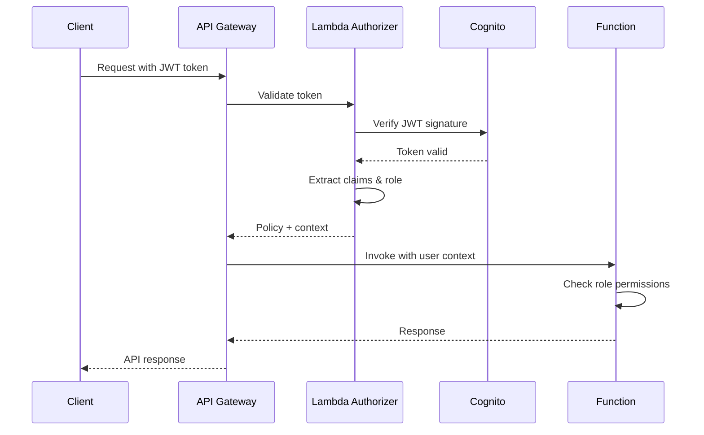

# Backend Architecture

## Service Architecture

### Function Organization

```text
api/src/functions/
├── auth/
│   ├── authorizer.ts       # Cognito JWT validation
│   └── refresh.ts          # Token refresh handler
├── instances/
│   ├── list.ts            # List all instances
│   ├── get.ts             # Get instance details
│   ├── reboot.ts          # Reboot instance
│   └── metrics.ts         # Get CloudWatch metrics
├── audit/
│   ├── list.ts            # List audit logs
│   └── write.ts           # Write audit entry
└── shared/
    ├── middleware/
    │   ├── errorHandler.ts
    │   ├── logger.ts
    │   └── validator.ts
    ├── services/
    │   ├── ec2Service.ts
    │   ├── dynamoService.ts
    │   └── cloudwatchService.ts
    └── utils/
        ├── response.ts
        └── constants.ts
```

### Function Template

```typescript
// api/src/functions/instances/reboot.ts
import { APIGatewayProxyHandler } from 'aws-lambda';
import { EC2Client, RebootInstancesCommand } from '@aws-sdk/client-ec2';
import { DynamoDBClient } from '@aws-sdk/client-dynamodb';
import { DynamoDBDocument } from '@aws-sdk/lib-dynamodb';
import { createResponse, createErrorResponse } from '@/shared/utils/response';
import { logger } from '@/shared/middleware/logger';
import { AuditService } from '@/shared/services/auditService';

const ec2Client = new EC2Client({ region: process.env.AWS_REGION });
const dynamoClient = DynamoDBDocument.from(new DynamoDBClient({}));
const auditService = new AuditService(dynamoClient);

export const handler: APIGatewayProxyHandler = async (event) => {
  const requestId = event.requestContext.requestId;
  const instanceId = event.pathParameters?.instanceId;
  const user = event.requestContext.authorizer?.claims;

  logger.info('Reboot request received', { requestId, instanceId, userId: user.sub });

  try {
    // Validate user role
    if (user['custom:role'] !== 'admin') {
      await auditService.logAction({
        userId: user.sub,
        userEmail: user.email,
        action: 'ACCESS_DENIED',
        resourceType: 'EC2_INSTANCE',
        resourceId: instanceId,
        details: { reason: 'Insufficient permissions' },
      });

      return createErrorResponse(403, 'FORBIDDEN', 'Admin role required');
    }

    // Reboot instance
    const command = new RebootInstancesCommand({
      InstanceIds: [instanceId],
    });

    await ec2Client.send(command);

    // Log audit
    await auditService.logAction({
      userId: user.sub,
      userEmail: user.email,
      action: 'REBOOT_INSTANCE',
      resourceType: 'EC2_INSTANCE',
      resourceId: instanceId,
      ipAddress: event.requestContext.identity.sourceIp,
    });

    logger.info('Instance reboot successful', { instanceId });

    return createResponse(200, {
      message: 'Instance reboot initiated successfully',
      instanceId,
    });
  } catch (error) {
    logger.error('Reboot failed', { error, instanceId });

    if (error.name === 'InvalidInstanceID.NotFound') {
      return createErrorResponse(404, 'NOT_FOUND', 'Instance not found');
    }

    return createErrorResponse(500, 'INTERNAL_ERROR', 'Failed to reboot instance');
  }
};
```

## Database Architecture

### Schema Design

```sql
-- Note: Using DynamoDB, showing conceptual schema
-- Primary Table: audit-logs
CREATE TABLE audit_logs (
  userId VARCHAR(128) NOT NULL,        -- Partition Key
  timestamp VARCHAR(30) NOT NULL,      -- Sort Key (ISO 8601)
  auditId VARCHAR(128) NOT NULL,
  userEmail VARCHAR(255) NOT NULL,
  action VARCHAR(50) NOT NULL,
  resourceType VARCHAR(50) NOT NULL,
  resourceId VARCHAR(255) NOT NULL,
  details JSON,
  ipAddress VARCHAR(45),
  userAgent TEXT,
  ttl BIGINT,                         -- Unix timestamp for auto-deletion
  PRIMARY KEY (userId, timestamp)
);

-- Global Secondary Index: action-index
CREATE INDEX action_index ON audit_logs (
  action,                              -- Partition Key
  timestamp                            -- Sort Key
);

-- Global Secondary Index: resource-index
CREATE INDEX resource_index ON audit_logs (
  resourceId,                          -- Partition Key
  timestamp                            -- Sort Key
);
```

### Data Access Layer

```typescript
// api/src/shared/services/auditService.ts
import { DynamoDBDocument } from '@aws-sdk/lib-dynamodb';
import { v4 as uuidv4 } from 'uuid';

export interface AuditEntry {
  userId: string;
  userEmail: string;
  action: string;
  resourceType: string;
  resourceId: string;
  details?: Record<string, any>;
  ipAddress?: string;
  userAgent?: string;
}

export class AuditService {
  private tableName = process.env.AUDIT_TABLE_NAME || 'audit-logs';

  constructor(private dynamoClient: DynamoDBDocument) {}

  async logAction(entry: AuditEntry): Promise<void> {
    const timestamp = new Date().toISOString();
    const ttl = Math.floor(Date.now() / 1000) + 30 * 24 * 60 * 60; // 30 days

    const item = {
      ...entry,
      auditId: uuidv4(),
      timestamp,
      ttl,
    };

    await this.dynamoClient.put({
      TableName: this.tableName,
      Item: item,
    });
  }

  async getAuditLogs(userId?: string, limit = 50, startDate?: string): Promise<AuditEntry[]> {
    if (userId) {
      // Query by userId (primary key)
      const response = await this.dynamoClient.query({
        TableName: this.tableName,
        KeyConditionExpression: 'userId = :userId',
        ExpressionAttributeValues: {
          ':userId': userId,
        },
        Limit: limit,
        ScanIndexForward: false, // Most recent first
      });

      return response.Items as AuditEntry[];
    } else {
      // Scan with filter (less efficient, use sparingly)
      const params: any = {
        TableName: this.tableName,
        Limit: limit,
      };

      if (startDate) {
        params.FilterExpression = 'timestamp >= :startDate';
        params.ExpressionAttributeValues = {
          ':startDate': startDate,
        };
      }

      const response = await this.dynamoClient.scan(params);
      return response.Items as AuditEntry[];
    }
  }

  async getAuditLogsByAction(action: string, limit = 50): Promise<AuditEntry[]> {
    const response = await this.dynamoClient.query({
      TableName: this.tableName,
      IndexName: 'action-index',
      KeyConditionExpression: 'action = :action',
      ExpressionAttributeValues: {
        ':action': action,
      },
      Limit: limit,
      ScanIndexForward: false,
    });

    return response.Items as AuditEntry[];
  }
}
```

## Authentication and Authorization

### Auth Flow



### Middleware/Guards

```typescript
// api/src/shared/middleware/authorizer.ts
import { APIGatewayTokenAuthorizerHandler } from 'aws-lambda';
import { CognitoJwtVerifier } from 'aws-jwt-verify';

const verifier = CognitoJwtVerifier.create({
  userPoolId: process.env.COGNITO_USER_POOL_ID!,
  tokenUse: 'access',
  clientId: process.env.COGNITO_CLIENT_ID!,
});

export const handler: APIGatewayTokenAuthorizerHandler = async (event) => {
  const token = event.authorizationToken.replace('Bearer ', '');

  try {
    const payload = await verifier.verify(token);

    return {
      principalId: payload.sub,
      policyDocument: {
        Version: '2012-10-17',
        Statement: [
          {
            Action: 'execute-api:Invoke',
            Effect: 'Allow',
            Resource: event.methodArn,
          },
        ],
      },
      context: {
        userId: payload.sub,
        email: payload.email,
        role: payload['custom:role'],
      },
    };
  } catch (error) {
    throw new Error('Unauthorized');
  }
};

// api/src/shared/middleware/roleGuard.ts
export const requireRole = (requiredRole: 'admin' | 'readonly') => {
  return (handler: APIGatewayProxyHandler): APIGatewayProxyHandler => {
    return async (event, context) => {
      const userRole = event.requestContext.authorizer?.claims['custom:role'];

      if (userRole !== requiredRole && userRole !== 'admin') {
        return createErrorResponse(403, 'FORBIDDEN', `${requiredRole} role required`);
      }

      return handler(event, context);
    };
  };
};
```
