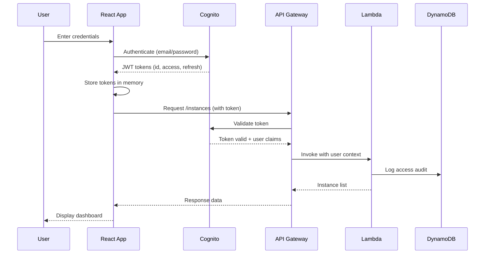
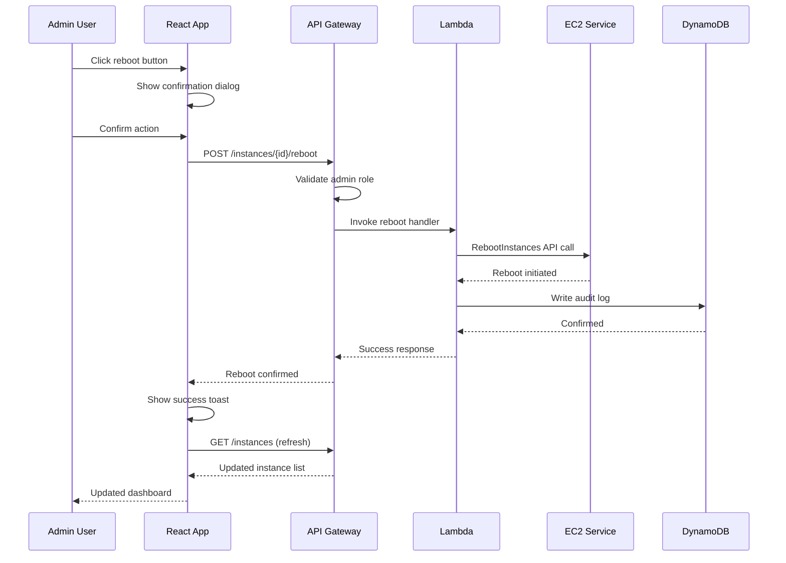
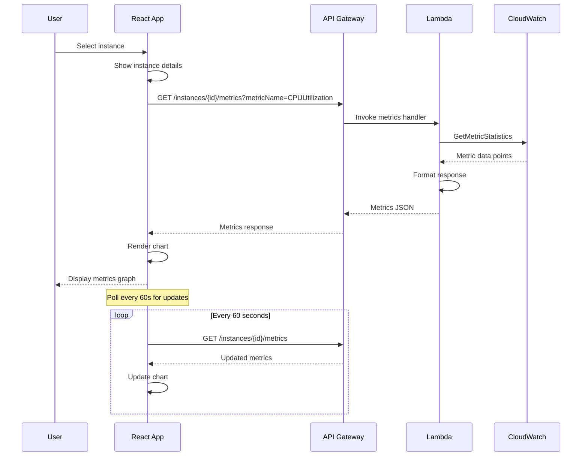
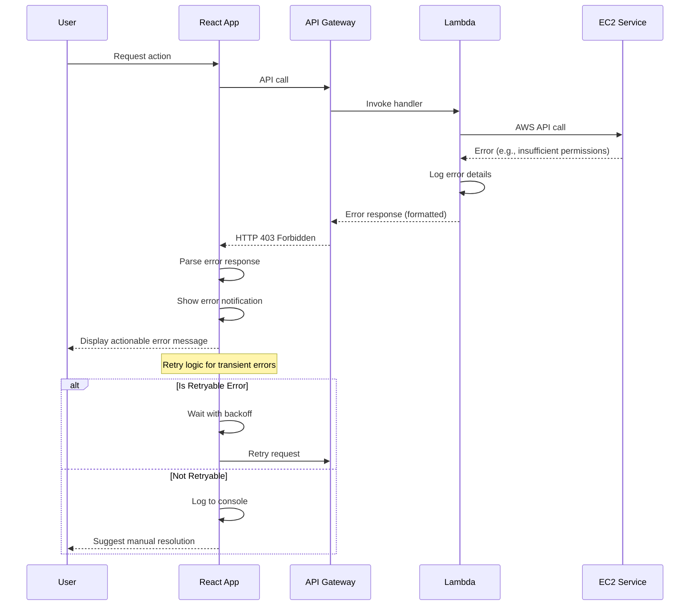

# Core Workflows

## User Authentication Flow

```mermaid
sequenceDiagram
    participant U as User
    participant UI as React App
    participant C as Cognito
    participant API as API Gateway
    participant L as Lambda
    participant D as DynamoDB

    U->>UI: Enter credentials
    UI->>C: Authenticate (email/password)
    C-->>UI: JWT tokens (id, access, refresh)
    UI->>UI: Store tokens in memory
    UI->>API: Request /instances (with token)
    API->>C: Validate token
    C-->>API: Token valid + user claims
    API->>L: Invoke with user context
    L->>D: Log access audit
    L-->>API: Instance list
    API-->>UI: Response data
    UI-->>U: Display dashboard
```

## Instance Reboot Flow (Admin)

```mermaid
sequenceDiagram
    participant U as Admin User
    participant UI as React App
    participant API as API Gateway
    participant L as Lambda
    participant EC2 as EC2 Service
    participant D as DynamoDB

    U->>UI: Click reboot button
    UI->>UI: Show confirmation dialog
    U->>UI: Confirm action
    UI->>API: POST /instances/{id}/reboot
    API->>API: Validate admin role
    API->>L: Invoke reboot handler
    L->>EC2: RebootInstances API call
    EC2-->>L: Reboot initiated
    L->>D: Write audit log
    D-->>L: Confirmed
    L-->>API: Success response
    API-->>UI: Reboot confirmed
    UI->>UI: Show success toast
    UI->>API: GET /instances (refresh)
    API-->>UI: Updated instance list
    UI-->>U: Updated dashboard
```

## Real-time Metrics Retrieval

```mermaid
sequenceDiagram
    participant U as User
    participant UI as React App
    participant API as API Gateway
    participant L as Lambda
    participant CW as CloudWatch

    U->>UI: Select instance
    UI->>UI: Show instance details
    UI->>API: GET /instances/{id}/metrics?metricName=CPUUtilization
    API->>L: Invoke metrics handler
    L->>CW: GetMetricStatistics
    CW-->>L: Metric data points
    L->>L: Format response
    L-->>API: Metrics JSON
    API-->>UI: Metrics response
    UI->>UI: Render chart
    UI-->>U: Display metrics graph

    Note over UI: Poll every 60s for updates
    loop Every 60 seconds
        UI->>API: GET /instances/{id}/metrics
        API-->>UI: Updated metrics
        UI->>UI: Update chart
    end
```

## Error Handling Flow

```mermaid
sequenceDiagram
    participant U as User
    participant UI as React App
    participant API as API Gateway
    participant L as Lambda
    participant EC2 as EC2 Service

    U->>UI: Request action
    UI->>API: API call
    API->>L: Invoke handler
    L->>EC2: AWS API call
    EC2-->>L: Error (e.g., insufficient permissions)
    L->>L: Log error details
    L-->>API: Error response (formatted)
    API-->>UI: HTTP 403 Forbidden
    UI->>UI: Parse error response
    UI->>UI: Show error notification
    UI-->>U: Display actionable error message

    Note over UI: Retry logic for transient errors
    alt Is Retryable Error
        UI->>UI: Wait with backoff
        UI->>API: Retry request
    else Not Retryable
        UI->>UI: Log to console
        UI-->>U: Suggest manual resolution
    end
```
