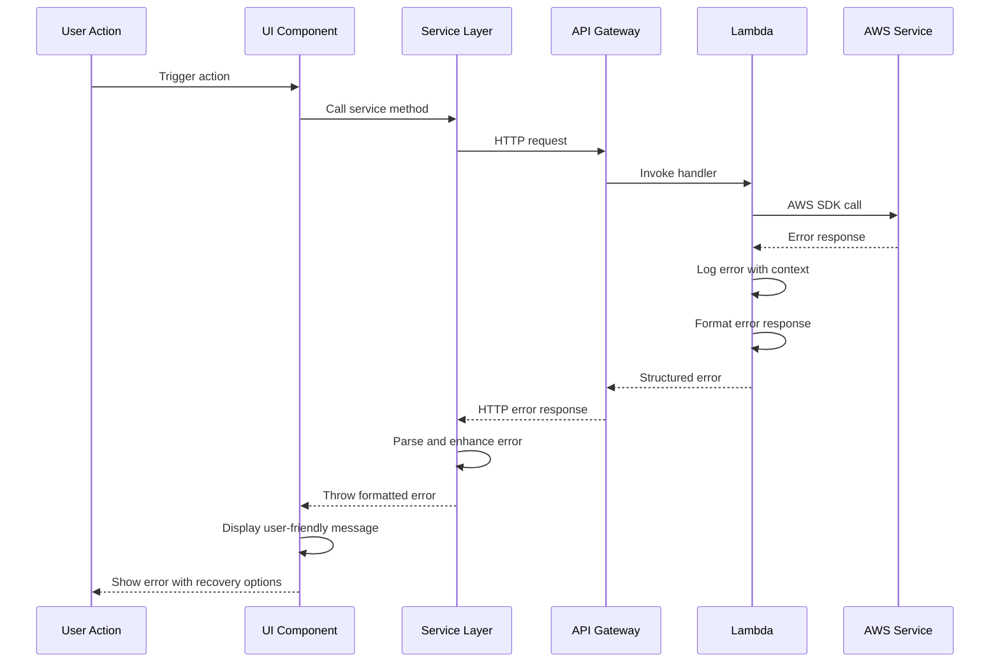

# Error Handling Strategy

## Error Flow



## Error Response Format

```typescript
interface ApiError {
  error: {
    code: string;
    message: string;
    details?: Record<string, any>;
    timestamp: string;
    requestId: string;
  };
}
```

## Frontend Error Handling

```typescript
// src/hooks/useErrorHandler.ts
export const useErrorHandler = () => {
  const { showNotification } = useNotification();

  const handleError = useCallback(
    (error: any) => {
      console.error('Error occurred:', error);

      let message = 'An unexpected error occurred';
      let severity: 'error' | 'warning' = 'error';

      if (error.code === 'NETWORK_ERROR') {
        message = 'Network connection failed. Please check your connection.';
      } else if (error.code === 'UNAUTHORIZED') {
        message = 'Your session has expired. Please login again.';
        // Redirect to login
      } else if (error.code === 'FORBIDDEN') {
        message = 'You do not have permission to perform this action.';
        severity = 'warning';
      } else if (error.message) {
        message = error.message;
      }

      showNotification({
        message,
        severity,
        action:
          error.code === 'NETWORK_ERROR'
            ? {
                label: 'Retry',
                onClick: () => window.location.reload(),
              }
            : undefined,
      });
    },
    [showNotification]
  );

  return { handleError };
};
```

## Backend Error Handling

```typescript
// api/src/shared/middleware/errorHandler.ts
export const errorHandler = (error: any, requestId: string): APIGatewayProxyResult => {
  logger.error('Request failed', {
    requestId,
    error: error.message,
    stack: error.stack,
    code: error.code,
  });

  const errorResponse: ApiError = {
    error: {
      code: error.code || 'INTERNAL_ERROR',
      message: error.message || 'An unexpected error occurred',
      timestamp: new Date().toISOString(),
      requestId,
    },
  };

  let statusCode = 500;

  if (error.code === 'VALIDATION_ERROR') statusCode = 400;
  if (error.code === 'UNAUTHORIZED') statusCode = 401;
  if (error.code === 'FORBIDDEN') statusCode = 403;
  if (error.code === 'NOT_FOUND') statusCode = 404;
  if (error.code === 'RATE_LIMIT') statusCode = 429;

  return {
    statusCode,
    headers: {
      'Content-Type': 'application/json',
      'X-Request-Id': requestId,
    },
    body: JSON.stringify(errorResponse),
  };
};
```
