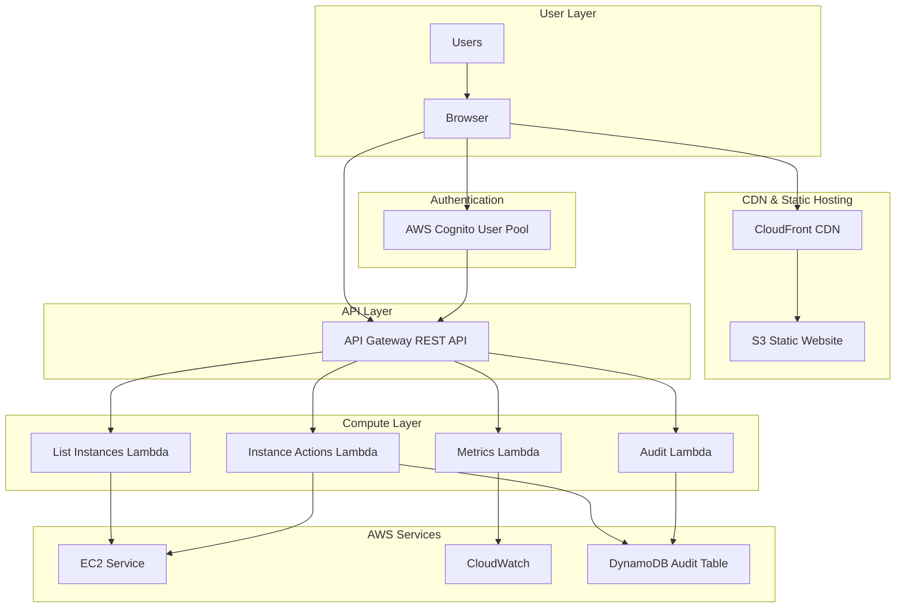

# High Level Architecture

## Technical Summary

The AWS EC2 Instance Management Platform employs a serverless, event-driven architecture using AWS managed services for the backend and a React-based single-page application for the frontend. The system leverages AWS Cognito for authentication, API Gateway with Lambda functions for business logic, and direct AWS SDK integration for EC2 operations. Frontend deployment utilizes S3 static hosting with CloudFront CDN for global distribution and optimal performance. The architecture prioritizes operational simplicity through serverless patterns while maintaining enterprise-grade security and scalability. This design achieves the PRD goals of 50% operational overhead reduction by eliminating server management and providing auto-scaling capabilities out of the box.

## Platform and Infrastructure Choice

**Platform:** AWS (Single Cloud Provider)
**Key Services:** Lambda, API Gateway, Cognito, S3, CloudFront, CloudWatch, DynamoDB, IAM
**Deployment Host and Regions:** us-east-1 (primary), with CloudFront global edge locations

## Repository Structure

**Structure:** Monorepo
**Monorepo Tool:** npm workspaces (built-in Node.js feature)
**Package Organization:** Separate packages for web (frontend), api (backend), shared (common types/utils), and infrastructure (CDK)

## High Level Architecture Diagram

## Architectural Patterns

- **Serverless Architecture:** Lambda functions for all compute needs - _Rationale:_ Eliminates server management overhead and provides automatic scaling
- **Static Site Generation:** React SPA hosted on S3/CloudFront - _Rationale:_ Maximum performance with global CDN distribution and no server requirements
- **API Gateway Pattern:** Single entry point for all backend APIs - _Rationale:_ Centralized authentication, rate limiting, and monitoring
- **Repository Pattern:** Abstract AWS SDK calls behind service interfaces - _Rationale:_ Enables unit testing and potential multi-cloud migration
- **Component-Based UI:** Reusable React components with TypeScript - _Rationale:_ Maintainability and type safety across the frontend codebase
- **Token-Based Authentication:** JWT tokens via Cognito - _Rationale:_ Stateless authentication that scales horizontally
- **Event-Driven Audit Logging:** Async DynamoDB writes for audit trails - _Rationale:_ Non-blocking audit logs that don't impact API performance
