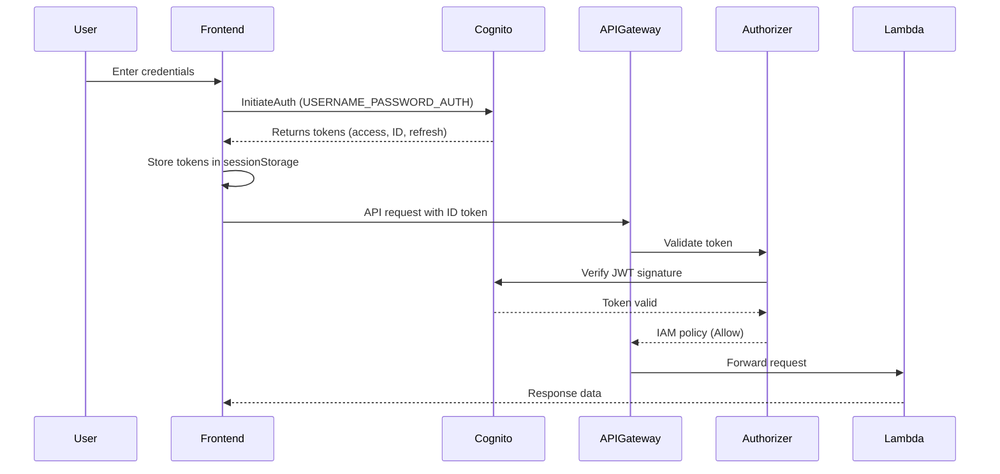

# Authentication Implementation Guide

## Overview

This document explains the authentication and authorization flow for the EC2 Instance Manager application, including a critical fix implemented to resolve token type mismatches between the frontend and backend.

## Architecture Components

### 1. AWS Cognito User Pool
- **Purpose**: Manages user authentication and issues JWT tokens
- **Token Types Issued**:
  - **Access Token**: Contains scopes and groups for API access
  - **ID Token**: Contains user identity claims (email, role, name, etc.)
  - **Refresh Token**: Used to obtain new access/ID tokens

### 2. Frontend Authentication Service (`apps/web/src/services/auth.ts`)
- **Purpose**: Handles login, logout, and token management
- **Key Methods**:
  - `login()`: Authenticates with Cognito using USER_PASSWORD_AUTH flow
  - `getIdToken()`: Returns the ID token for API calls
  - `getAccessToken()`: Returns the access token (not used for API auth)
  - `getCurrentUser()`: Retrieves user info from access token

### 3. API Gateway Custom Authorizer (`apps/api/src/functions/auth/authorizer.ts`)
- **Purpose**: Validates JWT tokens and generates IAM policies
- **Token Type**: Validates **ID tokens** (`tokenUse: 'id'`)
- **Claims Used**: email, custom:role, sub (user ID)

### 4. EC2 Service (`apps/web/src/services/ec2.ts`)
- **Purpose**: Makes authenticated API calls to backend
- **Authentication**: Sends ID token in Authorization header

## Authentication Flow



## Critical Fix: Token Type Mismatch

### Problem Identified
The application was experiencing authentication failures with the following symptoms:
1. Successful Cognito authentication (200 response)
2. 401 Unauthorized errors from API Gateway
3. Users redirected back to login page
4. Authorizer logs: "JWT string does not consist of exactly 3 parts"

### Root Cause
- **Authorizer Configuration**: Expected access tokens (`tokenUse: 'access'`)
- **Frontend Behavior**: Sent access tokens via `getAccessToken()`
- **Issue**: Access tokens don't contain the user claims (email, custom:role) needed by the authorizer

### Solution Implemented

#### 1. Authorizer Update
```typescript
// Before (INCORRECT)
verifier = CognitoJwtVerifier.create({
  userPoolId: config.userPoolId,
  tokenUse: 'access',  // Wrong token type
  clientId: config.clientId,
});

// After (CORRECT)
verifier = CognitoJwtVerifier.create({
  userPoolId: config.userPoolId,
  tokenUse: 'id',  // Correct token type for user claims
  clientId: config.clientId,
});
```

#### 2. Frontend Service Update
```typescript
// Before (INCORRECT)
private async makeRequest<T>(endpoint: string, options: RequestInit = {}): Promise<T> {
  const token = authService.getAccessToken();  // Wrong token
  // ...
}

// After (CORRECT)
private async makeRequest<T>(endpoint: string, options: RequestInit = {}): Promise<T> {
  const token = authService.getIdToken();  // Correct token with user claims
  // ...
}
```

## Token Types Explained

### Access Token
- **Purpose**: API access authorization
- **Contains**: Scopes, groups, client ID
- **Format**: JWT with limited claims
- **Use Case**: API rate limiting, OAuth scopes

### ID Token
- **Purpose**: User identity verification
- **Contains**: User attributes (email, name, custom claims)
- **Format**: JWT with full user profile
- **Use Case**: User identification, role-based access

### Why ID Tokens for API Authorization?

1. **User Claims**: ID tokens contain custom attributes like `custom:role` needed for authorization decisions
2. **User Context**: Provides full user context (email, name) for audit logging
3. **Standard Practice**: Common pattern for user-facing APIs requiring identity

## Token Storage

Tokens are stored in `sessionStorage` to ensure:
- Automatic cleanup on browser/tab close
- No persistence across sessions
- Security against XSS (still vulnerable but limited scope)

```typescript
// Token storage keys
const ACCESS_TOKEN_KEY = 'access_token';
const ID_TOKEN_KEY = 'id_token';
const REFRESH_TOKEN_KEY = 'refresh_token';

// Storage in sessionStorage
sessionStorage.setItem(ACCESS_TOKEN_KEY, tokens.accessToken);
sessionStorage.setItem(ID_TOKEN_KEY, tokens.idToken);
sessionStorage.setItem(REFRESH_TOKEN_KEY, tokens.refreshToken);
```

## Debugging Authentication Issues

### 1. Check Token Type
```javascript
// In browser console
const idToken = sessionStorage.getItem('id_token');
const accessToken = sessionStorage.getItem('access_token');

// Decode tokens (base64)
const decodeToken = (token) => {
  const parts = token.split('.');
  return {
    header: JSON.parse(atob(parts[0])),
    payload: JSON.parse(atob(parts[1]))
  };
};

console.log('ID Token Claims:', decodeToken(idToken));
console.log('Access Token Claims:', decodeToken(accessToken));
```

### 2. Verify Authorizer Logs
```bash
# View authorizer Lambda logs
aws logs tail /aws/lambda/ec2-manager-authorizer-dev --follow
```

### 3. Common Issues and Solutions

| Issue | Symptom | Solution |
|-------|---------|----------|
| Wrong token type | 401 Unauthorized | Ensure ID token is sent for API calls |
| Token expired | 401 after time | Implement token refresh logic |
| Missing claims | 403 Forbidden | Verify custom attributes in Cognito |
| CORS errors | Network failed | Check API Gateway CORS configuration |

## Security Considerations

1. **Never log tokens**: Remove token logging before production
2. **Use HTTPS only**: Tokens must only be transmitted over TLS
3. **Token expiration**: ID tokens expire after 1 hour by default
4. **Refresh strategy**: Implement automatic token refresh before expiration
5. **Logout cleanup**: Ensure all tokens are cleared on logout

## Environment Variables

### Frontend (.env)
```bash
VITE_COGNITO_USER_POOL_ID=us-west-2_xxxxx
VITE_COGNITO_CLIENT_ID=xxxxxxxxxxxxx
VITE_COGNITO_DOMAIN=https://ec2-manager-dev.auth.us-west-2.amazoncognito.com
VITE_AWS_REGION=us-west-2
VITE_API_URL=https://xxx.execute-api.us-west-2.amazonaws.com/dev
```

### Backend (Lambda Environment)
```bash
COGNITO_USER_POOL_ID=us-west-2_xxxxx
COGNITO_CLIENT_ID=xxxxxxxxxxxxx
```

## Testing Authentication

### Manual Testing
1. Open browser Developer Tools
2. Navigate to Network tab
3. Login with valid credentials
4. Check request to `/api/v1/instances`:
   - Authorization header should contain: `Bearer eyJ...` (ID token)
   - Response should be 200 OK (or 403 if no permissions, not 401)

### Automated Testing (Playwright)
```typescript
test('should successfully login and navigate to dashboard', async ({ page }) => {
  await page.goto('/login');
  await page.getByLabel(/email/i).fill('admin@ec2manager.com');
  await page.getByLabel(/password/i).fill('AdminPass123!');
  await page.getByRole('button', { name: /sign in/i }).click();

  // Verify navigation to dashboard
  await expect(page).toHaveURL(/\/dashboard$/);
  await expect(page.getByRole('heading', { name: /ec2 instances/i })).toBeVisible();
});
```

## Future Improvements

1. **Token Refresh**: Implement automatic token refresh before expiration
2. **Secure Storage**: Consider using secure cookie storage with httpOnly flag
3. **MFA Support**: Add multi-factor authentication support
4. **Session Management**: Add session timeout and activity monitoring
5. **Audit Logging**: Enhanced logging of authentication events

## References

- [AWS Cognito Token Documentation](https://docs.aws.amazon.com/cognito/latest/developerguide/amazon-cognito-user-pools-using-tokens-with-identity-providers.html)
- [JWT Token Debugger](https://jwt.io/)
- [API Gateway Custom Authorizers](https://docs.aws.amazon.com/apigateway/latest/developerguide/apigateway-use-lambda-authorizer.html)