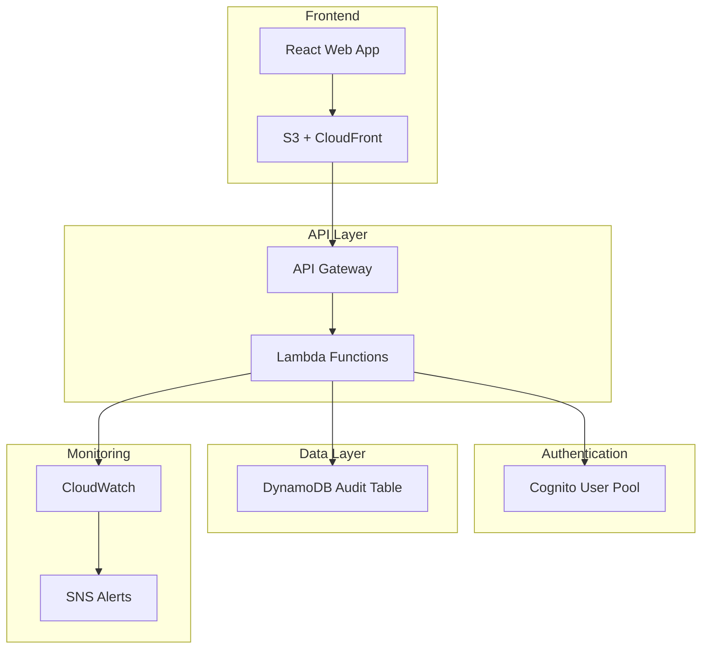

# EC2 Manager Developer Onboarding Guide

**Document Version:** 1.0
**Last Updated:** 2025-09-14
**Audience:** New development team members

## Welcome to EC2 Manager

This guide will help you get up and running with the EC2 Manager development environment, understand our infrastructure, and follow our DevOps processes.

## Table of Contents

1. [Prerequisites](#prerequisites)
2. [Development Environment Setup](#development-environment-setup)
3. [Project Structure](#project-structure)
4. [Infrastructure Overview](#infrastructure-overview)
5. [Development Workflow](#development-workflow)
6. [Testing Guidelines](#testing-guidelines)
7. [Deployment Process](#deployment-process)
8. [Monitoring and Debugging](#monitoring-and-debugging)
9. [Common Tasks](#common-tasks)
10. [Troubleshooting](#troubleshooting)
11. [Resources and Documentation](#resources-and-documentation)

## Prerequisites

Before starting development, ensure you have the following tools and accounts:

### Required Tools

```bash
# Node.js and package management
node --version  # Required: v20.x
npm --version   # Required: v10.x+

# Git
git --version   # Required: v2.30+

# AWS CLI
aws --version   # Required: v2.0+

# Optional but recommended
jq --version    # JSON processing
curl --version  # API testing
```

### Required Accounts and Access

- **GitHub Account:** With access to the project repository
- **AWS Account:** Development environment access (provided by DevOps team)
- **Slack:** Team communication and alerts
- **SonarCloud:** Code quality reports (optional)

### Development Tools (Recommended)

```bash
# Visual Studio Code with extensions
code --list-extensions | grep -E "(eslint|prettier|typescript|aws-toolkit)"

# Recommended extensions:
# - ESLint
# - Prettier
# - TypeScript
# - AWS Toolkit
# - GitLens
# - Thunder Client (for API testing)
```

## Development Environment Setup

### 1. Repository Setup

```bash
# Clone the repository
git clone https://github.com/company/ec2-manager.git
cd ec2-manager

# Install dependencies
npm install

# Verify installation
npm run build
npm run test
```

### 2. AWS Configuration

**Set up AWS CLI profiles:**

```bash
# Configure AWS CLI with development credentials
aws configure --profile ec2-manager-dev
# AWS Access Key ID: [provided by DevOps]
# AWS Secret Access Key: [provided by DevOps]
# Default region: us-west-2
# Default output format: json

# Test AWS access
aws sts get-caller-identity --profile ec2-manager-dev
```

**Environment file setup:**

```bash
# Copy environment template
cp .env.example .env.dev

# Update with your settings
cat .env.dev
```

```env
# Development environment settings
NODE_ENV=development
ENVIRONMENT=dev
AWS_PROFILE=ec2-manager-dev
AWS_REGION=us-west-2

# Development-specific overrides
LOG_LEVEL=debug
```

### 3. Infrastructure Setup

**Initialize CDK (first time only):**

```bash
cd infrastructure

# Install CDK dependencies
npm install

# Bootstrap CDK (if not already done)
npx cdk bootstrap --profile ec2-manager-dev

# Deploy development infrastructure
npm run deploy -- --context environment=dev --profile ec2-manager-dev
```

**Verify infrastructure deployment:**

```bash
# Check CloudFormation stack
aws cloudformation describe-stacks \
  --stack-name EC2Manager-dev \
  --region us-west-2 \
  --profile ec2-manager-dev

# Run deployment status check
./scripts/deployment-status.sh dev all ec2-manager-dev
```

### 4. Development Server Setup

```bash
# Start development servers
npm run dev:api     # API server (if applicable)
npm run dev:web     # Web development server
```

**Verify development setup:**

```bash
# Test API endpoints (once implemented)
curl -f http://localhost:3000/health

# Test web application
open http://localhost:3001  # or appropriate port
```

## Project Structure

Understanding the project structure is crucial for effective development:

```
ec2-manager/
├── .github/
│   └── workflows/          # CI/CD workflow definitions
│       ├── ci.yml         # Main CI/CD pipeline
│       ├── infrastructure.yml
│       ├── pr-validation.yml
│       └── notifications.yml
├── apps/
│   ├── api/               # Backend API (future)
│   └── web/               # Frontend web application (future)
├── infrastructure/        # AWS CDK infrastructure code
│   ├── bin/
│   │   └── app.ts        # CDK app entry point
│   ├── lib/
│   │   ├── app-stack.ts  # Main infrastructure stack
│   │   └── monitoring-stack.ts
│   ├── config/           # Environment configurations
│   │   ├── dev.json
│   │   ├── staging.json
│   │   └── prod.json
│   └── tests/            # Infrastructure tests
├── scripts/              # Operational scripts
│   ├── provision-env.sh  # Environment provisioning
│   ├── rollback.sh      # Rollback procedures
│   └── deployment-status.sh
├── docs/                 # Documentation
└── shared/              # Shared utilities and types (future)
```

### Key Files and Their Purposes

| File/Directory | Purpose | When to Modify |
|----------------|---------|----------------|
| `.github/workflows/` | CI/CD pipeline definitions | Rarely, with DevOps approval |
| `infrastructure/lib/` | Infrastructure as Code | Infrastructure changes only |
| `infrastructure/config/` | Environment settings | Environment-specific config |
| `scripts/` | Operational scripts | Deployment/maintenance tasks |
| `package.json` | Dependencies and scripts | Adding new dependencies |

## Infrastructure Overview

### Architecture Components

The EC2 Manager uses a serverless architecture on AWS:



### Environment Mapping

| Environment | AWS Account | Purpose | Access Level |
|-------------|-------------|---------|--------------|
| **Development** | Dev Account | Feature development | Full access |
| **Staging** | Staging Account | Pre-production testing | Read access |
| **Production** | Prod Account | Live system | No direct access |

### AWS Services Used

| Service | Purpose | Developer Access |
|---------|---------|------------------|
| **Lambda** | Serverless functions | View logs, test locally |
| **API Gateway** | REST API management | View configuration |
| **DynamoDB** | Audit trail storage | Query data (dev only) |
| **S3** | Static web hosting | Upload test files |
| **CloudFront** | CDN and caching | View configurations |
| **Cognito** | User authentication | Test authentication flows |
| **CloudWatch** | Monitoring and logging | View metrics and logs |

## Development Workflow

### Git Workflow

We use **GitFlow** with specific branch naming conventions:

```bash
# Branch naming conventions
feature/JIRA-123-user-authentication
bugfix/JIRA-456-fix-login-error
hotfix/JIRA-789-security-patch
```

### Development Process

**1. Starting a New Feature:**

```bash
# Create and switch to feature branch
git checkout develop
git pull origin develop
git checkout -b feature/JIRA-123-new-feature

# Make your changes
# ... development work ...

# Commit with conventional format
git add .
git commit -m "feat: add user authentication endpoint

- Add Cognito integration
- Implement JWT token validation
- Add error handling for auth failures

Closes JIRA-123"
```

**2. Code Quality Checks:**

```bash
# Run locally before pushing
npm run lint          # ESLint checks
npm run format        # Prettier formatting
npm run type-check    # TypeScript validation
npm run test          # Run all tests
npm run build         # Verify build succeeds
```

**3. Infrastructure Changes:**

```bash
# For infrastructure modifications
cd infrastructure

# Check what will change
npm run diff -- --context environment=dev

# Test in development
npm run deploy -- --context environment=dev

# Verify changes
./scripts/deployment-status.sh dev infrastructure
```

**4. Pull Request Process:**

```bash
# Push feature branch
git push origin feature/JIRA-123-new-feature

# Create PR via GitHub UI
# - Use PR template
# - Add appropriate labels
# - Request review from team lead
```

### Code Review Process

**Review Checklist:**
- [ ] Code follows project conventions
- [ ] Tests are included and passing
- [ ] Documentation is updated
- [ ] Security considerations addressed
- [ ] Performance impact assessed
- [ ] Infrastructure changes reviewed by DevOps

**Automated PR Validation:**
- Quick validation (linting, type checking)
- Security scanning (secrets, vulnerabilities)
- Test execution (unit, integration)
- Bundle size analysis

## Testing Guidelines

### Testing Strategy

We follow the **Testing Pyramid** approach:

```
        /\
       /  \
      / E2E \     10% - End-to-end tests
     /______\
    /        \
   /Integration\ 20% - Integration tests
  /____________\
 /              \
/   Unit Tests   \ 70% - Unit tests
/__________________\
```

### Unit Testing

**Framework:** Jest with TypeScript support

**Example Infrastructure Test:**

```typescript
// infrastructure/tests/unit/app-stack.test.ts
import { App, Stack } from 'aws-cdk-lib';
import { Template } from 'aws-cdk-lib/assertions';
import { AppStack } from '../../lib/app-stack';

describe('AppStack', () => {
  let app: App;
  let stack: AppStack;
  let template: Template;

  beforeEach(() => {
    app = new App();
    stack = new AppStack(app, 'TestStack', { environment: 'test' });
    template = Template.fromStack(stack);
  });

  test('creates VPC with correct CIDR', () => {
    template.hasResourceProperties('AWS::EC2::VPC', {
      CidrBlock: '10.0.0.0/16',
      EnableDnsHostnames: true,
      EnableDnsSupport: true,
    });
  });

  test('creates DynamoDB table with encryption', () => {
    template.hasResourceProperties('AWS::DynamoDB::Table', {
      SSESpecification: {
        SSEEnabled: true,
      },
    });
  });
});
```

**Running Tests:**

```bash
# Run all tests
npm run test

# Run specific test suite
npm run test:infra
npm run test:api    # When API is implemented
npm run test:web    # When web app is implemented

# Run with coverage
npm run test:coverage

# Watch mode for development
npm run test:watch
```

### Integration Testing

**Infrastructure Integration Tests:**

```bash
# Run integration tests (may deploy temporary resources)
npm run test:integration

# These tests will:
# - Deploy a test stack
# - Validate resource creation
# - Test resource interactions
# - Clean up resources
```

### Testing Best Practices

**1. Test Naming Convention:**
```typescript
describe('ComponentName', () => {
  describe('when condition', () => {
    test('should expected behavior', () => {
      // Test implementation
    });
  });
});
```

**2. Infrastructure Test Patterns:**
```typescript
// Test for resource existence
template.resourceCountIs('AWS::Lambda::Function', 2);

// Test for specific properties
template.hasResourceProperties('AWS::S3::Bucket', {
  BucketEncryption: {
    ServerSideEncryptionConfiguration: [{
      ServerSideEncryptionByDefault: {
        SSEAlgorithm: 'AES256'
      }
    }]
  }
});

// Test for resource relationships
template.hasResource('AWS::IAM::Role', {
  Properties: Match.objectLike({
    AssumeRolePolicyDocument: Match.anyValue()
  })
});
```

**3. Mock External Dependencies:**
```typescript
// Mock AWS SDK calls
jest.mock('@aws-sdk/client-dynamodb');
const mockDynamoDB = DynamoDBClient as jest.MockedClass<typeof DynamoDBClient>;
```

## Deployment Process

### Local Development Deployment

**Deploy to Development Environment:**

```bash
# Quick deployment script
./scripts/provision-env.sh dev

# Or manual steps
cd infrastructure
npm run deploy -- --context environment=dev --profile ec2-manager-dev
```

### CI/CD Pipeline Deployment

**Automatic Deployments:**
- **Push to `develop`** → Deploys to staging
- **Push to `main`** → Deploys to production (with approval)

**Manual Deployment Triggers:**
```bash
# Trigger deployment via GitHub Actions
# (Push to appropriate branch or use GitHub CLI)
gh workflow run "CI/CD Pipeline" --ref develop
```

### Deployment Validation

**Post-Deployment Checks:**

```bash
# Check deployment status
./scripts/deployment-status.sh <environment> all

# Expected output:
# ✅ AWS connectivity: OK
# ✅ CloudFormation stack: UPDATE_COMPLETE
# ✅ DynamoDB table: ACTIVE
# ✅ S3 bucket: EXISTS
# ✅ API Gateway: EXISTS
```

**Health Check Endpoints:**
```bash
# API health check (when implemented)
curl -f https://api-dev.ec2manager.local/health

# Web application check
curl -f https://dev.ec2manager.local/
```

## Monitoring and Debugging

### CloudWatch Integration

**Accessing Logs:**

```bash
# View Lambda function logs
aws logs tail /aws/lambda/ec2-manager-function-dev \
  --follow \
  --profile ec2-manager-dev

# View API Gateway logs
aws logs tail API-Gateway-Execution-Logs_<api-id>/dev \
  --follow \
  --profile ec2-manager-dev
```

**CloudWatch Dashboard:**
- Navigate to AWS Console → CloudWatch → Dashboards
- Look for `EC2Manager-Enhanced-dev` dashboard

### Local Debugging

**Infrastructure Debugging:**

```bash
# Debug CDK synthesis
cd infrastructure
npm run synth -- --context environment=dev --debug

# Verbose CDK deployment
npm run deploy -- --context environment=dev --debug --verbose
```

**Application Debugging:**
```bash
# Debug mode with detailed logging
NODE_ENV=development LOG_LEVEL=debug npm run dev

# Enable AWS SDK debugging
AWS_SDK_DEBUG=1 npm run dev
```

### Common Debugging Scenarios

**1. Stack Deployment Failures:**
```bash
# Check CloudFormation events
aws cloudformation describe-stack-events \
  --stack-name EC2Manager-dev \
  --profile ec2-manager-dev

# Check CDK diff for changes
cd infrastructure
npm run diff -- --context environment=dev
```

**2. Lambda Function Issues:**
```bash
# Test Lambda function locally (when implemented)
sam local invoke FunctionName \
  --event test-events/api-gateway-event.json

# Check function configuration
aws lambda get-function \
  --function-name ec2-manager-function-dev \
  --profile ec2-manager-dev
```

**3. API Gateway Issues:**
```bash
# Test API endpoints
curl -v https://<api-id>.execute-api.us-west-2.amazonaws.com/dev/health

# Check API Gateway logs in CloudWatch
```

## Common Tasks

### Adding New Infrastructure Resources

**1. Modify CDK Stack:**

```typescript
// infrastructure/lib/app-stack.ts
// Add new resource
const newResource = new aws-service.ResourceType(this, `NewResource-${env}`, {
  // Resource configuration
});

// Export resource if needed
this.newResource = newResource;
```

**2. Add Tests:**

```typescript
// infrastructure/tests/unit/app-stack.test.ts
test('creates new resource with correct configuration', () => {
  template.hasResourceProperties('AWS::Service::ResourceType', {
    PropertyName: 'ExpectedValue',
  });
});
```

**3. Update Configuration:**

```json
// infrastructure/config/dev.json
{
  "newResource": {
    "enabled": true,
    "configuration": "dev-specific-value"
  }
}
```

**4. Deploy and Test:**

```bash
cd infrastructure
npm run diff -- --context environment=dev
npm run deploy -- --context environment=dev
npm run test
```

### Adding New Environment Variables

**1. Update Environment Config:**

```json
// infrastructure/config/dev.json
{
  "newFeature": {
    "apiKey": "dev-api-key",
    "enabled": true
  }
}
```

**2. Update Lambda Environment (if applicable):**

```typescript
// In Lambda function definition
environment: {
  NEW_FEATURE_API_KEY: config.newFeature.apiKey,
  NEW_FEATURE_ENABLED: config.newFeature.enabled.toString(),
}
```

### Running Infrastructure Tests

**Unit Tests:**
```bash
cd infrastructure
npm run test:unit

# Specific test file
npm run test -- app-stack.test.ts
```

**Integration Tests:**
```bash
npm run test:integration

# With specific environment
npm run test:integration -- --testTimeout=300000
```

### Viewing Metrics and Logs

**CloudWatch Metrics:**
```bash
# Get API Gateway metrics
aws cloudwatch get-metric-statistics \
  --namespace AWS/ApiGateway \
  --metric-name Count \
  --dimensions Name=ApiName,Value=ec2-manager-api-dev \
  --start-time 2025-09-14T00:00:00Z \
  --end-time 2025-09-14T23:59:59Z \
  --period 3600 \
  --statistics Sum \
  --profile ec2-manager-dev
```

**Custom Metrics:**
```bash
# View custom business metrics
aws cloudwatch get-metric-statistics \
  --namespace EC2Manager/Operations \
  --metric-name InstanceStart \
  --start-time 2025-09-14T00:00:00Z \
  --end-time 2025-09-14T23:59:59Z \
  --period 3600 \
  --statistics Sum \
  --profile ec2-manager-dev
```

## Troubleshooting

### Common Issues and Solutions

**1. CDK Bootstrap Issues:**

```bash
# Error: "Need to perform AWS CDK bootstrap"
# Solution:
npx cdk bootstrap aws://ACCOUNT-ID/us-west-2 --profile ec2-manager-dev
```

**2. Permission Denied Errors:**

```bash
# Error: "User: ... is not authorized to perform: ..."
# Solutions:
# 1. Check AWS profile configuration
aws configure list --profile ec2-manager-dev

# 2. Verify IAM permissions with DevOps team
# 3. Ensure you're using the correct environment
```

**3. Stack Update Failures:**

```bash
# Error: "Resource ... already exists"
# Solution:
cd infrastructure
npm run diff -- --context environment=dev
# Review changes and resolve conflicts

# If needed, import existing resources
# Contact DevOps team for assistance
```

**4. Test Failures:**

```bash
# Error: Tests failing due to environment issues
# Solutions:
# 1. Ensure AWS credentials are configured
# 2. Check if development stack is deployed
./scripts/deployment-status.sh dev infrastructure

# 3. Clear node_modules and reinstall
rm -rf node_modules package-lock.json
npm install
```

**5. Network/Timeout Issues:**

```bash
# Error: Connection timeouts or network errors
# Solutions:
# 1. Check VPN connection (if required)
# 2. Verify AWS region settings
# 3. Check security group configurations
aws ec2 describe-security-groups \
  --group-names default \
  --profile ec2-manager-dev
```

### Getting Help

**Escalation Path:**
1. **First:** Check this documentation and project README
2. **Second:** Search team Slack channels for similar issues
3. **Third:** Ask in #engineering-support Slack channel
4. **Fourth:** Contact DevOps team lead
5. **Last Resort:** Create GitHub issue with detailed error logs

**When Asking for Help, Include:**
- Exact error message or output
- Steps to reproduce the issue
- Your environment (OS, Node version, AWS profile)
- Recent changes you made
- Screenshots if relevant

## Resources and Documentation

### Internal Documentation

| Document | Purpose | Location |
|----------|---------|----------|
| **Infrastructure Architecture** | System design and AWS resources | `/docs/infrastructure-architecture.md` |
| **DevOps Process Documentation** | CI/CD and operational procedures | `/docs/devops-process-documentation.md` |
| **Operations Runbook** | Troubleshooting and maintenance | `/docs/operations-runbook.md` |
| **API Documentation** | API endpoints and usage | `/docs/api-documentation.md` (future) |

### External Resources

**AWS Documentation:**
- [AWS CDK Developer Guide](https://docs.aws.amazon.com/cdk/v2/guide/)
- [AWS Lambda Developer Guide](https://docs.aws.amazon.com/lambda/latest/dg/)
- [Amazon API Gateway Developer Guide](https://docs.aws.amazon.com/apigateway/latest/developerguide/)
- [Amazon DynamoDB Developer Guide](https://docs.aws.amazon.com/amazondynamodb/latest/developerguide/)

**Development Tools:**
- [TypeScript Handbook](https://www.typescriptlang.org/docs/)
- [Jest Testing Framework](https://jestjs.io/docs/getting-started)
- [ESLint Configuration](https://eslint.org/docs/user-guide/getting-started)
- [Prettier Code Formatter](https://prettier.io/docs/en/index.html)

### Team Contacts

| Role | Contact | Slack | Availability |
|------|---------|-------|--------------|
| **Tech Lead** | tech-lead@company.com | @tech.lead | 9 AM - 6 PM PST |
| **DevOps Lead** | devops-lead@company.com | @devops.lead | 8 AM - 5 PM PST |
| **Engineering Manager** | eng-manager@company.com | @eng.manager | 9 AM - 7 PM PST |

### Slack Channels

- `#ec2-manager-dev` - Development discussions
- `#engineering-support` - Technical help and questions
- `#devops-alerts` - Deployment and infrastructure notifications
- `#random` - General team chat

### Quick Reference Commands

**Development Setup:**
```bash
# Full development environment setup
git clone https://github.com/company/ec2-manager.git
cd ec2-manager
npm install
./scripts/provision-env.sh dev
```

**Daily Development:**
```bash
# Start development
npm run dev

# Run tests
npm run test

# Check code quality
npm run lint && npm run format && npm run type-check
```

**Infrastructure Management:**
```bash
# Deploy changes
cd infrastructure && npm run deploy -- --context environment=dev

# Check status
./scripts/deployment-status.sh dev all

# View diff
cd infrastructure && npm run diff -- --context environment=dev
```

**Debugging:**
```bash
# View logs
aws logs tail /aws/lambda/function-name --follow --profile ec2-manager-dev

# Check CloudFormation
aws cloudformation describe-stacks --stack-name EC2Manager-dev --profile ec2-manager-dev
```

---

**Welcome to the team! 🚀**

This guide should get you started with EC2 Manager development. Remember that infrastructure and DevOps practices evolve, so always refer to the latest documentation and don't hesitate to ask questions.

For your first week, we recommend:
1. Complete the development environment setup
2. Deploy to your development environment
3. Run through the test suite
4. Review the infrastructure architecture document
5. Make a small change and go through the full development workflow

Good luck and happy coding!

---

_Document Version: 1.0_
_Last Updated: 2025-09-14_
_Next Review: 2025-12-14_