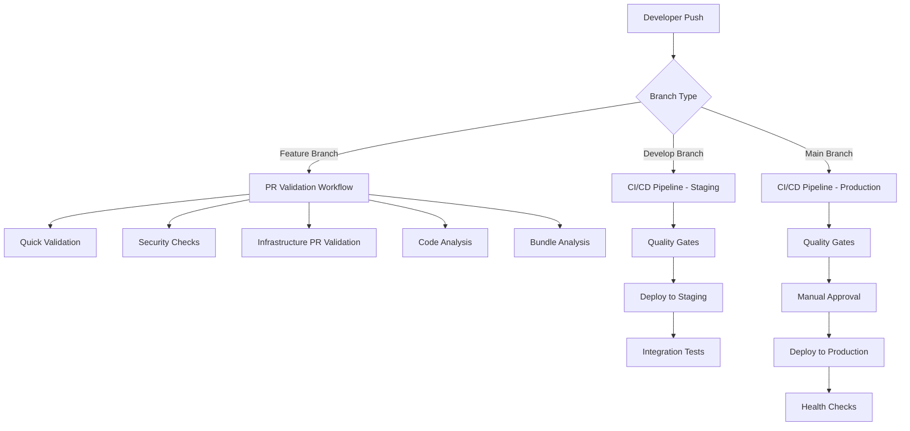
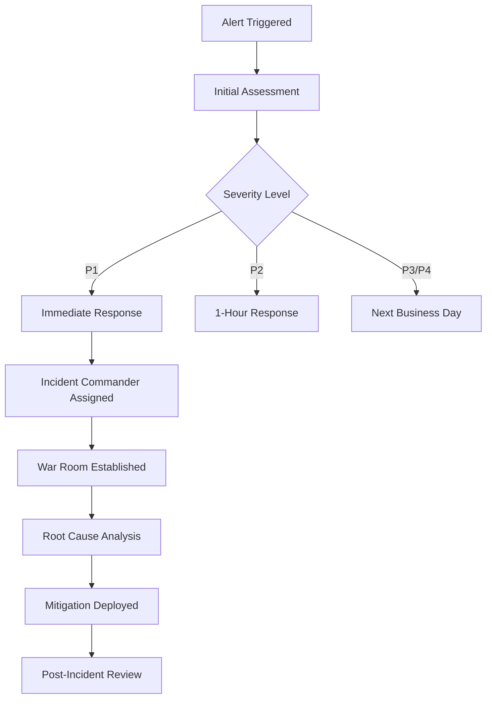

# EC2 Manager DevOps Process Documentation

**Document Version:** 1.0
**Last Updated:** 2025-09-14
**Review Cycle:** Quarterly

## Overview

This document describes the comprehensive DevOps processes, workflows, and operational procedures for the EC2 Manager application. It covers CI/CD pipelines, deployment strategies, testing frameworks, monitoring, and incident response procedures.

## Table of Contents

1. [CI/CD Workflow Architecture](#cicd-workflow-architecture)
2. [GitHub Actions Workflows](#github-actions-workflows)
3. [Deployment Procedures](#deployment-procedures)
4. [Testing Framework](#testing-framework)
5. [Environment Management](#environment-management)
6. [Monitoring and Alerting](#monitoring-and-alerting)
7. [Incident Response](#incident-response)
8. [Security and Compliance](#security-and-compliance)
9. [Operational Procedures](#operational-procedures)
10. [Rollback and Recovery](#rollback-and-recovery)

## CI/CD Workflow Architecture

### Pipeline Overview

The EC2 Manager uses a sophisticated multi-workflow CI/CD approach with GitHub Actions, designed for reliability, security, and rapid feedback cycles.



### Workflow Triggers

| Workflow | Trigger | Purpose |
|----------|---------|---------|
| **PR Validation** | Pull request to `main`/`develop` | Fast feedback on code quality |
| **CI/CD Pipeline** | Push to `main`/`develop` | Full deployment pipeline |
| **Infrastructure** | Changes to `infrastructure/` | Infrastructure-focused validation |
| **Notifications** | Workflow completion | Status notifications and reporting |

### Quality Gates

All code must pass through sequential quality gates:

1. **Lint and Format Gate**
   - ESLint validation
   - Prettier formatting check
   - TypeScript compilation

2. **Testing Gate**
   - Unit tests (80% coverage minimum)
   - Integration tests
   - Infrastructure tests

3. **Security Gate**
   - npm audit (high severity vulnerabilities block deployment)
   - Snyk security scanning
   - Secrets detection

4. **Build Validation Gate**
   - Multi-workspace build validation
   - CDK synthesis validation
   - Bundle size analysis

## GitHub Actions Workflows

### 1. CI/CD Pipeline (`/.github/workflows/ci.yml`)

**Primary deployment workflow handling the complete application lifecycle.**

**Key Features:**
- Parallel quality gates for fast feedback
- Environment-specific deployments
- Automated rollback on failure
- Comprehensive testing coverage

**Workflow Stages:**

```yaml
stages:
  quality_gates:      # Parallel execution
    - lint-and-format
    - test-api
    - test-web
    - test-infrastructure
    - security-scan

  build_validation:   # Depends on quality gates
    - build-all-workspaces
    - cdk-synth-validation

  deployment:         # Sequential by environment
    - deploy-staging  # develop branch only
    - deploy-production # main branch with manual approval
```

**Environment Variables:**
```bash
NODE_VERSION: '20.x'
AWS_REGION: us-west-2
```

**Secrets Required:**
- `AWS_ACCESS_KEY_ID` / `AWS_SECRET_ACCESS_KEY` (staging)
- `PROD_AWS_ACCESS_KEY_ID` / `PROD_AWS_SECRET_ACCESS_KEY` (production)
- `SNYK_TOKEN` for security scanning
- `SLACK_WEBHOOK_URL` for notifications

### 2. Infrastructure Deployment (`/.github/workflows/infrastructure.yml`)

**Specialized workflow for infrastructure changes with enhanced validation.**

**Trigger Conditions:**
- Changes to `infrastructure/` directory
- Changes to the infrastructure workflow file
- Pull requests affecting infrastructure

**Specialized Validation:**
```bash
# Security checks for infrastructure
grep -r "AKIA\|password\|secret" lib/ bin/

# Compliance checks
npm run synth | grep -q "ManagedBy.*CDK"
npm run synth | grep -q "SSEEnabled.*true"
```

**Environment Progression:**
- Development → Staging → Production
- Each with appropriate AWS credentials
- Enhanced validation for production deployments

### 3. Pull Request Validation (`/.github/workflows/pr-validation.yml`)

**Fast feedback workflow for pull request validation.**

**Validation Categories:**

**Quick Validation (< 2 minutes):**
- Lint checks
- Type checking
- Basic build validation

**Security Validation:**
- Hardcoded secrets detection
- Sensitive file type checking
- Environment file validation

**Infrastructure PR Validation:**
- CDK diff analysis with impact assessment
- Resource change detection
- Destructive operation warnings

**Code Quality Analysis:**
- Comprehensive test execution
- SonarCloud static analysis
- Codecov coverage reporting

**Bundle Analysis:**
- Build size impact assessment
- Large file detection (> 1MB)
- Performance impact evaluation

### 4. Deployment Notifications (`/.github/workflows/notifications.yml`)

**Comprehensive notification system for deployment events.**

**Notification Channels:**
- **Slack Integration:** Rich formatted messages with deployment status
- **Microsoft Teams:** Alternative notification channel
- **GitHub Deployments:** Native GitHub deployment tracking
- **Email Notifications:** Production deployments only

**Notification Content:**
```json
{
  "environment": "production",
  "status": "success|failure|cancelled",
  "branch": "main",
  "author": "developer-name",
  "commit": "sha-hash",
  "workflow_url": "github-actions-url"
}
```

**Special Handling:**
- **Rollback Notifications:** Critical production failures
- **Health Check Results:** Post-deployment validation
- **Deployment Status Tracking:** GitHub deployment API integration

## Deployment Procedures

### Environment-Specific Deployment Process

#### Development Environment

**Trigger:** Any push to `develop` branch
**Approval:** Automatic (no manual intervention)
**Deployment Steps:**

```bash
# 1. Infrastructure Deployment
cd infrastructure
npm run deploy -- --context environment=dev --require-approval never

# 2. Application Build and Deploy
npm run build:web
aws s3 sync apps/web/dist/ s3://ec2-manager-web-dev-${ACCOUNT_ID}/

# 3. Cache Invalidation
aws cloudfront create-invalidation --distribution-id ${DEV_CLOUDFRONT_ID} --paths "/*"
```

**Health Checks:**
- Basic API connectivity test
- CloudFormation stack status verification

#### Staging Environment

**Trigger:** Successful development deployment from `develop` branch
**Approval:** Automatic after successful tests
**Enhanced Validation:**

```bash
# Extended health checks with retry logic
curl -f https://api-staging.ec2manager.local/health || exit 1

# Integration test execution
npm run test:integration:staging
```

**Smoke Tests:**
- API endpoint availability
- Authentication flow validation
- Database connectivity verification

#### Production Environment

**Trigger:** Push to `main` branch
**Approval:** Manual approval required (GitHub Environments)
**Pre-deployment Validation:**

```bash
# Production readiness checks
npm run synth -- --context environment=production | grep -q "RemovalPolicy.*RETAIN"
```

**Deployment Process:**
1. Manual approval gate (DevOps Lead/Engineering Manager)
2. Infrastructure deployment with extra validation
3. Application deployment with blue-green simulation
4. Comprehensive health checks
5. Success notification to team channels

**Post-deployment:**
- 30-second service stabilization period
- Health check validation
- Performance baseline comparison
- Success/failure notification dispatch

### Deployment Scripts

#### Environment Provisioning (`/scripts/provision-env.sh`)

**Comprehensive environment setup and deployment script.**

**Usage:**
```bash
./scripts/provision-env.sh <environment> [aws-profile]
```

**Features:**
- AWS credential validation
- Pre-deployment change preview with `cdk diff`
- Interactive confirmation for existing stacks
- CDK bootstrapping for new environments
- Post-deployment validation and health checks
- Environment file generation
- Resource output documentation

**Safety Features:**
```bash
# Production safety checks
if [[ "$ENVIRONMENT" == "prod" ]]; then
    echo "⚠️  PRODUCTION DEPLOYMENT"
    echo "❓ Are you sure? (y/N)"
    read -r PROD_CONFIRM
    [[ ! "$PROD_CONFIRM" =~ ^[Yy]$ ]] && exit 1
fi
```

#### Rollback Script (`/scripts/rollback.sh`)

**Enterprise-grade rollback capability with safety mechanisms.**

**Usage:**
```bash
./scripts/rollback.sh <environment> [rollback-target] [aws-profile]
```

**Rollback Strategies:**
- **Previous Version:** Roll back to last known good state
- **Specific Change Set:** Target specific CloudFormation change set
- **Timestamp-based:** Roll back to specific point in time

**Safety Mechanisms:**
```bash
# Production rollback confirmation
if [[ "$ENVIRONMENT" == "prod" ]]; then
    echo "⚠️  WARNING: PRODUCTION rollback!"
    echo "❓ Type 'ROLLBACK' to confirm:"
    read -r CONFIRMATION
    [[ "$CONFIRMATION" != "ROLLBACK" ]] && exit 1
fi
```

**Rollback Process:**
1. Current state backup creation
2. Dependency and data resource validation
3. Rollback execution with progress monitoring
4. Post-rollback validation and health checks
5. Notification dispatch and documentation

#### Deployment Status Checker (`/scripts/deployment-status.sh`)

**Comprehensive health and status monitoring tool.**

**Usage:**
```bash
./scripts/deployment-status.sh <environment> [check-type] [aws-profile]
```

**Check Categories:**
- **Infrastructure:** CloudFormation stacks, resource status
- **Application:** Service health, API availability
- **Monitoring:** CloudWatch alarms, dashboard status
- **Security:** IAM roles, encryption validation

**Status Reporting:**
```bash
# Exit codes for automation
case "$OVERALL_STATUS" in
    "HEALTHY"|"DEPLOYING") exit 0 ;;
    "WARNING") exit 1 ;;
    "UNHEALTHY") exit 2 ;;
esac
```

## Testing Framework

### Testing Strategy Overview

**Test Pyramid Implementation:**
- **Unit Tests (70%):** Fast, isolated component testing
- **Integration Tests (20%):** Service interaction validation
- **End-to-End Tests (10%):** Complete user journey validation

### Infrastructure Testing

**Unit Tests (`/infrastructure/tests/unit/`):**
```typescript
// Example: app-stack.test.ts
import { App } from 'aws-cdk-lib';
import { AppStack } from '../../lib/app-stack';

test('VPC created with correct CIDR', () => {
  const app = new App();
  const stack = new AppStack(app, 'TestStack', { environment: 'test' });

  const template = Template.fromStack(stack);
  template.hasResourceProperties('AWS::EC2::VPC', {
    CidrBlock: '10.0.0.0/16'
  });
});
```

**Integration Tests (`/infrastructure/tests/integration/`):**
```typescript
// Example: infrastructure.test.ts
describe('Infrastructure Integration', () => {
  test('Stack deploys successfully', async () => {
    const stackName = `Test-Stack-${Date.now()}`;
    // Deploy test stack
    // Validate resources
    // Clean up
  });
});
```

### Application Testing

**API Tests:**
- Unit tests for Lambda functions
- Integration tests for API Gateway endpoints
- Contract testing for API specifications

**Web Application Tests:**
- Component unit tests with Jest and React Testing Library
- Integration tests for user workflows
- Bundle size and performance testing

### Testing in CI/CD Pipeline

**Parallel Test Execution:**
```yaml
jobs:
  test-api:
    name: API Tests
    steps:
      - run: npm run test:api
      - run: npm run test:coverage --workspace=apps/api

  test-web:
    name: Web Tests
    steps:
      - run: npm run test:web
      - run: npm run test:coverage --workspace=apps/web

  test-infrastructure:
    name: Infrastructure Tests
    steps:
      - run: npm run test:infra
      - run: npm run diff # CDK diff validation
```

**Coverage Requirements:**
- **Minimum Coverage:** 80% for all workspaces
- **Coverage Reporting:** Codecov integration
- **Coverage Gates:** Deployment blocked on coverage failures

## Environment Management

### Environment Configuration

**Configuration Structure:**
```
infrastructure/config/
├── dev.json      # Development environment
├── staging.json  # Staging environment
└── prod.json     # Production environment
```

**Configuration Example (`dev.json`):**
```json
{
  "environment": "dev",
  "region": "us-west-2",
  "vpc": {
    "cidr": "10.0.0.0/16",
    "maxAzs": 2
  },
  "cognito": {
    "mfaRequired": false,
    "selfSignUpEnabled": true
  },
  "monitoring": {
    "detailedMonitoring": false,
    "logRetentionDays": 7
  }
}
```

### Environment Isolation

**Resource Naming Convention:**
- **Pattern:** `{service}-{resource}-{environment}-{account-id}`
- **Example:** `ec2-manager-web-prod-123456789012`

**Network Isolation:**
- Separate VPCs per environment (planned for Phase 3)
- Environment-specific security groups
- IAM role segregation by environment

### Environment Promotion

**Promotion Pipeline:**
```
Feature Branch → Development → Staging → Production
      ↓              ↓           ↓          ↓
   PR Tests    Integration    Manual     Full
   Only        Tests        Approval   Monitoring
```

**Promotion Gates:**
- **Dev → Staging:** Automated on successful tests
- **Staging → Production:** Manual approval + additional validation

## Monitoring and Alerting

### Monitoring Architecture

**Three-Tier Monitoring:**

1. **Infrastructure Monitoring (CloudWatch)**
   - AWS resource metrics and logs
   - System-level performance indicators
   - Cost and billing alerts

2. **Application Performance Monitoring**
   - Custom business metrics
   - API performance and error rates
   - User experience metrics

3. **Business Intelligence Monitoring**
   - Feature usage analytics
   - User behavior patterns
   - Business KPI tracking

### CloudWatch Implementation

**Enhanced Monitoring Stack:**
```typescript
// Custom metrics collection Lambda
const metricsCollector = new lambda.Function(this, `MetricsCollector-${env}`, {
  runtime: lambda.Runtime.NODEJS_20_X,
  handler: 'index.handler',
  code: lambda.Code.fromInline(`
    // Custom metrics collection logic
    // Publishes to CloudWatch with business context
  `),
});

// Scheduled execution every 15 minutes
new events.Rule(this, `MetricsSchedule-${env}`, {
  schedule: events.Schedule.rate(Duration.minutes(15)),
  targets: [new eventsTargets.LambdaFunction(metricsCollector)],
});
```

**Dashboard Configuration:**
- **Executive Dashboard:** High-level KPIs and system health
- **Operations Dashboard:** Technical metrics and alerts
- **Business Dashboard:** User activity and feature usage

### Alerting Framework

**Alert Categories and Thresholds:**

| Alert Type | Threshold | Evaluation Period | Action |
|------------|-----------|------------------|--------|
| **Critical API Errors** | 3+ server errors | 10 minutes | SNS → Slack |
| **High Latency** | >2s average | 15 minutes | SNS → Slack |
| **DynamoDB Throttling** | Any throttling | 5 minutes | SNS → Slack |
| **Security Alert** | 10+ auth failures | 5 minutes | SNS → Slack + Email |
| **Low Activity** | <1 request/hour | 2 hours | SNS → Slack |

**Notification Channels:**
```typescript
const alertTopic = new sns.Topic(this, `AlertTopic-${env}`, {
  topicName: `ec2-manager-alerts-${env}`,
});

// Slack integration
alertTopic.addSubscription(
  new snsSubscriptions.EmailSubscription(alertEmail)
);
```

### Health Check Framework

**Multi-Layer Health Checks:**

1. **Infrastructure Health:**
   - CloudFormation stack status
   - Resource availability checks
   - Service connectivity validation

2. **Application Health:**
   - API endpoint responsiveness
   - Database connectivity
   - Authentication service status

3. **Business Health:**
   - Critical user journey validation
   - Feature functionality checks
   - Performance baseline compliance

## Incident Response

### Incident Classification

**Severity Levels:**

| Severity | Description | Response Time | Escalation |
|----------|-------------|---------------|------------|
| **P1 - Critical** | System down, data loss | 15 minutes | Immediate page |
| **P2 - High** | Major feature broken | 1 hour | Manager notification |
| **P3 - Medium** | Minor feature issue | 4 hours | Next business day |
| **P4 - Low** | Cosmetic or documentation | 1 week | Sprint planning |

### Incident Response Process

**Automated Detection:**
1. CloudWatch alarm triggers
2. SNS notification dispatch
3. Slack/Teams message with context
4. GitHub deployment status update

**Manual Response Flow:**


**Communication Templates:**

**Initial Incident Report:**
```
🚨 INCIDENT ALERT 🚨
Severity: P1
Environment: Production
Service: EC2 Manager API
Description: High error rate detected
Started: 2025-09-14 10:30 UTC
Status: Investigating
Incident Commander: @oncall-engineer
```

**Resolution Notification:**
```
✅ INCIDENT RESOLVED
Incident: #2025-0914-001
Duration: 45 minutes
Root Cause: DynamoDB throttling
Resolution: Capacity increased
Post-mortem: [Link to document]
```

### Runbook Integration

**Automated Runbooks:**
- Rollback procedures with one-click execution
- Health check validation scripts
- Communication template automation

**Manual Runbooks:**
- Step-by-step troubleshooting guides
- Escalation contact information
- External service status check procedures

## Security and Compliance

### Security Pipeline Integration

**Automated Security Scanning:**

1. **Dependency Vulnerability Scanning:**
   ```bash
   # npm audit for Node.js vulnerabilities
   npm audit --audit-level=high

   # Snyk integration for comprehensive scanning
   snyk test --severity-threshold=high
   ```

2. **Static Code Analysis:**
   - SonarCloud integration for code quality
   - ESLint security rule enforcement
   - TypeScript strict mode compliance

3. **Infrastructure Security:**
   - CDK security rule validation
   - Hardcoded secret detection
   - IAM policy least privilege enforcement

### Compliance Automation

**Compliance Checks in CI/CD:**
```bash
# Check for required tags
npm run synth | grep -q "ManagedBy.*CDK" || exit 1

# Verify encryption settings
npm run synth | grep -q "SSEEnabled.*true"

# Validate retention policies
npm run synth | grep -q "RemovalPolicy.*RETAIN"
```

**Audit Trail:**
- All deployments logged to CloudTrail
- Infrastructure changes tracked in Git
- Access patterns monitored via CloudWatch

### Secret Management

**Secret Handling Strategy:**
- AWS Systems Manager Parameter Store for configuration
- Environment variables for non-sensitive settings
- No hardcoded secrets in code (enforced by CI/CD)
- Regular secret rotation (manual process, automation planned)

## Operational Procedures

### Daily Operations

**Morning Checklist:**
1. Review overnight deployment status
2. Check CloudWatch dashboard for anomalies
3. Validate backup completion status
4. Review security alerts and events
5. Assess resource utilization and costs

**Monitoring Routine:**
- Real-time Slack notifications for critical alerts
- Daily cost analysis and optimization
- Weekly performance trend analysis
- Monthly security audit review

### Maintenance Windows

**Scheduled Maintenance:**
- **Development:** Anytime (no user impact)
- **Staging:** Outside business hours (6 PM - 8 AM PST)
- **Production:** Planned maintenance windows (Sunday 2 AM - 6 AM PST)

**Emergency Maintenance:**
- Security patches: Immediate deployment authorized
- Critical bug fixes: DevOps Lead approval required
- Data integrity issues: CTO approval required

### Performance Optimization

**Continuous Optimization Process:**

1. **Weekly Performance Review:**
   - API response time analysis
   - Resource utilization assessment
   - Cost optimization opportunities

2. **Monthly Optimization Sprint:**
   - Lambda function optimization
   - Database query performance tuning
   - CDN cache configuration optimization

3. **Quarterly Architecture Review:**
   - Technology stack evaluation
   - Scalability planning
   - Technical debt assessment

### Capacity Management

**Capacity Planning Process:**
- Monthly usage trend analysis
- Quarterly capacity forecasting
- Annual budget and resource planning

**Auto-scaling Configuration:**
- Lambda: Automatic concurrent execution scaling
- DynamoDB: On-demand capacity with cost monitoring
- CloudFront: Automatic global scaling

## Rollback and Recovery

### Rollback Strategy

**Rollback Decision Matrix:**

| Scenario | Rollback Type | Time to Execute | Risk Level |
|----------|---------------|-----------------|------------|
| **Application Bug** | Lambda version rollback | 2 minutes | Low |
| **Configuration Error** | CloudFormation rollback | 10 minutes | Medium |
| **Data Corruption** | Point-in-time recovery | 2 hours | High |
| **Security Breach** | Full system isolation | 30 minutes | Critical |

### Automated Rollback Triggers

**Health Check Failures:**
```typescript
// Automatic rollback on health check failure
const healthCheckAlarm = new cloudwatch.Alarm(this, 'HealthCheck', {
  metric: api.metricServerError(),
  threshold: 5,
  evaluationPeriods: 2,
});

// Trigger automatic rollback
healthCheckAlarm.addAlarmAction(
  new cloudwatch.actions.SnsAction(rollbackTopic)
);
```

**Performance Degradation:**
- Response time > 2x baseline
- Error rate > 10% for 5 minutes
- Throughput drop > 50% for 10 minutes

### Recovery Procedures

**Disaster Recovery Testing:**
- Monthly backup restoration tests in development
- Quarterly full disaster recovery simulations
- Annual business continuity exercises

**Recovery Time Objectives:**
- **Application Recovery:** 15 minutes
- **Infrastructure Recovery:** 1 hour
- **Data Recovery:** 4 hours
- **Full System Recovery:** 8 hours

### Backup and Restoration

**Automated Backup Strategy:**
```bash
# Daily backup verification script
./scripts/verify-backups.sh production

# Backup restoration test
./scripts/test-restore.sh development
```

**Backup Components:**
- DynamoDB point-in-time recovery (35 days)
- S3 versioning for web assets
- CloudFormation template exports
- Lambda function code in Git repositories

---

## Appendices

### A. Required Secrets and Environment Variables

**GitHub Secrets:**
```
# AWS Credentials
AWS_ACCESS_KEY_ID
AWS_SECRET_ACCESS_KEY
STAGING_AWS_ACCESS_KEY_ID
STAGING_AWS_SECRET_ACCESS_KEY
PROD_AWS_ACCESS_KEY_ID
PROD_AWS_SECRET_ACCESS_KEY

# External Services
SNYK_TOKEN
CODECOV_TOKEN
SONAR_TOKEN

# Notifications
SLACK_WEBHOOK_URL
TEAMS_WEBHOOK_URL

# Infrastructure
STAGING_CLOUDFRONT_ID
PROD_CLOUDFRONT_ID
```

### B. Workflow File Locations

| Workflow | File Path |
|----------|-----------|
| **CI/CD Pipeline** | `/.github/workflows/ci.yml` |
| **Infrastructure** | `/.github/workflows/infrastructure.yml` |
| **PR Validation** | `/.github/workflows/pr-validation.yml` |
| **Notifications** | `/.github/workflows/notifications.yml` |

### C. Script Locations

| Script | File Path |
|--------|-----------|
| **Environment Provisioning** | `/scripts/provision-env.sh` |
| **Rollback** | `/scripts/rollback.sh` |
| **Deployment Status** | `/scripts/deployment-status.sh` |

### D. Contact Information

| Role | Contact | Escalation |
|------|---------|------------|
| **DevOps Lead** | devops-lead@company.com | CTO |
| **Engineering Manager** | eng-manager@company.com | VP Engineering |
| **Security Team** | security@company.com | CISO |
| **On-call Engineer** | oncall@company.com | DevOps Lead |

---

**Document Maintenance:**
- **Review Schedule:** Quarterly
- **Update Triggers:** Process changes, tool updates, incident learnings
- **Approval Required:** DevOps Lead for major changes
- **Distribution:** All engineering team members, operations team

_Document Version: 1.0_
_Last Updated: 2025-09-14_
_Next Review: 2025-12-14_