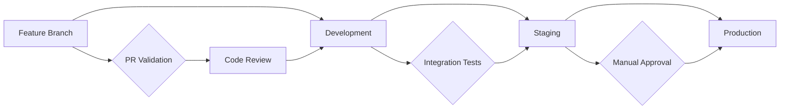
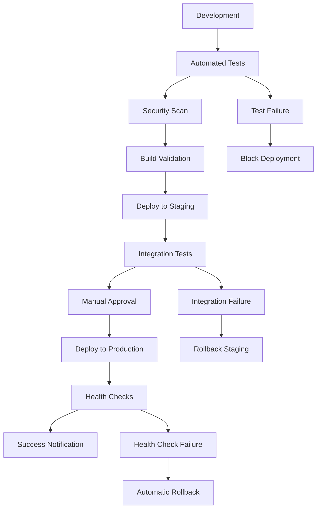
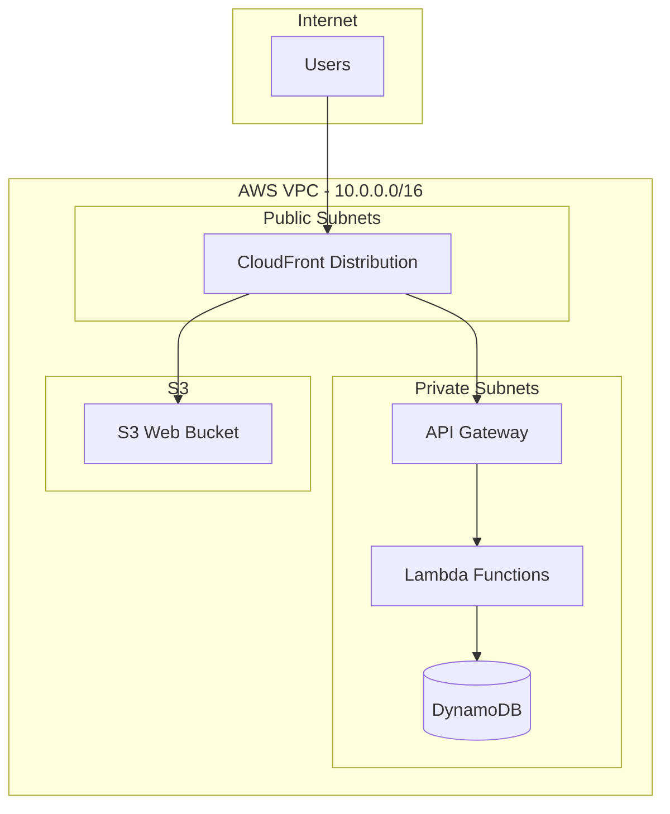
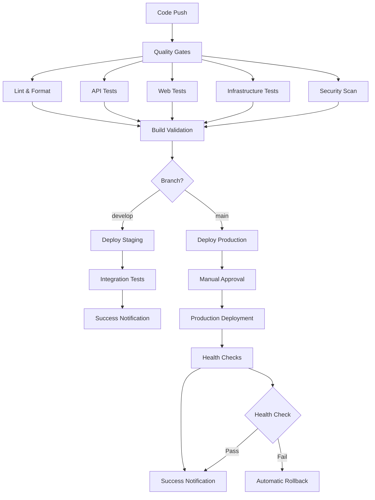
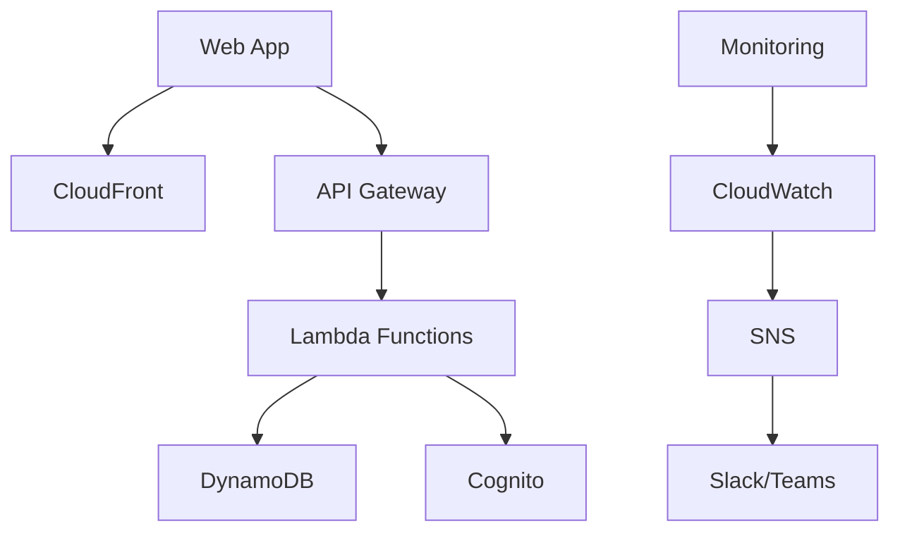

# EC2 Manager Infrastructure Architecture

**Document Version:** 1.0
**Last Updated:** 2025-09-14
**Next Review:** 2025-12-14

## Infrastructure Overview

The EC2 Manager application is built on AWS using a comprehensive cloud-native architecture designed for scalability, security, and operational excellence. The infrastructure supports multiple environments (development, staging, production) with identical patterns for consistency and reduced operational overhead.

### Cloud Provider & Core Services

- **Primary Cloud Provider:** AWS (us-west-2 region)
- **Infrastructure as Code:** AWS CDK (TypeScript)
- **Core Services:**
  - **Compute:** AWS Lambda for serverless API processing
  - **Storage:** Amazon DynamoDB for audit trails, S3 for static web hosting
  - **Networking:** VPC with public/private subnets, API Gateway for API management
  - **Security:** Amazon Cognito for user authentication, IAM roles for access control
  - **Monitoring:** CloudWatch for metrics, logs, and alarms
  - **Distribution:** CloudFront for global content delivery

### Regional Architecture

- **Primary Region:** us-west-2 (Oregon)
- **Availability Zones:** 2 AZs for high availability
- **Single-region deployment** with plans for multi-region expansion in Phase 3

### Multi-Environment Strategy

Three identical environments with environment-specific configurations:

| Environment     | Purpose                         | Features                              | Retention Policies                            |
| --------------- | ------------------------------- | ------------------------------------- | --------------------------------------------- |
| **Development** | Feature development and testing | Relaxed security, cost-optimized      | 7 days log retention, DESTROY removal policy  |
| **Staging**     | Pre-production validation       | Production-like configuration         | 14 days log retention, mixed removal policies |
| **Production**  | Live system                     | Full security, monitoring, and backup | 30 days log retention, RETAIN removal policy  |

## Infrastructure as Code (IaC)

### Tools & Frameworks

- **Primary:** AWS CDK v2 with TypeScript
- **Build System:** Node.js 20.x with npm workspaces
- **Testing:** Jest for unit and integration tests
- **Validation:** CDK diff and synth for pre-deployment validation

### Repository Structure

```
infrastructure/
├── bin/
│   └── app.ts                 # CDK app entry point
├── lib/
│   ├── app-stack.ts          # Main infrastructure stack
│   └── monitoring-stack.ts   # Enhanced monitoring stack
├── config/
│   ├── dev.json              # Development configuration
│   ├── staging.json          # Staging configuration
│   └── prod.json             # Production configuration
├── tests/
│   ├── unit/                 # Unit tests for stacks
│   └── integration/          # Integration tests
├── cdk.json                  # CDK configuration
└── package.json              # Dependencies and scripts
```

### State Management

- **CDK State:** Managed automatically by AWS CloudFormation
- **Bootstrap:** CDK bootstrap for deployment artifacts
- **Versioning:** Git-based versioning with tagged releases
- **Backup:** CloudFormation stack exports for disaster recovery

### Dependency Management

- **Node.js Packages:** NPM with package-lock.json for version consistency
- **CDK Libraries:** AWS CDK v2 constructs with peer dependencies
- **Security:** npm audit for vulnerability scanning
- **Updates:** Dependabot for automated dependency updates

**Critical Rule:** All infrastructure must be defined as code. No manual resource creation in production environments.

## Environment Configuration

### Environment Promotion Strategy



### Configuration Management

Each environment uses JSON configuration files with environment-specific settings:

**Development Environment**

- **Purpose:** Feature development and rapid iteration
- **Resources:** Minimal resource allocation, single AZ for cost optimization
- **Access Control:** Open access for development team
- **Data Classification:** Non-sensitive development data only

**Staging Environment**

- **Purpose:** Pre-production validation and testing
- **Resources:** Production-like resources with reduced capacity
- **Access Control:** Restricted to QA and senior development team
- **Data Classification:** Anonymized production-like data

**Production Environment**

- **Purpose:** Live customer-facing system
- **Resources:** Full production capacity with auto-scaling
- **Access Control:** Strict access controls with MFA required
- **Data Classification:** Sensitive customer and operational data

### Secret Management

- **AWS Systems Manager Parameter Store:** Configuration parameters
- **Environment Variables:** Non-sensitive configuration
- **IAM Roles:** Service-to-service authentication
- **Cognito:** User authentication and authorization

### Feature Flag Integration

Feature flags are managed at the application level but infrastructure supports:

- Environment-specific API Gateway configurations
- Lambda environment variables for feature toggles
- CloudWatch custom metrics for feature usage tracking

## Environment Transition Strategy

### Development to Production Pipeline



### Deployment Stages and Gates

1. **Code Quality Gate**
   - Linting and formatting checks
   - TypeScript compilation
   - Unit test execution (80% coverage minimum)

2. **Security Gate**
   - Dependency vulnerability scanning
   - Static code analysis
   - Secrets detection

3. **Infrastructure Validation Gate**
   - CDK synthesis validation
   - Resource diff analysis
   - Cost impact assessment

4. **Integration Gate**
   - End-to-end test execution
   - Performance baseline validation
   - Cross-service compatibility checks

### Approval Workflows and Authorities

- **Development → Staging:** Automatic upon successful tests
- **Staging → Production:** Manual approval required
- **Production Approval Authority:** DevOps Lead or Engineering Manager
- **Emergency Deployments:** CTO approval with post-deployment review

### Rollback Procedures

- **Automatic Rollback:** Health check failures trigger automatic rollback
- **Manual Rollback:** `./scripts/rollback.sh <environment>` command
- **Rollback Time Target:** < 5 minutes for application, < 15 minutes for infrastructure
- **Rollback Validation:** Automated health checks post-rollback

### Change Cadence and Release Windows

- **Development:** Continuous deployment
- **Staging:** Multiple times per day
- **Production:** Once per day during business hours (8 AM - 6 PM PST)
- **Emergency Window:** 24/7 for critical security and bug fixes

## Network Architecture

### VPC/VNET Design

- **VPC CIDR:** 10.0.0.0/16
- **Subnets:**
  - Public Subnets: 10.0.1.0/24, 10.0.2.0/24 (2 AZs)
  - Private Subnets: 10.0.10.0/24, 10.0.11.0/24 (2 AZs)

### Subnet Strategy

- **Public Subnets:** Load balancers, NAT gateways, bastion hosts
- **Private Subnets:** Application servers, databases, internal services
- **Isolated Subnets:** Future use for highly sensitive workloads

### Security Groups & NACLs

- **API Gateway Security Group:** HTTPS (443) from CloudFront only
- **Lambda Security Group:** Outbound to DynamoDB and AWS services
- **Default NACL:** Allow all traffic (security enforced at security group level)

### Load Balancers & API Gateways

- **API Gateway:** Regional API Gateway for REST APIs
- **CloudFront:** Global CDN for web content and API caching
- **No Application Load Balancer:** Serverless architecture uses managed services



## Compute Resources

### Container Strategy

**Current:** Serverless-first architecture with AWS Lambda
**Future:** Container support for microservices expansion in Phase 3

### Serverless Architecture

- **AWS Lambda:** Node.js 20.x runtime for API functions
- **API Gateway:** REST API with Lambda proxy integration
- **Event-driven:** CloudWatch Events for scheduled tasks
- **Auto-scaling:** Automatic scaling based on request volume

### VM/Instance Configuration

**Current:** No EC2 instances (fully serverless)
**Future:** EC2 instances for worker processes if needed

### Auto-scaling Approach

- **Lambda:** Automatic concurrent execution scaling (up to 1000 concurrent)
- **DynamoDB:** On-demand billing mode with automatic scaling
- **API Gateway:** Automatic request handling up to throttling limits

## Data Resources

### Database Deployment Strategy

- **Primary Database:** Amazon DynamoDB (NoSQL)
- **Table Design:** Single table with partition key `id` and sort key `timestamp`
- **Billing Mode:** Pay-per-request for variable workloads
- **Encryption:** AWS managed encryption at rest

### Backup & Recovery

- **Point-in-Time Recovery:** Enabled for production, disabled for dev
- **Backup Retention:**
  - Production: 35 days
  - Staging: 7 days
  - Development: Disabled
- **Cross-Region Backup:** Planned for Phase 3

### Replication & Failover

- **Current:** Single region deployment
- **Availability:** Multi-AZ within region for DynamoDB
- **Future:** Global Tables for multi-region replication

### Data Migration Strategy

- **Schema Evolution:** DynamoDB's schemaless design supports gradual migration
- **Version Management:** Application-level versioning for data compatibility
- **Testing:** Migration scripts tested in development environment first

## Security Architecture

### IAM & Authentication

- **User Authentication:** Amazon Cognito User Pools
- **Service Authentication:** IAM roles and policies
- **API Authorization:** Cognito authorizer on API Gateway
- **Multi-Factor Authentication:** Required for production, optional for staging/dev

### Network Security

- **VPC Security:** Private subnets for sensitive resources
- **API Security:** HTTPS only with CloudFront and API Gateway
- **Access Control:** Security groups restrict network access
- **DDoS Protection:** CloudFront and AWS Shield basic protection

### Data Encryption

- **In Transit:** TLS 1.2+ for all communications
- **At Rest:**
  - DynamoDB: AWS managed encryption
  - S3: S3-managed encryption (SSE-S3)
  - Lambda: Encrypted environment variables
- **Key Management:** AWS KMS with AWS managed keys

### Compliance Controls

- **Audit Logging:** CloudTrail for API calls and resource changes
- **Access Logging:** API Gateway request/response logging
- **Monitoring:** CloudWatch metrics and custom business metrics
- **Data Classification:** Environment-based data segregation

### Security Scanning & Monitoring

- **Dependency Scanning:** npm audit and Snyk integration
- **Code Analysis:** SonarCloud for static analysis
- **Runtime Monitoring:** CloudWatch alarms for security events
- **Incident Response:** Automated alerting via SNS and Slack

**Critical Rule:** Apply principle of least privilege for all access controls. Document all security exceptions with business justification.

## Shared Responsibility Model

| Component                  | Cloud Provider   | Platform Team  | Dev Team            | Security Team |
| -------------------------- | ---------------- | -------------- | ------------------- | ------------- |
| **Physical Security**      | ✓                | -              | -                   | Audit         |
| **Network Infrastructure** | ✓                | Configuration  | -                   | Review        |
| **Compute Platform**       | ✓                | Configuration  | -                   | Audit         |
| **Storage Encryption**     | Engine           | Configuration  | -                   | Standards     |
| **Network Security**       | Foundation       | ✓              | Configuration       | Review        |
| **IAM Policies**           | Engine           | ✓              | Request             | Standards     |
| **Application Security**   | -                | Tools          | ✓                   | Review        |
| **Data Security**          | Encryption       | Policies       | Implementation      | Audit         |
| **Patch Management**       | Managed Services | OS Updates     | Dependencies        | Audit         |
| **Monitoring**             | Platform         | ✓              | Application Metrics | Compliance    |
| **Incident Response**      | Platform Support | Infrastructure | Application Issues  | Coordination  |
| **Compliance Reporting**   | Certification    | Implementation | Documentation       | ✓             |

### Operational Monitoring Ownership

- **Platform Team:** Infrastructure metrics, resource utilization, cost optimization
- **Development Team:** Application performance, business metrics, user experience
- **Security Team:** Security events, compliance monitoring, vulnerability management
- **DevOps Engineer:** Overall system health, deployment pipeline, cross-team coordination

## Monitoring & Observability

### Metrics Collection

**Infrastructure Metrics:**

- CloudFormation stack status and events
- Lambda function duration, errors, and cold starts
- API Gateway request count, latency, and error rates
- DynamoDB read/write capacity utilization and throttling

**Business Metrics:**

- EC2 management operations (start, stop, reboot)
- User authentication events and failures
- API endpoint usage patterns
- Error rates by operation type

### Logging Strategy

**Structured Logging:**

- JSON format for all application logs
- Correlation IDs for request tracing
- Log levels: ERROR, WARN, INFO, DEBUG

**Log Destinations:**

- CloudWatch Logs for centralized collection
- Log Groups per service with appropriate retention
- Structured queries using CloudWatch Insights

### Tracing Implementation

- **AWS X-Ray:** Distributed tracing for Lambda functions
- **API Gateway Integration:** Request/response tracing
- **Custom Segments:** Business logic tracing in application code

### Alerting & Incident Response

**Critical Alerts:**

- API Gateway 5xx errors > 3 in 10 minutes
- Lambda function errors > 5% error rate
- DynamoDB throttling events
- Authentication failure spike > 10 failures in 5 minutes

**Alert Channels:**

- Slack integration for team notifications
- SNS topics for automated escalation
- PagerDuty integration for production incidents (planned)

### Dashboards & Visualization

**CloudWatch Dashboard Widgets:**

- API performance overview with request count and latency
- Error analysis with 4xx/5xx error tracking
- DynamoDB performance and capacity utilization
- Custom business metrics for EC2 operations
- System health score calculation

**Dashboard Organization:**

- Executive Summary: High-level health and KPIs
- Operations Dashboard: Detailed technical metrics
- Business Dashboard: User activity and feature usage

## CI/CD Pipeline

### Pipeline Architecture

The CI/CD pipeline implements a multi-stage approach with parallel quality gates and sequential deployment stages:



### Build Process

1. **Dependency Installation:** npm ci for consistent package installation
2. **Code Quality:** ESLint, Prettier, and TypeScript compilation
3. **Unit Testing:** Jest with coverage requirements (80% minimum)
4. **Security Scanning:** npm audit and Snyk vulnerability detection
5. **Infrastructure Validation:** CDK diff and synthesis validation
6. **Build Artifacts:** Compiled code and CDK templates

### Deployment Strategy

**Blue-Green Deployment Simulation:**

- Lambda versions enable instant rollback
- API Gateway stages for traffic switching
- CloudFront cache invalidation for immediate updates

**Deployment Stages:**

1. Infrastructure deployment (CDK)
2. Application code deployment (Lambda)
3. Static assets deployment (S3 + CloudFront)
4. Health check validation
5. Notification dispatch

### Rollback Procedures

**Automatic Rollback Triggers:**

- Health check failures
- Error rate spike > 10%
- Response time > 2 seconds average

**Manual Rollback Process:**

```bash
./scripts/rollback.sh <environment> [target]
```

**Rollback Capabilities:**

- Lambda function version rollback
- CloudFormation stack rollback
- S3 object version restoration
- CloudFront cache invalidation

### Approval Gates

**Automated Approvals:**

- Development environment (all changes)
- Staging environment (successful test validation)

**Manual Approvals:**

- Production deployments (DevOps Lead or Engineering Manager)
- Infrastructure changes affecting data retention
- Security configuration modifications

## Disaster Recovery

### Backup Strategy

**Automated Backups:**

- DynamoDB: Point-in-time recovery for production (35 days)
- S3: Versioning enabled for web assets
- Lambda: Code stored in Git with deployment artifacts
- CloudFormation: Stack templates exported nightly

**Backup Validation:**

- Monthly restore testing in development environment
- Backup integrity checks via CloudWatch alarms
- Recovery time objective (RTO): 4 hours
- Recovery point objective (RPO): 1 hour

### Recovery Procedures

**Disaster Scenarios:**

1. **Region Failure:**
   - Manual failover to secondary region (planned for Phase 3)
   - DNS update for traffic redirection
   - Data replication from backups

2. **Data Corruption:**
   - Point-in-time recovery for DynamoDB
   - S3 object version restoration
   - Application rollback to last known good state

3. **Security Breach:**
   - Immediate access revocation via IAM
   - Network isolation using security groups
   - System restore from clean backup

### RTO & RPO Targets

| Scenario                   | RTO Target | RPO Target | Recovery Method        |
| -------------------------- | ---------- | ---------- | ---------------------- |
| **Application Error**      | 15 minutes | 0 minutes  | Lambda rollback        |
| **Data Corruption**        | 2 hours    | 1 hour     | Point-in-time recovery |
| **Infrastructure Failure** | 4 hours    | 1 hour     | CloudFormation restore |
| **Region Outage**          | 8 hours    | 4 hours    | Cross-region failover  |

### DR Testing Approach

**Monthly Testing:**

- Automated backup restoration in dev environment
- Recovery procedure documentation review
- RTO/RPO measurement and reporting

**Quarterly Testing:**

- Full disaster recovery simulation
- Cross-team coordination exercise
- Post-incident review and process improvement

**Critical Rule:** DR procedures must be tested at least quarterly. Document test results and improvement actions.

## Cost Optimization

### Resource Sizing Strategy

**Right-Sizing Approach:**

- DynamoDB: On-demand billing for variable workloads
- Lambda: Memory optimization based on performance profiling
- S3: Intelligent tiering for automated cost optimization
- CloudFront: Regional pricing optimization

### Reserved Instances/Commitments

**Current:** Pay-as-you-go model for flexibility
**Future:** Savings plans for predictable Lambda usage (Phase 3)

### Cost Monitoring & Reporting

**AWS Cost Explorer Integration:**

- Daily cost alerts for budget overruns
- Monthly cost analysis by service and environment
- Resource utilization tracking and optimization recommendations

**Budget Thresholds:**

- Development: $100/month
- Staging: $200/month
- Production: $500/month (with 20% variance alert)

### Optimization Recommendations

1. **Lambda Optimization:** Function memory and timeout tuning
2. **DynamoDB Optimization:** Query pattern optimization and GSI management
3. **S3 Optimization:** Lifecycle policies for old objects
4. **CloudWatch Optimization:** Log retention period adjustment
5. **API Gateway Optimization:** Caching strategy implementation

## Integration with Application Architecture

### Service-to-Infrastructure Mapping

| Application Service     | Infrastructure Component | Dependencies                     |
| ----------------------- | ------------------------ | -------------------------------- |
| **User Authentication** | Cognito User Pool        | IAM roles, API Gateway           |
| **API Layer**           | Lambda Functions         | API Gateway, DynamoDB            |
| **Audit Logging**       | DynamoDB Table           | Lambda functions, CloudWatch     |
| **Web Frontend**        | S3 + CloudFront          | API Gateway endpoints            |
| **Monitoring**          | CloudWatch + SNS         | Lambda functions, custom metrics |

### Application Dependency Matrix



### Performance Requirements Implementation

- **Response Time:** < 200ms for API calls (enforced by CloudWatch alarms)
- **Availability:** 99.9% uptime SLA (monitored via synthetic transactions)
- **Throughput:** 1000 requests/minute per API endpoint
- **Concurrent Users:** 100 simultaneous users supported

### Security Requirements Implementation

- **Authentication:** Multi-factor authentication via Cognito
- **Authorization:** Role-based access control with IAM
- **Audit Trail:** All operations logged to DynamoDB with CloudTrail
- **Data Protection:** Encryption in transit and at rest

## Cross-Team Collaboration

### Platform Engineer and Developer Touchpoints

**Daily Interaction:**

- Morning standup alignment on infrastructure needs
- Slack channel for real-time issue resolution
- Infrastructure change notifications

**Weekly Interaction:**

- Architecture review meetings
- Performance analysis and optimization planning
- Capacity planning discussions

### Frontend/Backend Integration Requirements

- **API Contracts:** OpenAPI specification maintained
- **CORS Configuration:** Environment-specific CORS policies
- **Authentication Flow:** Cognito integration patterns
- **Error Handling:** Standardized error response formats

### Product Requirements to Infrastructure Mapping

- **Scalability Needs:** Auto-scaling configuration based on user growth projections
- **Feature Flags:** Infrastructure support for A/B testing
- **Analytics Requirements:** Custom metrics collection for business KPIs
- **Compliance Needs:** Audit logging and data retention policies

### Design Architect UI/UX Infrastructure Requirements

- **Performance Budget:** CloudFront caching for < 1s page load
- **Mobile Optimization:** Responsive S3 hosting with CloudFront compression
- **A11y Support:** Monitoring for accessibility compliance
- **SEO Requirements:** Proper HTTP headers and meta tag support

## Infrastructure Change Management

### Change Request Process

1. **RFC Creation:** Request for Comment document with impact analysis
2. **Peer Review:** Technical review by platform team
3. **Security Review:** Security impact assessment
4. **Approval:** DevOps Lead approval for production changes

### Risk Assessment

**Change Risk Categories:**

- **Low Risk:** Configuration changes, monitoring updates
- **Medium Risk:** New resource deployment, capacity changes
- **High Risk:** Security modifications, data schema changes

**Risk Mitigation:**

- Staging environment validation for all changes
- Rollback plan documentation required
- Change windows for production modifications

### Testing Strategy

**Pre-deployment Testing:**

- CDK diff analysis for impact assessment
- Integration tests in staging environment
- Performance impact evaluation

**Post-deployment Testing:**

- Automated smoke tests
- Health check validation
- Performance regression testing

### Validation Procedures

- **Infrastructure Tests:** CDK unit and integration tests
- **Compliance Checks:** Security and compliance validation
- **Performance Tests:** Load testing and benchmark validation
- **Documentation:** Architecture decision records (ADRs) maintenance

---

**Infrastructure Evolution**

### Technical Debt Inventory

**Current Technical Debt:**

1. Single-region deployment limits disaster recovery
2. Manual secret rotation process
3. Limited automated testing coverage for infrastructure
4. Basic monitoring without advanced analytics

**Debt Prioritization:**

- **High Priority:** Multi-region deployment capability
- **Medium Priority:** Advanced monitoring and alerting
- **Low Priority:** Infrastructure testing enhancement

### Planned Upgrades and Migrations

**Phase 3 Roadmap (Q1 2026):**

- Multi-region deployment with active-passive failover
- Container support with Amazon ECS for microservices
- Advanced monitoring with AWS X-Ray and custom metrics
- CI/CD pipeline enhancement with feature flag integration

### Deprecation Schedule

**Planned Deprecations:**

- Legacy CDK v1 constructs → CDK v2 (completed)
- Basic CloudWatch dashboards → Enhanced monitoring stack (Q4 2025)
- Manual deployment scripts → Full CI/CD automation (Q1 2026)

### Technology Roadmap

**Short-term (6 months):**

- Enhanced monitoring and alerting implementation
- Automated security scanning integration
- Performance optimization and cost reduction

**Medium-term (12 months):**

- Multi-region deployment architecture
- Container workload support
- Advanced analytics and business intelligence

**Long-term (18+ months):**

- Machine learning for predictive scaling
- Zero-downtime deployment strategies
- Advanced security with AWS Security Hub integration

### Capacity Planning

**Current Capacity:**

- Lambda: 1000 concurrent executions
- DynamoDB: On-demand scaling
- API Gateway: 10,000 requests per second

**Growth Projections:**

- 3x user growth expected in next 12 months
- API request volume increase of 5x anticipated
- Storage requirements growth of 2x per year

### Scalability Considerations

**Horizontal Scaling:**

- Lambda automatic scaling with reserved concurrency
- DynamoDB global secondary indexes for query optimization
- CloudFront edge locations for global performance

**Vertical Scaling:**

- Lambda memory allocation optimization
- DynamoDB capacity mode evaluation
- S3 transfer acceleration for large uploads

---

_Document Version: 1.0_
_Last Updated: 2025-09-14_
_Next Review: 2025-12-14_
