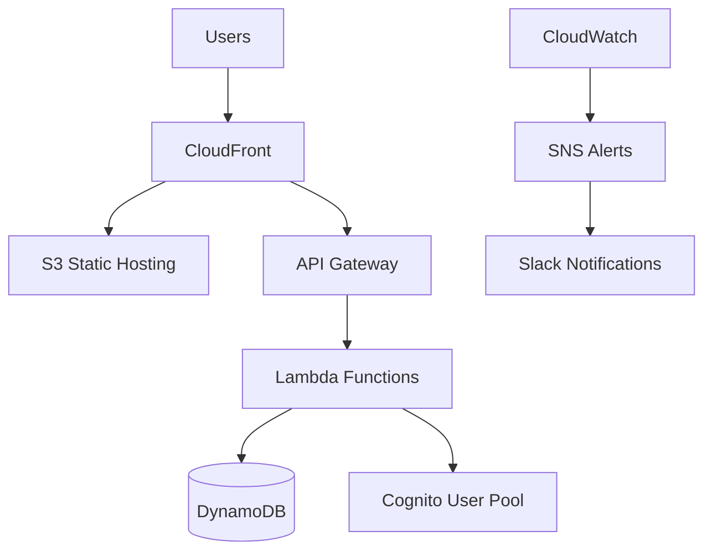
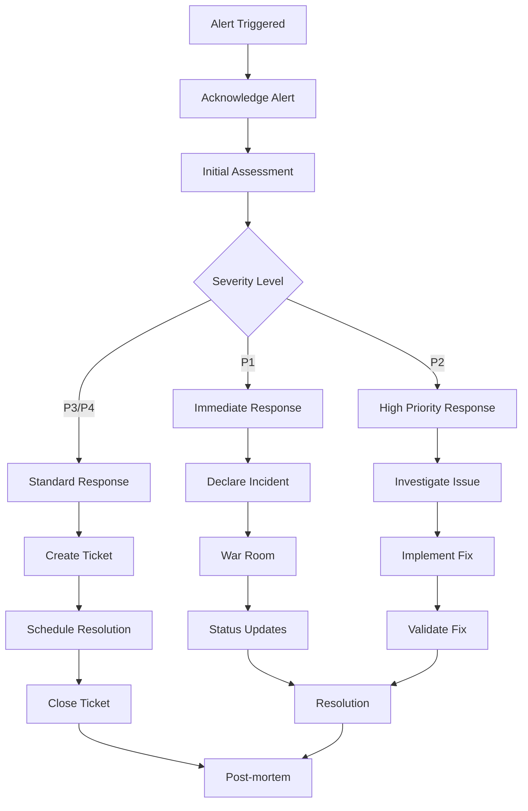

# EC2 Manager Operations Runbook

**Document Version:** 1.0
**Last Updated:** 2025-09-14
**Review Cycle:** Monthly
**On-Call Reference:** Keep this document accessible during on-call rotations

## Table of Contents

1. [Quick Reference](#quick-reference)
2. [System Overview](#system-overview)
3. [Monitoring and Alerting](#monitoring-and-alerting)
4. [Deployment Operations](#deployment-operations)
5. [Incident Response](#incident-response)
6. [Troubleshooting Guide](#troubleshooting-guide)
7. [Maintenance Procedures](#maintenance-procedures)
8. [Rollback Procedures](#rollback-procedures)
9. [Performance Optimization](#performance-optimization)
10. [Security Operations](#security-operations)
11. [Emergency Procedures](#emergency-procedures)

## Quick Reference

### Emergency Contacts

| Role                    | Contact                 | Slack        | Phone                  |
| ----------------------- | ----------------------- | ------------ | ---------------------- |
| **On-Call Engineer**    | oncall@company.com      | @oncall      | [On-Call Number]       |
| **DevOps Lead**         | devops-lead@company.com | @devops.lead | [Emergency Number]     |
| **Engineering Manager** | eng-manager@company.com | @eng.manager | [Manager Number]       |
| **CTO**                 | cto@company.com         | @cto         | [Executive Escalation] |

### Critical Commands

```bash
# Emergency rollback
./scripts/rollback.sh prod

# Check system status
./scripts/deployment-status.sh prod all

# View production logs
aws logs tail /aws/ec2-manager/prod --follow --region us-west-2

# Check CloudFormation stack
aws cloudformation describe-stacks --stack-name EC2Manager-production --region us-west-2
```

### Service URLs

| Environment     | URL                            | Purpose          |
| --------------- | ------------------------------ | ---------------- |
| **Production**  | https://ec2manager.com         | Live application |
| **Staging**     | https://staging.ec2manager.com | Pre-production   |
| **Development** | https://dev.ec2manager.com     | Development      |

### AWS Console Quick Links

- [Production CloudFormation](https://console.aws.amazon.com/cloudformation/home?region=us-west-2#/stacks)
- [Production CloudWatch](https://console.aws.amazon.com/cloudwatch/home?region=us-west-2#dashboards:)
- [Production API Gateway](https://console.aws.amazon.com/apigateway/main/apis?region=us-west-2)
- [Production DynamoDB](https://console.aws.amazon.com/dynamodb/home?region=us-west-2#tables)

## System Overview

### Architecture Summary

The EC2 Manager is a serverless application running on AWS with the following key components:



### Environment Overview

| Environment     | Stack Name            | Region    | Purpose                   |
| --------------- | --------------------- | --------- | ------------------------- |
| **Production**  | EC2Manager-production | us-west-2 | Live system               |
| **Staging**     | EC2Manager-staging    | us-west-2 | Pre-production validation |
| **Development** | EC2Manager-dev        | us-west-2 | Development and testing   |

### Key Metrics to Monitor

| Metric                  | Normal Range | Warning Threshold | Critical Threshold |
| ----------------------- | ------------ | ----------------- | ------------------ |
| **API Latency**         | < 200ms      | > 1s              | > 2s               |
| **Error Rate**          | < 1%         | > 5%              | > 10%              |
| **DynamoDB Throttling** | 0            | > 0               | > 5 events         |
| **Lambda Duration**     | < 5s         | > 10s             | > 15s              |
| **CloudFront 4xx Rate** | < 5%         | > 10%             | > 20%              |

## Monitoring and Alerting

### CloudWatch Dashboards

**Primary Dashboard:** `EC2Manager-Enhanced-production`

**Dashboard Sections:**

1. **API Performance Overview** - Request count, latency, errors
2. **DynamoDB Performance** - Read/write capacity, throttling
3. **Business Metrics** - EC2 operations, user activity
4. **System Health** - Health score, response times

**Accessing Dashboards:**

```bash
# Open production dashboard
aws cloudwatch get-dashboard \
  --dashboard-name EC2Manager-Enhanced-production \
  --region us-west-2

# Generate dashboard URL
echo "https://console.aws.amazon.com/cloudwatch/home?region=us-west-2#dashboards:name=EC2Manager-Enhanced-production"
```

### Alert Configuration

**Critical Alerts (Immediate Response Required):**

| Alert                      | Condition                  | Response Time | Action                          |
| -------------------------- | -------------------------- | ------------- | ------------------------------- |
| **API Server Errors**      | 3+ 5xx errors in 10 min    | 5 minutes     | Check logs, consider rollback   |
| **High Latency**           | >2s average for 15 min     | 10 minutes    | Performance investigation       |
| **DynamoDB Throttling**    | Any throttling events      | 5 minutes     | Check capacity, scale if needed |
| **Lambda Function Errors** | >5% error rate             | 5 minutes     | Check function logs and config  |
| **Security Alert**         | 10+ auth failures in 5 min | 2 minutes     | Security investigation          |

**Warning Alerts (Monitor and Investigate):**

| Alert                       | Condition                   | Response Time | Action                                   |
| --------------------------- | --------------------------- | ------------- | ---------------------------------------- |
| **Elevated Error Rate**     | 5-10% error rate            | 30 minutes    | Monitor trends, investigate if sustained |
| **Performance Degradation** | 1-2s average latency        | 30 minutes    | Performance analysis                     |
| **Low Activity**            | <1 request/hour for 2 hours | 1 hour        | Check system availability                |

### Alert Response Procedures

**1. Initial Alert Response (First 5 Minutes):**

```bash
# Step 1: Acknowledge alert in Slack
# Step 2: Check system status
./scripts/deployment-status.sh prod all

# Step 3: Check recent deployments
aws cloudformation describe-stack-events \
  --stack-name EC2Manager-production \
  --region us-west-2 \
  --max-items 10

# Step 4: Review CloudWatch dashboard
# Step 5: Check application logs
```

**2. Alert Escalation:**

- **0-15 minutes:** On-call engineer investigates
- **15-30 minutes:** Escalate to DevOps Lead if unresolved
- **30-60 minutes:** Escalate to Engineering Manager
- **60+ minutes:** Executive escalation (CTO)

### Log Management

**Log Locations:**

```bash
# API Gateway logs
aws logs tail API-Gateway-Execution-Logs_<api-id>/prod --follow

# Lambda function logs
aws logs tail /aws/lambda/ec2-manager-function-prod --follow

# Custom application logs
aws logs tail /aws/ec2-manager/prod --follow

# CloudTrail audit logs
aws logs tail /aws/cloudtrail/<trail-name> --follow
```

**Log Analysis Commands:**

```bash
# Search for errors in the last hour
aws logs filter-log-events \
  --log-group-name /aws/ec2-manager/prod \
  --start-time $(date -d '1 hour ago' +%s)000 \
  --filter-pattern "ERROR"

# Search for specific patterns
aws logs filter-log-events \
  --log-group-name /aws/ec2-manager/prod \
  --start-time $(date -d '1 hour ago' +%s)000 \
  --filter-pattern "[timestamp, request_id, level=ERROR, ...]"

# Export logs for analysis
aws logs create-export-task \
  --log-group-name /aws/ec2-manager/prod \
  --from $(date -d '1 day ago' +%s)000 \
  --to $(date +%s)000 \
  --destination s3-bucket-name
```

## Deployment Operations

### Deployment Status Monitoring

**Real-time Deployment Monitoring:**

```bash
# Monitor active deployment
aws cloudformation describe-stack-events \
  --stack-name EC2Manager-production \
  --region us-west-2 | \
  jq '.StackEvents[] | select(.Timestamp > "2025-09-14T00:00:00Z") | {Timestamp, LogicalResourceId, ResourceStatus, ResourceStatusReason}'

# Watch deployment progress
watch -n 30 'aws cloudformation describe-stacks \
  --stack-name EC2Manager-production \
  --region us-west-2 \
  --query "Stacks[0].StackStatus"'
```

**Post-Deployment Validation:**

```bash
# Full system health check
./scripts/deployment-status.sh prod all

# API health validation
curl -f https://api.ec2manager.com/health || echo "API health check failed"

# Performance baseline check
curl -w "@curl-format.txt" -o /dev/null -s https://api.ec2manager.com/health
```

### Blue-Green Deployment Simulation

**Lambda Version Management:**

```bash
# Check current Lambda version
aws lambda get-function \
  --function-name ec2-manager-function-prod \
  --region us-west-2 \
  --query 'Configuration.Version'

# List recent versions
aws lambda list-versions-by-function \
  --function-name ec2-manager-function-prod \
  --region us-west-2 \
  --query 'Versions[?$Version != "$LATEST"].Version'

# Traffic routing (when implemented)
aws lambda get-alias \
  --function-name ec2-manager-function-prod \
  --name LIVE \
  --region us-west-2
```

### Deployment Rollback Triggers

**Automatic Rollback Conditions:**

- Health check failures for >5 minutes
- Error rate >10% for >10 minutes
- Response time >5s average for >15 minutes

**Manual Rollback Decision Points:**

- Data corruption detected
- Security vulnerability exposed
- Critical business function impaired
- Customer impact severity assessment

## Incident Response

### Incident Classification

| Severity          | Description                       | Response Time     | Notification                    |
| ----------------- | --------------------------------- | ----------------- | ------------------------------- |
| **P1 - Critical** | Complete system outage, data loss | 15 minutes        | Page on-call, notify management |
| **P2 - High**     | Major functionality impaired      | 1 hour            | Slack alert, email notification |
| **P3 - Medium**   | Minor functionality affected      | 4 hours           | Slack notification              |
| **P4 - Low**      | Cosmetic issues, documentation    | Next business day | Ticket creation                 |

### Incident Response Workflow

**1. Incident Detection and Initial Response:**



**2. Incident Commander Responsibilities:**

- Coordinate response efforts
- Communicate with stakeholders
- Make rollback decisions
- Document incident timeline
- Lead post-incident review

**3. Communication Templates:**

**Initial Incident Notification:**

```
🚨 INCIDENT DECLARED - P1
Incident ID: INC-2025-0914-001
Service: EC2 Manager Production
Impact: Complete service outage
Started: 2025-09-14 14:30 UTC
Incident Commander: @oncall.engineer
Status: Investigating
ETA: TBD

Initial assessment: API Gateway returning 5xx errors
Current actions: Checking recent deployments, reviewing logs
```

**Status Update Template:**

```
📊 INCIDENT UPDATE - INC-2025-0914-001
Time: 15:00 UTC (+30 minutes)
Status: Mitigation in progress
Root cause: DynamoDB throttling due to traffic spike
Actions taken:
- Increased DynamoDB capacity
- Implemented request throttling
- Monitoring system recovery
ETA: 15 minutes to full resolution
```

**Resolution Notification:**

```
✅ INCIDENT RESOLVED - INC-2025-0914-001
Duration: 45 minutes (14:30-15:15 UTC)
Root cause: DynamoDB capacity exceeded during traffic spike
Resolution: Increased DynamoDB provisioned capacity
Impact: ~500 users affected, data integrity maintained
Post-mortem: Scheduled for 2025-09-15 10:00 AM
```

### War Room Procedures

**Virtual War Room Setup:**

1. Create dedicated Slack channel: `#incident-2025-0914-001`
2. Start Zoom/Teams call with screen sharing
3. Invite key stakeholders:
   - Incident Commander
   - On-call Engineer
   - DevOps Lead
   - Engineering Manager (P1/P2 incidents)

**War Room Communication Protocol:**

- Status updates every 15 minutes for P1, 30 minutes for P2
- Single source of truth: Incident Commander
- Record all actions taken with timestamps
- Maintain calm, professional communication

## Troubleshooting Guide

### API Gateway Issues

**Symptom: API returning 5xx errors**

**Diagnostic Steps:**

```bash
# 1. Check API Gateway health
aws apigateway get-rest-apis \
  --region us-west-2 \
  --query 'items[?name==`ec2-manager-api-production`]'

# 2. Check recent deployments
aws apigateway get-deployments \
  --rest-api-id <api-id> \
  --region us-west-2

# 3. Check Lambda function backing the API
aws lambda get-function \
  --function-name ec2-manager-function-prod \
  --region us-west-2

# 4. Check Lambda function logs
aws logs tail /aws/lambda/ec2-manager-function-prod --follow

# 5. Test Lambda function directly
aws lambda invoke \
  --function-name ec2-manager-function-prod \
  --payload '{"test": "data"}' \
  --region us-west-2 \
  response.json && cat response.json
```

**Common Solutions:**

1. **Lambda function errors:** Check function logs for exceptions
2. **Timeout issues:** Increase Lambda timeout or optimize code
3. **Permission issues:** Verify IAM roles and policies
4. **API Gateway configuration:** Check integration settings

### DynamoDB Issues

**Symptom: DynamoDB throttling events**

**Diagnostic Steps:**

```bash
# 1. Check table status
aws dynamodb describe-table \
  --table-name ec2-manager-audit-production \
  --region us-west-2

# 2. Check consumed capacity
aws cloudwatch get-metric-statistics \
  --namespace AWS/DynamoDB \
  --metric-name ConsumedReadCapacityUnits \
  --dimensions Name=TableName,Value=ec2-manager-audit-production \
  --start-time $(date -d '1 hour ago' --iso-8601) \
  --end-time $(date --iso-8601) \
  --period 300 \
  --statistics Average,Maximum \
  --region us-west-2

# 3. Check for throttling
aws cloudwatch get-metric-statistics \
  --namespace AWS/DynamoDB \
  --metric-name ThrottledRequests \
  --dimensions Name=TableName,Value=ec2-manager-audit-production \
  --start-time $(date -d '1 hour ago' --iso-8601) \
  --end-time $(date --iso-8601) \
  --period 300 \
  --statistics Sum \
  --region us-west-2
```

**Resolution Steps:**

1. **On-demand billing:** Already configured, should auto-scale
2. **Query optimization:** Review access patterns
3. **Hot partition:** Analyze partition key distribution
4. **Temporary relief:** Consider caching strategies

### Lambda Function Issues

**Symptom: Lambda function timeouts or errors**

**Diagnostic Steps:**

```bash
# 1. Check function configuration
aws lambda get-function-configuration \
  --function-name ec2-manager-function-prod \
  --region us-west-2

# 2. Check recent invocations
aws logs filter-log-events \
  --log-group-name /aws/lambda/ec2-manager-function-prod \
  --start-time $(date -d '1 hour ago' +%s)000 \
  --filter-pattern "ERROR"

# 3. Check function metrics
aws cloudwatch get-metric-statistics \
  --namespace AWS/Lambda \
  --metric-name Duration \
  --dimensions Name=FunctionName,Value=ec2-manager-function-prod \
  --start-time $(date -d '1 hour ago' --iso-8601) \
  --end-time $(date --iso-8601) \
  --period 300 \
  --statistics Average,Maximum \
  --region us-west-2
```

**Common Issues and Solutions:**

1. **Memory issues:** Increase memory allocation
2. **Timeout issues:** Increase timeout or optimize code
3. **Cold starts:** Consider provisioned concurrency
4. **Permission issues:** Check IAM roles and VPC configuration

### CloudFront Issues

**Symptom: Static content not loading or slow performance**

**Diagnostic Steps:**

```bash
# 1. Check CloudFront distribution
aws cloudfront get-distribution \
  --id <distribution-id>

# 2. Check origin health
aws cloudfront get-distribution-config \
  --id <distribution-id> \
  --query 'DistributionConfig.Origins'

# 3. Check cache hit rates
aws cloudwatch get-metric-statistics \
  --namespace AWS/CloudFront \
  --metric-name CacheHitRate \
  --dimensions Name=DistributionId,Value=<distribution-id> \
  --start-time $(date -d '1 hour ago' --iso-8601) \
  --end-time $(date --iso-8601) \
  --period 300 \
  --statistics Average \
  --region us-east-1  # CloudFront metrics are in us-east-1
```

**Resolution Steps:**

1. **Cache invalidation:** Create invalidation for affected paths
2. **Origin issues:** Check S3 bucket accessibility
3. **Configuration issues:** Verify behaviors and caching policies

### Authentication Issues

**Symptom: Users unable to authenticate**

**Diagnostic Steps:**

```bash
# 1. Check Cognito User Pool status
aws cognito-idp describe-user-pool \
  --user-pool-id <user-pool-id> \
  --region us-west-2

# 2. Check User Pool Client configuration
aws cognito-idp describe-user-pool-client \
  --user-pool-id <user-pool-id> \
  --client-id <client-id> \
  --region us-west-2

# 3. Check authentication metrics
aws cloudwatch get-metric-statistics \
  --namespace AWS/Cognito \
  --metric-name SignInSuccesses \
  --dimensions Name=UserPool,Value=<user-pool-id> \
  --start-time $(date -d '1 hour ago' --iso-8601) \
  --end-time $(date --iso-8601) \
  --period 300 \
  --statistics Sum \
  --region us-west-2
```

## Maintenance Procedures

### Regular Maintenance Tasks

**Daily Tasks:**

```bash
# 1. Check system health
./scripts/deployment-status.sh prod all

# 2. Review overnight alerts
aws cloudwatch describe-alarms \
  --state-value ALARM \
  --region us-west-2

# 3. Check cost metrics
aws ce get-cost-and-usage \
  --time-period Start=$(date -d 'yesterday' +%Y-%m-%d),End=$(date +%Y-%m-%d) \
  --granularity DAILY \
  --metrics BlendedCost
```

**Weekly Tasks:**

```bash
# 1. Review performance trends
# 2. Analyze cost optimization opportunities
# 3. Update security patches
# 4. Review backup status
# 5. Clean up old resources
```

**Monthly Tasks:**

- Capacity planning review
- Security audit
- Documentation updates
- DR testing
- Cost optimization review

### Backup Verification

**DynamoDB Backup Status:**

```bash
# Check point-in-time recovery status
aws dynamodb describe-continuous-backups \
  --table-name ec2-manager-audit-production \
  --region us-west-2

# List recent backups
aws dynamodb list-backups \
  --table-name ec2-manager-audit-production \
  --region us-west-2

# Test backup restoration (in development environment)
aws dynamodb restore-table-from-backup \
  --target-table-name ec2-manager-audit-test \
  --backup-arn <backup-arn> \
  --region us-west-2
```

**S3 Backup Verification:**

```bash
# Check versioning status
aws s3api get-bucket-versioning \
  --bucket ec2-manager-web-prod-<account-id>

# List object versions
aws s3api list-object-versions \
  --bucket ec2-manager-web-prod-<account-id> \
  --max-items 10
```

### Log Rotation and Cleanup

**CloudWatch Log Management:**

```bash
# Check log group retention
aws logs describe-log-groups \
  --log-group-name-prefix "/aws/ec2-manager" \
  --region us-west-2 \
  --query 'logGroups[*].{LogGroupName:logGroupName,RetentionInDays:retentionInDays}'

# Update retention for cost optimization
aws logs put-retention-policy \
  --log-group-name /aws/ec2-manager/prod \
  --retention-in-days 30 \
  --region us-west-2
```

**Old Resource Cleanup:**

```bash
# Clean up old Lambda versions
aws lambda list-versions-by-function \
  --function-name ec2-manager-function-prod \
  --region us-west-2 | \
  jq -r '.Versions[] | select(.Version != "$LATEST") | select(.LastModified < "2025-08-01") | .Version' | \
  xargs -I {} aws lambda delete-function \
  --function-name ec2-manager-function-prod \
  --qualifier {} \
  --region us-west-2
```

## Rollback Procedures

### Automated Rollback Scenarios

**Health Check Failures:**

```bash
# Triggered automatically by CloudWatch alarms
# Check rollback status
./scripts/deployment-status.sh prod all

# Monitor rollback progress
aws cloudformation describe-stack-events \
  --stack-name EC2Manager-production \
  --region us-west-2 | \
  grep -i rollback
```

### Manual Rollback Procedures

**Production Rollback (Emergency):**

```bash
# Emergency rollback command
./scripts/rollback.sh prod

# With specific target
./scripts/rollback.sh prod previous

# Monitor rollback progress
watch -n 30 'aws cloudformation describe-stacks \
  --stack-name EC2Manager-production \
  --region us-west-2 \
  --query "Stacks[0].StackStatus"'
```

**Lambda Function Rollback:**

```bash
# Rollback Lambda to previous version
aws lambda update-alias \
  --function-name ec2-manager-function-prod \
  --name LIVE \
  --function-version <previous-version> \
  --region us-west-2

# Verify rollback
aws lambda get-alias \
  --function-name ec2-manager-function-prod \
  --name LIVE \
  --region us-west-2
```

**S3 Content Rollback:**

```bash
# Restore previous object versions
aws s3 sync s3://ec2-manager-web-prod-<account-id>/ ./backup-web/
aws s3 sync ./previous-version/ s3://ec2-manager-web-prod-<account-id>/ --delete

# Invalidate CloudFront cache
aws cloudfront create-invalidation \
  --distribution-id <distribution-id> \
  --paths "/*"
```

### Post-Rollback Validation

**Validation Checklist:**

```bash
# 1. System health check
./scripts/deployment-status.sh prod all

# 2. API functionality test
curl -f https://api.ec2manager.com/health

# 3. Authentication test
# (Manual validation through UI)

# 4. Performance validation
curl -w "@curl-format.txt" -o /dev/null -s https://api.ec2manager.com/health

# 5. Monitor error rates
aws cloudwatch get-metric-statistics \
  --namespace AWS/ApiGateway \
  --metric-name 5XXError \
  --dimensions Name=ApiName,Value=ec2-manager-api-production \
  --start-time $(date -d '10 minutes ago' --iso-8601) \
  --end-time $(date --iso-8601) \
  --period 300 \
  --statistics Sum \
  --region us-west-2
```

## Performance Optimization

### Performance Monitoring

**Key Performance Indicators:**

```bash
# API response times
aws cloudwatch get-metric-statistics \
  --namespace AWS/ApiGateway \
  --metric-name Latency \
  --dimensions Name=ApiName,Value=ec2-manager-api-production \
  --start-time $(date -d '1 hour ago' --iso-8601) \
  --end-time $(date --iso-8601) \
  --period 300 \
  --statistics Average,p95,p99 \
  --region us-west-2

# Lambda duration
aws cloudwatch get-metric-statistics \
  --namespace AWS/Lambda \
  --metric-name Duration \
  --dimensions Name=FunctionName,Value=ec2-manager-function-prod \
  --start-time $(date -d '1 hour ago' --iso-8601) \
  --end-time $(date --iso-8601) \
  --period 300 \
  --statistics Average,Maximum \
  --region us-west-2

# DynamoDB response times
aws cloudwatch get-metric-statistics \
  --namespace AWS/DynamoDB \
  --metric-name SuccessfulRequestLatency \
  --dimensions Name=TableName,Value=ec2-manager-audit-production \
  --start-time $(date -d '1 hour ago' --iso-8601) \
  --end-time $(date --iso-8601) \
  --period 300 \
  --statistics Average \
  --region us-west-2
```

### Performance Optimization Actions

**Lambda Optimization:**

```bash
# Check memory utilization
aws logs filter-log-events \
  --log-group-name /aws/lambda/ec2-manager-function-prod \
  --start-time $(date -d '1 hour ago' +%s)000 \
  --filter-pattern "[report_type=\"REPORT\", ...]"

# Optimize memory allocation
aws lambda update-function-configuration \
  --function-name ec2-manager-function-prod \
  --memory-size 512 \
  --region us-west-2
```

**DynamoDB Optimization:**

```bash
# Analyze hot partitions
aws dynamodb describe-table \
  --table-name ec2-manager-audit-production \
  --region us-west-2 \
  --query 'Table.TableSizeBytes'

# Consider adding GSI for frequent queries
aws dynamodb update-table \
  --table-name ec2-manager-audit-production \
  --global-secondary-index-updates file://gsi-update.json \
  --region us-west-2
```

## Security Operations

### Security Monitoring

**Security Event Detection:**

```bash
# Check CloudTrail for suspicious activity
aws logs filter-log-events \
  --log-group-name CloudTrail/<trail-name> \
  --start-time $(date -d '1 hour ago' +%s)000 \
  --filter-pattern "{$.errorCode = \"*\"}" | \
  jq '.events[] | {time: .timestamp, error: .message}'

# Monitor authentication failures
aws logs filter-log-events \
  --log-group-name /aws/cognito/<user-pool-id> \
  --start-time $(date -d '1 hour ago' +%s)000 \
  --filter-pattern "FAILED"

# Check for unauthorized API access
aws logs filter-log-events \
  --log-group-name API-Gateway-Execution-Logs_<api-id>/prod \
  --start-time $(date -d '1 hour ago' +%s)000 \
  --filter-pattern "[timestamp, request_id, ip, user, timestamp, method, resource, protocol, status=4*, ...]"
```

### Security Incident Response

**Suspected Security Breach:**

**Immediate Actions:**

1. **Isolate affected systems:**

```bash
# Disable API Gateway temporarily
aws apigateway update-rest-api \
  --rest-api-id <api-id> \
  --patch-ops op=replace,path=/policy,value='{"Version":"2012-10-17","Statement":[{"Effect":"Deny","Principal":"*","Action":"*","Resource":"*"}]}'

# Rotate API keys and secrets
aws cognito-idp admin-user-global-sign-out \
  --user-pool-id <user-pool-id> \
  --username <compromised-user>
```

2. **Preserve evidence:**

```bash
# Export relevant logs
aws logs create-export-task \
  --log-group-name /aws/ec2-manager/prod \
  --from $(date -d '24 hours ago' +%s)000 \
  --to $(date +%s)000 \
  --destination security-incident-logs-bucket

# Snapshot current state
aws cloudformation get-template \
  --stack-name EC2Manager-production \
  --template-stage Processed > security-incident-template.json
```

3. **Notify stakeholders and authorities as required**

### Security Hardening

**Regular Security Tasks:**

```bash
# Check for overly permissive IAM policies
aws iam list-policies \
  --only-attached \
  --query 'Policies[?PolicyName == `ec2-manager-*`]'

# Audit IAM roles
aws iam get-account-summary | \
  jq '.SummaryMap | {Users, Roles, Policies}'

# Check security group configurations
aws ec2 describe-security-groups \
  --group-names default \
  --query 'SecurityGroups[0].IpPermissions'

# Verify encryption settings
aws s3api get-bucket-encryption \
  --bucket ec2-manager-web-prod-<account-id>
```

## Emergency Procedures

### Complete System Outage

**Immediate Response Protocol:**

1. **Declare P1 Incident** (within 2 minutes)
2. **Initial Assessment** (within 5 minutes)
3. **Escalation** (if not resolved in 15 minutes)

**Emergency Response Steps:**

```bash
# 1. Check overall AWS service health
curl -s https://status.aws.amazon.com/ | grep -i us-west-2

# 2. Verify infrastructure stack
aws cloudformation describe-stacks \
  --stack-name EC2Manager-production \
  --region us-west-2 \
  --query 'Stacks[0].StackStatus'

# 3. Check critical dependencies
aws dynamodb describe-table \
  --table-name ec2-manager-audit-production \
  --region us-west-2 \
  --query 'Table.TableStatus'

# 4. Test direct service access
aws lambda invoke \
  --function-name ec2-manager-function-prod \
  --payload '{"test": true}' \
  --region us-west-2 \
  test-response.json

# 5. If infrastructure is healthy, consider application-level issues
```

### Data Corruption Incident

**Data Integrity Response:**

1. **Immediate Actions:**

```bash
# Stop all write operations (if possible)
# This would require application-level circuit breakers

# Assess scope of corruption
aws dynamodb query \
  --table-name ec2-manager-audit-production \
  --key-condition-expression "id = :id" \
  --expression-attribute-values '{":id": {"S": "test-corruption-check"}}' \
  --region us-west-2

# Check recent backups
aws dynamodb list-backups \
  --table-name ec2-manager-audit-production \
  --region us-west-2
```

2. **Recovery Options:**

```bash
# Point-in-time recovery
aws dynamodb restore-table-to-point-in-time \
  --source-table-name ec2-manager-audit-production \
  --target-table-name ec2-manager-audit-recovery \
  --restore-date-time $(date -d '1 hour ago' --iso-8601) \
  --region us-west-2

# Backup-based recovery
aws dynamodb restore-table-from-backup \
  --target-table-name ec2-manager-audit-recovery \
  --backup-arn <backup-arn> \
  --region us-west-2
```

### AWS Service Outage

**External Dependency Failure Response:**

1. **Assess Impact:**

```bash
# Check AWS service health
curl -s "https://status.aws.amazon.com/rss/dynamodb-us-west-2.rss"
curl -s "https://status.aws.amazon.com/rss/lambda-us-west-2.rss"
curl -s "https://status.aws.amazon.com/rss/apigateway-us-west-2.rss"
```

2. **Communication Strategy:**

- Update status page
- Notify users via in-app messaging
- Social media updates if appropriate
- Regular status updates to stakeholders

3. **Mitigation Options:**

```bash
# Enable read replicas if available
# Implement circuit breakers
# Serve cached content only
# Redirect to maintenance page
```

### Network Connectivity Issues

**Network Troubleshooting:**

```bash
# Test basic connectivity
ping api.ec2manager.com
nslookup api.ec2manager.com

# Check DNS resolution
dig api.ec2manager.com

# Test SSL certificates
openssl s_client -connect api.ec2manager.com:443 -servername api.ec2manager.com

# Check CloudFront distribution
aws cloudfront get-distribution \
  --id <distribution-id> \
  --query 'Distribution.Status'
```

---

## Quick Recovery Checklists

### P1 Incident Response Checklist

- [ ] Acknowledge alert within 2 minutes
- [ ] Declare incident in #incident-response channel
- [ ] Assign Incident Commander
- [ ] Initial assessment within 5 minutes
- [ ] Status update every 15 minutes
- [ ] Escalate if not resolved in 30 minutes
- [ ] Document all actions taken
- [ ] Post-incident review within 24 hours

### Rollback Checklist

- [ ] Identify rollback target (previous version, timestamp)
- [ ] Create backup of current state
- [ ] Execute rollback command
- [ ] Monitor rollback progress
- [ ] Validate system health post-rollback
- [ ] Update stakeholders on completion
- [ ] Document rollback reason and outcome

### Security Incident Checklist

- [ ] Isolate affected systems immediately
- [ ] Preserve evidence and logs
- [ ] Notify security team and management
- [ ] Document timeline of events
- [ ] Reset compromised credentials
- [ ] Review and update security measures
- [ ] Conduct post-incident security review

---

**On-Call Quick Reference Card:**

**Emergency Commands:**

```bash
# System status
./scripts/deployment-status.sh prod all

# Emergency rollback
./scripts/rollback.sh prod

# View critical logs
aws logs tail /aws/ec2-manager/prod --follow

# Check stack health
aws cloudformation describe-stacks --stack-name EC2Manager-production
```

**Critical Phone Numbers:**

- On-Call Escalation: [Phone Number]
- AWS Support: [Enterprise Support Number]
- Security Team: [Security Escalation]

**Remember: When in doubt, err on the side of caution. It's better to escalate early than to let an incident worsen.**

---

_Document Version: 1.0_
_Last Updated: 2025-09-14_
_Next Review: 2025-10-14_
